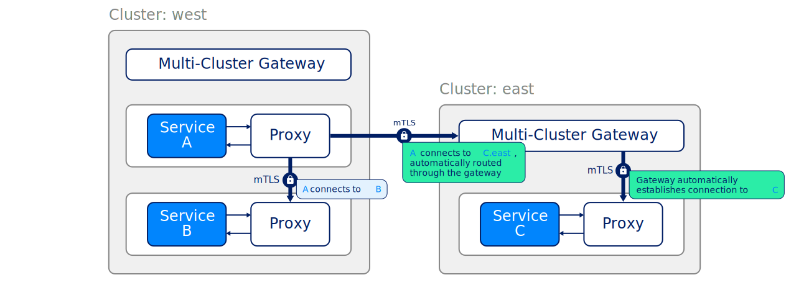

> 翻译自文章：[Multi-cluster communication | Linkerd](https://linkerd.io/2.12/features/multicluster/)

Linkerd可以跨越集群边界连接 Kubernetes 服务，其方式是安全的，对应用程序完全透明，并独立于网络拓扑结构。这种多集群能力旨在提供。

- **统一的信任域**。在集群内和跨集群边界的每一步，源和目标工作负载的身份都得到验证。

- **独立的故障域**。一个集群发生故障时，其余的集群可以正常运行。

- **支持异质网络**。由于集群可以跨越云、VPC、企业内部的数据中心，以及它们的组合，Linkerd不引入任何L3/L4要求，除了网关连接。

- **统一的模型与集群内的通信并存**。Linkerd为集群内通信提供的可观察性、可靠性和安全特性，也延伸到跨集群通信。

正如集群内连接一样，Linkerd的跨集群连接对应用程序代码是透明的。无论这种通信是发生在集群内，还是发生在数据中心或VPC内的集群间，或是发生在公共互联网上，Linkerd都会在集群间建立一个连接，并在双方都用mTLS进行加密和认证。

## 它是如何工作的

Linkerd 的多集群支持是通过在集群之间 "镜像" 服务信息来实现。由于远程服务被表示为 Kubernetes 服务，Linkerd的全部可观察性、安全性和路由功能都统一适用于集群内和集群调用，应用程序不需要区分这些情况。

Linkerd 的多集群功能是由两个组件实现的：一个 *service mirror*  和一个 *gateway*。service mirror 组件观察目标集群的服务更新，并将这些服务更新镜像在源集群上。这提供了对目标集群的服务名称的可见性，以便应用程序可以直接处理它们。多集群网关组件为目标集群提供了一种从源集群接收请求的方式。(这使得Linkerd可以支持分层网络）。

一旦安装了这些组件，符合标签选择器的Kubernetes服务资源就可以被输出到其他集群。

### headless 服务

默认情况下，Linkerd 会将所有导出的服务镜像为 Kubernetes clusterIP 服务。这也延伸到了 headless 服务；导出的 headless 服务将被镜像为 clusterIP，并有一个 IP 地址分配给它。一般来说，headless 服务不应该有一个IP地址，当工作负载需要一个稳定的网络标识符或促进服务发现而不被 Kubernetes 的本地实现所束缚时，它们就会被使用。这使得客户可以实现自己的负载均衡，或者直接通过DNS名称来定位 pod。在某些情况下，最好保留一些这种功能，特别是在使用需要这种功能的Kubernetes对象时，如StatefulSet。

Linkerd的多集群扩展可以在将两个集群连接在一起时配置对无头服务的支持。当该功能被打开时，服务镜像组件将导出无头服务，而不给它们分配IP。这允许客户端跨集群与特定的pod（或主机）对话。为了支持直接通信，在引擎盖下，服务镜像组件将为每个支持无头服务的主机创建一个端点镜像。举例来说，如果在一个目标集群中，有一个部署了两个副本的StatefulSet，并且该StatefulSet由一个无头服务支持，当该服务将被导出时，源集群将创建一个无头镜像以及两个代表StatefulSet中的主机的 "端点镜像"。

这种方法允许Linkerd保留DNS记录的创建，并支持跨集群与pod的直接通信。客户端也可以根据 headless 服务创建的DNS记录来实现自己的负载平衡。主机名也是跨集群保留的，也就是说，DNS名称（或FQDN）的唯一区别是 headless 服务的镜像名称。为了作为无头服务输出，支持该服务的主机需要被命名（例如，支持StatefulSet，因为所有的pod都有一个主机名，但不支持Deployment，因为他们不允许在pod规范中使用任意的主机名）。
