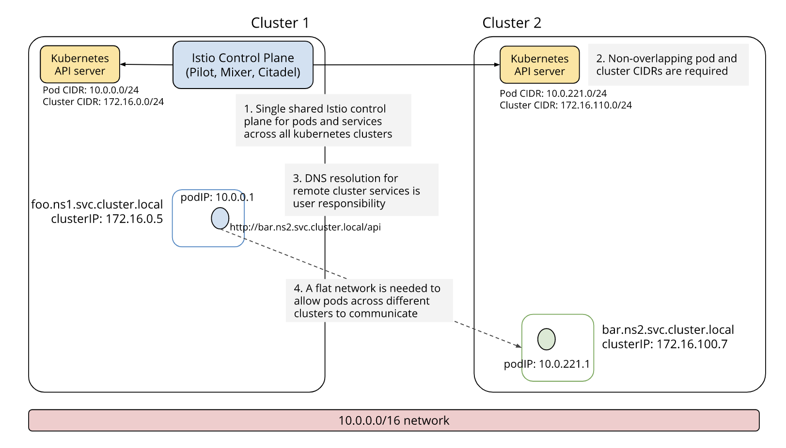
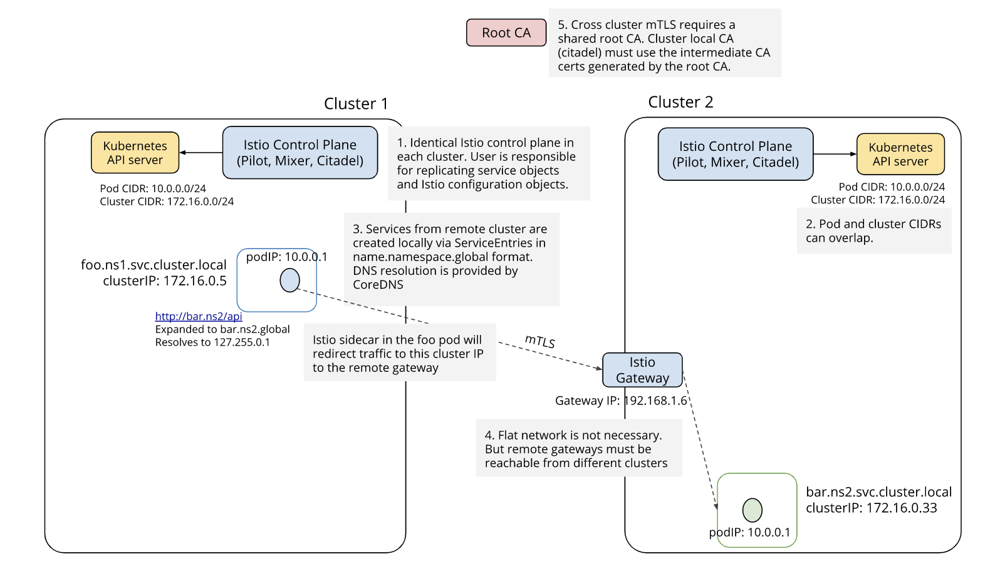
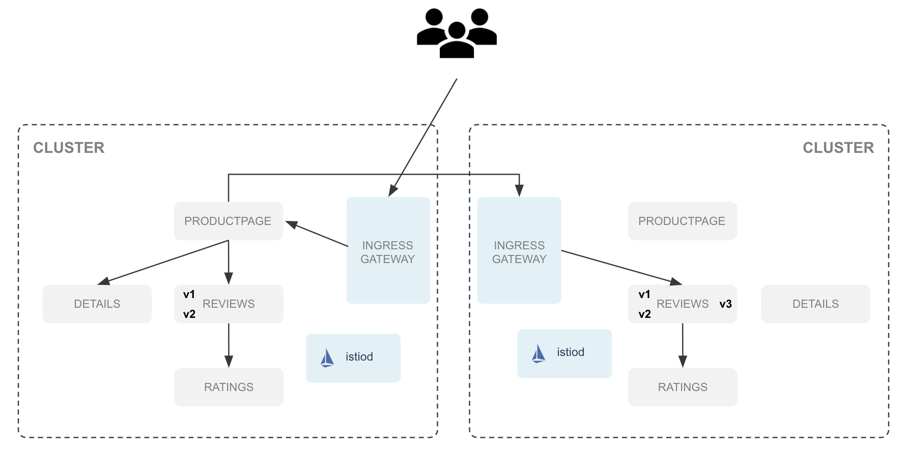

> 翻译自文章： [Cross-cluster service communication with service mesh - Solo.io](https://www.solo.io/blog/cross-cluster-service-communication/) ，原文发表于2020年10月


在这个系列博客中，我们将挖掘多集群 Kubernetes 和 服务网格的具体挑战领域，以及解决这些问题的考虑和方法。

上一篇博文介绍了多集群 Kubernetes 的身份联盟和服务网格，这是跨集群服务通信的基础。

Istio 是最流行的服务网格技术，是为处理多集群流量而设计的。

首先，让我们看看 Istio 不同的多集群部署模式。

## Istio多集群部署模式

有2种方法可以配置Istio，使运行在不同集群上的服务可以一起通信。

### 共享控制平面的方法



你需要在集群之间有一个扁平的网络(flat network)，但即使你满足了这个要求，出于可用性的考虑，我也不推荐这种方法。

如果运行控制平面的集群变得不可用，会发生什么？

### 复制控制平面的方法



在这种情况下，每个集群上都有一个控制平面，所以不存在可用性问题。

而且没有特定的网络要求。你所需要的只是能够访问其他集群的 Istio Ingress Gateway 。

但是，它的配置和维护要复杂得多。

我们假设你读了之前的博客文章，明白了为什么要给每个 Istio 集群设置不同的信任域以及如何联合不同集群的身份。

现在，每个服务在所有 Istio 集群中都有一个唯一的身份，而且所有 Istio 集群都有一个共同的根证书，我们仍然需要解决其他几个难题。

- 集群如何知道其他集群上运行的服务？
- 集群中的服务如何能够到达另一个集群中的服务？

## 跨集群服务通信的艰难方式

我们从下面的部署开始：



Istio已经部署在每个集群上，我们想让第一个集群上的 productpage 服务向两个集群上的 reviews 服务发送请求。

我们将一步一步地进行。

### 第一个集群上的 ServiceEntry

首先，第一个集群不知道第二个集群上运行的 reviews 服务。

因此，我们需要创建一个 ServiceEntry 来定义它，并告诉第一个集群如何到达它。

```yaml
apiVersion: networking.istio.io/v1beta1
kind: ServiceEntry
metadata:
  name: reviews.default.svc.kind3.global
  namespace: istio-system
spec:
  addresses:
  - 253.124.25.94
  endpoints:
  - address: 172.18.0.230
    labels:
      cluster: cluster2
    ports:
      http: 15443
  hosts:
  - reviews.default.svc.cluster2.global
  location: MESH_INTERNAL
  ports:
  - name: http
    number: 9080
    protocol: TCP
  resolution: DNS
```

地址 `253.124.25.94` 必须是唯一的，所以你需要手动跟踪你为每个 ServiceEntry 使用的IP地址。

该端点对应于第二个集群的 Istio Ingress Gateway（一般用 Kubernetes Service Type Load Balancer 暴露）。注意我们设置的标签，因为我们稍后会用它来针对我们之后要创建的 DestinationRule 中的这个 ServiceEntry。

最后，主机值 `reviews.default.svc.cluster2.global` 需要以 `.global` 后缀结尾，以告知。

为了理解我们为什么使用这个后缀，我们需要看一下 Istio 的 coredns 配置:

```yaml
.:53 {
 errors
 health
 
 # Removed support for the proxy plugin: https://coredns.io/2019/03/03/coredns-1.4.0-release/
 grpc global 127.0.0.1:8053
 forward . /etc/resolv.conf {
  except global
 }
 
 prometheus :9153
 cache 30
 reload
}
```

The `grpc global 127.0.0.1:8053` forwards all requests to `*.global` to the istio-coredns plugin which is listening on port 8053.

### 第一个集群上的 DestinationRule

下一步是创建一个 DestinationRule 来定义不同的子集。

```yaml
apiVersion: networking.istio.io/v1beta1
kind: DestinationRule
metadata:
  name: reviews.default.svc.cluster2.global
  namespace: istio-system
spec:
  host: reviews.default.svc.cluster2.global
  subsets:
  - labels:
      cluster: cluster2
    name: version-v3
  - labels:
      cluster: cluster2
    name: version-v1
  - labels:
      cluster: cluster2
    name: version-v2
  trafficPolicy:
    tls:
      mode: ISTIO_MUTUAL
```

你可以看到，我们使用了上面定义的相同的 FQDN（reviews.default.svc.cluster2.global），我们为在第二个集群上运行的reviews服务的每个版本创建了一个子集。

而标签 `cluster：cluster2` 允许我们针对我们在上一步创建的 ServiceEntry。

### 第一个集群上的 VirtualService 

现在，我们可以创建一个VirtualService 来定义我们希望流量如何分布在两个集群上。

```yaml
apiVersion: networking.istio.io/v1beta1
kind: VirtualService
metadata:
  name: reviews
  namespace: default
spec:
  hosts:
  - reviews.default.svc.cluster.local
  http:
  - route:
    - destination:
        host: reviews.default.svc.cluster2.global
        subset: version-v3
      weight: 75
    - destination:
        host: reviews.default.svc.cluster.local
        subset: version-v1
      weight: 15
    - destination:
        host: reviews.default.svc.cluster.local
        subset: version-v2
      weight: 10
```

通过这个VirtualService，我们告诉Istio我们想把 `reviews.default.svc.cluster.local` 的请求发送到。

- 在第二个集群上运行的评论服务的版本3，75%的流量

- 在本地集群上运行的评论服务的版本1，15%的流量

- 在本地集群上运行的评论服务的版本2，10%的流量

注意，我们使用我们在DestinationRule中定义的子集。

### 第二个集群上的EnvoyFilter

有了我们在第一个集群上创建的所有 Istio CRD，我们现在能够向第二个集群发送流量，但我们仍然需要配置第二个集群，告诉他如何管理这些传入的流量。

让我们从EnvoyFilter开始。

```yaml
apiVersion: networking.istio.io/v1alpha3
kind: EnvoyFilter
metadata:
  name: cross-cluster-traffic
  namespace: istio-system
spec:
  configPatches:
  - applyTo: NETWORK_FILTER
    match:
      context: GATEWAY
      listener:
        filterChain:
          filter:
            name: envoy.filters.network.sni_cluster
        portNumber: 15443
    patch:
      operation: INSERT_AFTER
      value:
        name: envoy.filters.network.tcp_cluster_rewrite
        typed_config:
          '@type': type.googleapis.com/istio.envoy.config.filter.network.tcp_cluster_rewrite.v2alpha1.TcpClusterRewrite
          cluster_pattern: \.cluster2.global$
          cluster_replacement: .cluster.local
  workloadSelector:
    labels:
      istio: ingressgateway
```

我们修改在 Istio Ingress Gateway 中运行的 Envoy 的配置，将 `.cluster2.global` 的后缀改为 `.cluster.local`，以便像处理来自本地服务的流量一样处理。

### 第二个集群上的DestinationRule

我们仍然需要创建一个 DestinationRule 来定义我们在这个集群上的子集。

```yaml
apiVersion: networking.istio.io/v1beta1
kind: DestinationRule
metadata:
  name: reviews
  namespace: default
spec:
  host: reviews.default.svc.cluster.local
  subsets:
  - labels:
      version: v3
    name: version-v3
  - labels:
      version: v1
    name: version-v1
  - labels:
      version: v2
    name: version-v2
  trafficPolicy:
    tls:
      mode: ISTIO_MUTUAL
```

你可以看到，我们现在在每个子集中使用标签 `version：v*`，以拥有此标签的Pod为目标。

我们做到了 !


因此，手动配置跨集群服务通信是可以做到的，但很复杂，容易出错，而且扩展性不强。

## 跨集群服务通信变得简单

我们上面所做的所有手动操作都可以通过创建一个单一的  Service Mesh Hub CRD 来完成。

```yaml
apiVersion: networking.smh.solo.io/v1alpha2
kind: TrafficPolicy
metadata:
  namespace: service-mesh-hub
  name: simple
spec:
  destinationSelector:
  - kubeServiceRefs:
      services:
        - clusterName: cluster1
          name: reviews
          namespace: default
  trafficShift:
    destinations:
      - kubeService:
          clusterName: cluster2
          name: reviews
          namespace: default
          subset:
            version: v3
        weight: 75
      - kubeService:
          clusterName: cluster1
          name: reviews
          namespace: default
          subset:
            version: v1
        weight: 15
      - kubeService:
          clusterName: cluster1
          name: reviews
          namespace: default
          subset:
            version: v2
        weight: 10
```

这个 CRD 很容易阅读和维护，不是吗？

ServiceMesh Hub就会为我们创建所有复杂的管道.

