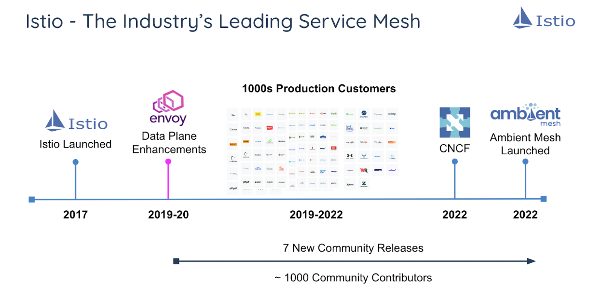
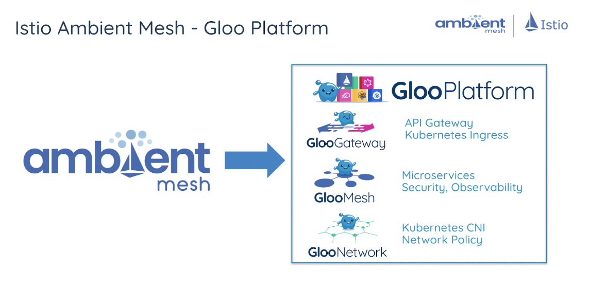
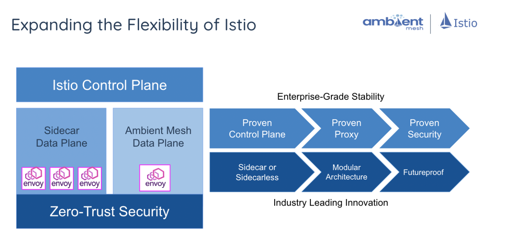
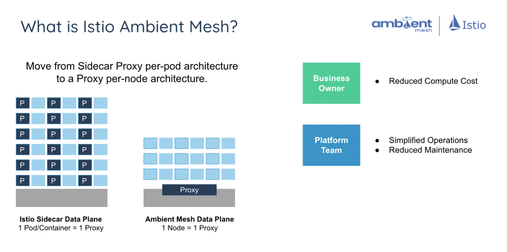
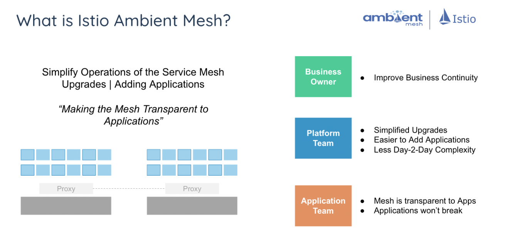
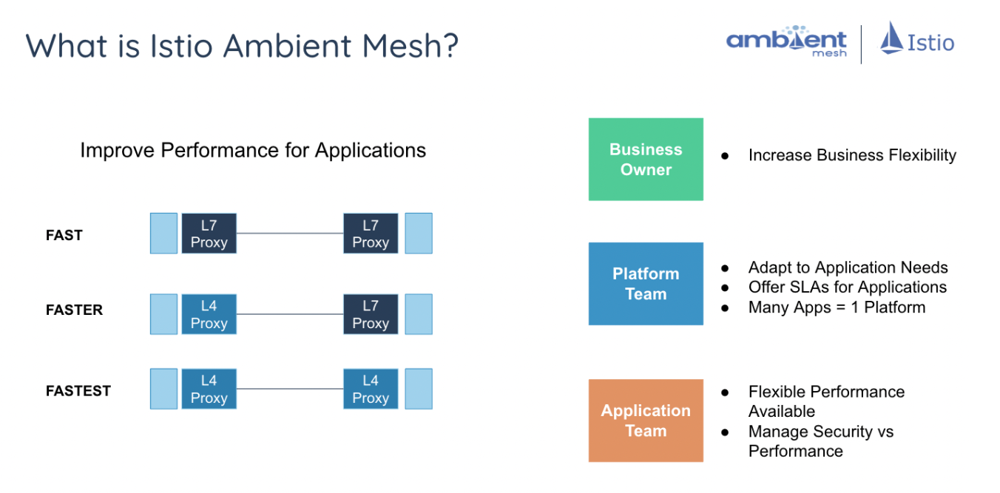
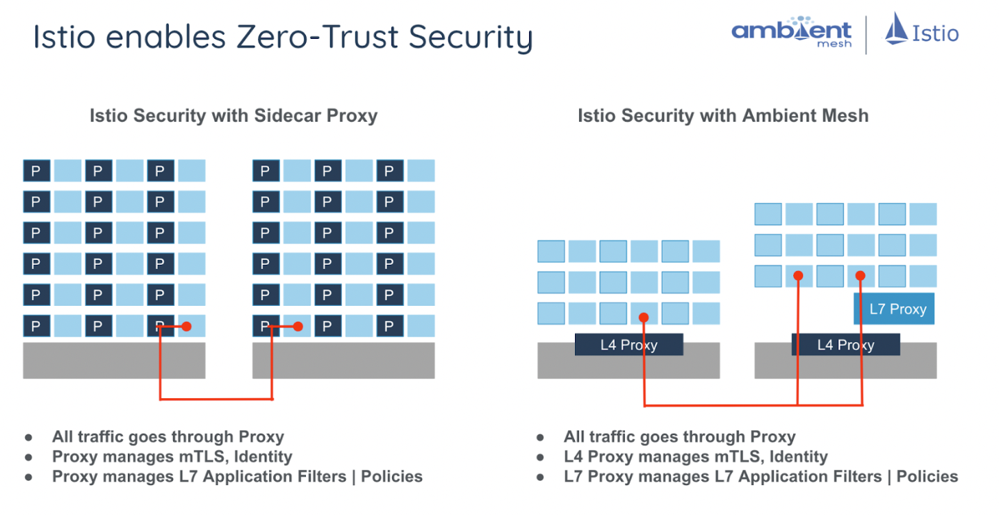

> 翻译自文章：[Introducing Istio Ambient Mesh - Solo.io](https://www.solo.io/blog/istio-ambient-mesh-evolution-service-mesh/)，原文发表于2022年9月7日

## Istio社区的新选择

今天，Solo.io 和谷歌将为 Istio 项目贡献一个重要的新架构，称为 Istio Ambient Mesh。这一贡献不仅将为我们的 Istio、Gloo Mesh和 Gloo Platform 客户提供令人兴奋的新功能，而且还将继续确立 Solo.io 作为服务网格市场的领先创新者的地位。

这一贡献是近一年来工程努力的结果，这些努力始于 Solo.io 内部，并与谷歌工程合并，因为我们发现我们都在为 Istio 的类似目标而努力。Solo.io 团队在项目的各个方面都发挥了重要作用，特别是在架构灵活性、安全性和性能测试等方面。现在代码已经提供给 Istio 社区，我们很高兴看到 Istio 数据平面的这个新架构选项如何发展。

Solo.io 将是业内第一家在我们的商业产品中支持 Istio Ambient Mesh 的公司，从下周 Gloo Mesh 2.1 的推出开始，我们将提前进入。

## 什么是 Istio Ambient Mesh？

Istio Ambient Mesh 建立在 Istio 社区5年多的经验之上，有成千上万的生产部署和近1000名工程师的贡献。它还建立在 Istio 成熟的安全模型上。

Istio Ambient Mesh 是新的 Istio 数据平面架构替代方案，默认情况下不依赖 sidecar。Istio Ambient Mesh 让客户可以围绕成本、运营透明度和性能等矢量进行选择。

Istio Ambient Mesh 使 Istio 能够在以下方面为我们的 Gloo Mesh 客户提供价值。

- 所有Istio技术都是开源的，并有五年多的持续开发、稳定和创新的支持--值得信赖、面向未来，并由Solo.io支持N-4版本。

- 代理技术的操作透明度选择--数据平面在应用程序之外运行，以实现简单的应用程序入职、升级和CVE补丁。

- 代理技术的成本优化选择--客户可以更精细地调整运维和计算资源的成本，以使用 "正确的规模"

  

- 灵活选择有sidecar（标准Istio架构）或无sidecar（Istio Ambient Mesh架构），可以混合或匹配以符合客户的应用需求--客户可以根据其应用需求匹配最佳设置

  

- 对第4层或第7层服务的部署方式进行性能优化选择--客户在所有的配置中都将获得很好的性能

- 应用程序代码与数据平面的分离提供了一个更好的安全态势

  

## 客户的选择，没有安全上的妥协

Istio一直有内置的零信任安全，并默认启用。通过启用加密生成的身份，零信任安全永远不会受到 sidecar 或无 sidecar 架构的影响。安全性从来不是客户需要担心的权衡因素。随着时间的推移，我们所了解到的是，服务网格的部署涉及到多个团队（CloudOps、DevOps、SRE）。

## Istio是服务网格的未来

在 Solo.io，我们一直都相信 Istio 的未来。这就是为什么我们在项目贡献和项目领导角色方面投入了如此多的工程资源。我们从 Istio 最早的时候就开始参与。但对我们来说，同样重要的是拥有一批强大的客户，他们向我们反馈他们如何使用 Istio 以及如何继续使项目变得更好。这种反馈是我们开始研究 Istio Ambient Mesh 的驱动力。我们希望给我们的客户提供选择，我们希望为整个社区做得更好。

现在，我们比以往任何时候都更相信，Istio 是服务网格的未来。

