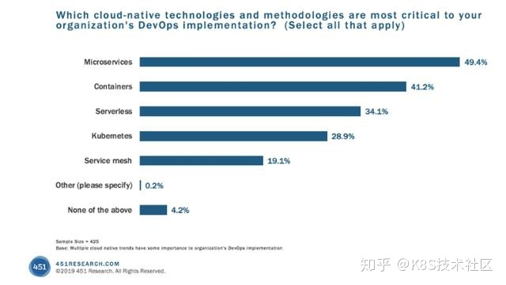
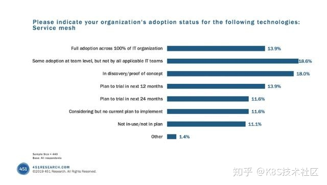

 ## 前言

The Top 3 Service Mesh Developments in 2020

https://thenewstack.io/the-top-3-service-mesh-developments-in-2020/

2020年三大服务网格发展

https://z.itpub.net/article/detail/8910269504CC681F54CA2ADCE2350659

-------

2019年，我们看到服务网格超越了试验性技术，成为了了一个组织很感兴趣并开始关注的解决方案，它是任何成功的Kubernetes部署的基本组成部分。服务网格的大规模采用开始成气候，无论是大公司还是小公司。最前沿的采用者们成功地使用了服务网格技术，后续的公司也心动起来，开始评估服务网格，以解决Kubernetes留下的挑战。

随着服务网格的日益采用，2019年出现了一个新兴的服务网格市场。Istio和Linkerd一直在发展，围绕Istio的工具和供应商生态系统全年几乎增长了两倍。也有许多新的参与者进入市场，为解决第七层网络挑战提供了替代方法。网格（如Kuma和Maesh提供的）已经出现并提供不同方法的服务网格，以解决各种边缘用例。

我们还看到了Service Mesh Interface spec和Meshery等工具的出现，它们试图进入一个早期市场，这个市场由于巨大的机会而蓬勃发展，但在关键厂商仍在等待一个契机。Network Service Mesh等相邻项目将服务网格原则带到堆栈的较低层。

虽然在服务网格领域还有很多需要解决的问题，但服务网格作为一种技术模式的价值是显而易见的，最近由451 Research进行的《Voice of the Enterprise: DevOps》调查就证明了这一点。

虽然仍然是一个新兴市场，但人们对将服务网格作为基础设施的关键部分的兴趣和采用计划正在迅速赶上Kubernetes和容器。

**2020年服务网格：三大发展**

**1.快速增长的服务网格需求**

Kubernetes正在爆炸式发展。它已成为企业和绿地部署中容器编排的首选。有一些真正的挑战存在，但人们正在探索和解决问题。Kubernetes是一项新兴技术，还有很长的路要走。但很明显，Kubernetes已经并将继续成为软件世界的主导力量。

如果Kubernetes已经赢了，并且基于Kubernetes的应用程序的规模和复杂性将会增加，那么就会有一个临界点，服务网格将是有效管理这些应用程序所必需的。

**2. Istio很难被打败**

市场上可能还有其他竞争者的存在，但我们将看到市场整合将在2020年开始。从长远来看，我们很可能会看到与Kubernetes类似的情况——一个赢家出现，公司围绕着这个赢家标准化。可以想象，服务网格可能不是为解决第7层网络问题而选择的技术模式。但如果真的发生了这种情况，Istio很可能成为服务网格的事实标准。

对这一点，有很多人支持，也有很多人反对，但最能说明问题的是围绕着Istio发展的生态系统。几乎每个主要的软件供应商都有一个Istio解决方案或集成，Istio开源社区在活动和贡献方面远远超过其他社区。

**3. 用例，用例，用例**

2019年是人们发现服务网格易于解决问题的一年。早期的采用者选择了服务网格中他们最想要的两三个功能，然后一头扎了进去。在过去一年中，需求最多的三个解决方案是：mTLS、可观察性、流量管理。

2020年将是核心服务网格用例出现的一年，并将成为下一波采用者实施服务网格解决方案的参照。

用户最想要的用例是：

- 能够更好地理解集群状态、快速调试和更深入地理解系统，从而构建更具弹性和稳定性的系统。

- 利用服务网格策略来驱动预期的应用程序行为。

- 执行并证明安全且兼容的环境。

- 像WebAssembly这样的技术使得有可能将现有的功能分发到数据平面上，并建立新的智能和可编程性。

如果你已经在使用服务网格，那么你能理解它所带来的价值。如果你正在考虑采用服务网格，那么请密切关注这个领域，用例的数量将使未来一年中它的价值越发凸显。

