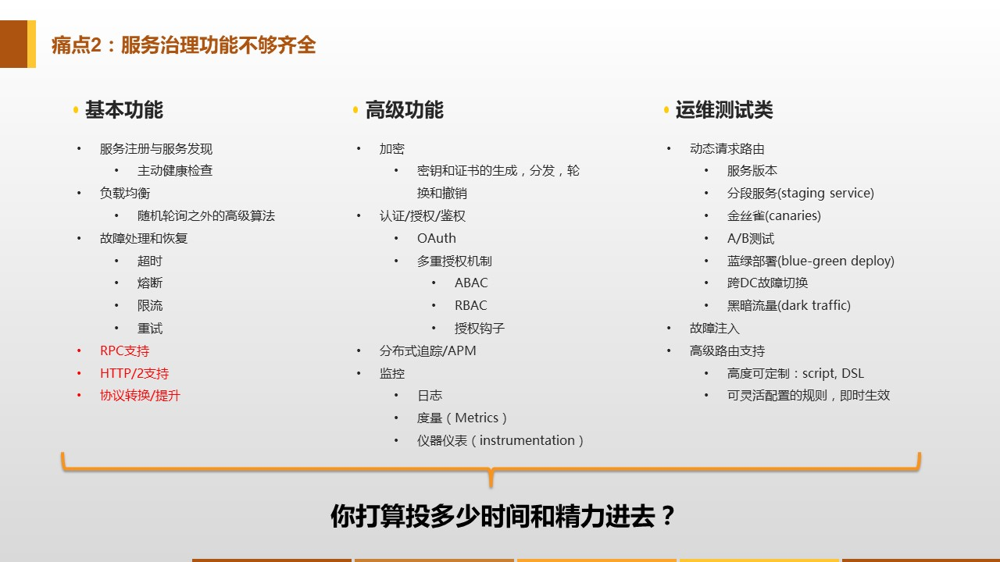

详细追溯一下Service Mesh技术的起源，发展和一步一步的演进历程。

让我们详细追溯一下Service Mesh技术的起源，发展和一步一步的演进历程。

需要注意的是，虽然Service Mesh这个词汇直到2016年9才出现，但是和Service Mesh一脉相承的技术很早就出现了，经过了长期的发展和演变，才形成了今天的Service Mesh，并且这个演进的过程目前还在继续。

## 远古时代的案例

远在微服务出现之前，在计算机的"远古时代"，在第一代网络计算机系统中，最初的一代开发人员需要在应用代码里处理网络通讯的细节问题，比如说数据包顺序、流量控制等等，导致网络通讯逻辑和业务逻辑混杂在一起。为了解决这个问题，出现了TCP/IP技术，解决了流量控制问题，并将这些功能做成通用能力。从右边的图上可以看到，实际功能没发生变化：所有的功能都在，相应的代码也在。但是，最重要的事情，流程控制，已经从应用程序里面剥离出来。抽出来的这些功能被进一步标准化和通用化，最终统一成操作系统网络层的一部分，这就是TCP/IP协议栈。

这个改动大幅降低了应用程序的复杂度，将业务逻辑和底层网络通讯细节解耦，应用程序的复杂度大为降低，应用程序的开发人员得以解脱并将精力集中在应用程序的业务逻辑实现上。

这个故事非常遥远，发生在大概五十年前。

## 微服务时代的现状

当时间流转，进入微服务时代后，我们也面临着类似的一些问题：比如在实现微服务的时候要处理一系列的比较基础和通用的事项，如服务发现，在得到服务器实例列表之后再做负载均衡，为了保护服务器要熔断/重试等等。

这些功能所有的微服务都需要，那怎么办呢？如果将这些功能直接在应用程序里面实现，那么又会和刚才TCP/IP出现前一样，应用程序里面又加上了大量的非业务相关的代码。很自然的，为了简化开发避免代码重复，我们选择使用类库，如经典的Netflix OSS套件。这样开发人员的重复编码问题就解决了：只需要写少量代码，就可以借助类库实现这些功能。

因为这个原因，最近这些年大家看到Java社区Spring Cloud的普及程度非常快，几乎成为了微服务的代名词。但这一切都完美了吗？

## 侵入式框架的痛点

以Spring Cloud/Dubbo为代表的传统微服务框架，是以类库的形式存在，通过重用类库来实现功能和避免代码重复。但在以运行时操作系统进程的角度来看，这些类库还是渗透进了打包部署之后的业务应用程序，和业务应用程序运行在同一进程内。所谓"侵入式框架"的称谓由此而来。

而建立在类库基础上的"侵入式框架"，会面临与生俱来的诸多痛点。

### 痛点1：门槛高

由于追求特性丰富，侵入式框架必然功能繁多，需要学习掌握的内容也比较多，因此入门的门槛会比较高。

从实践上看，简单了解和运行helloworld，是比较简单的。但是如果要到可以熟练掌握，并且能够在真实落地时解决遇到的各种问题，则会需要很长的时间。

而这些知识是需要团队中的每个开发人员都掌握的，对于业务开发团队来说，面临的挑战要更大一些：

- 业务开发团队的强项往往不是技术，而是对业务的理解，对整个业务体系的熟悉程度
- 业务应用的核心价值在于业务实现，微服务是手段而不是目标，在学习和掌握框架上投入太多精力，在业务逻辑的实现上的投入必然受影响。
- 业务团队往往承受极大的业务压力，时间人力永远不足

### 痛点2：功能不全

和Service Mesh，尤其是新贵Istio相比，传统侵入式框架如Spring Cloud、Dubbo所能提供的功能是很有限的，尤其不像Isito这样形成一个非常完备的生态体系。典型如Content Based Routing和Version Based Routing，Istio借助这两个特性可以实现非常强大而有弹性的服务治理功能，其能力远远超过Spring Cloud等。

当然，也可以选择在Spring Cloud的基础上进行各种补充、扩展、加强，实践中也的确是大家都在各自做定制化，但是如此一来需要投入的时间和精力就会非常可观。

### 痛点3：跨语言

微服务在面世时，承诺了一个很重要的特性：微服务可以采用最适合的语言来编写。理论上说，不同的团队，不同的微服务，可以根据实际情况选择团队最擅长，或者最适合当前应用的编程语言。

但是，在实践中，这个承诺往往受到极大挑战而沦为空话：微服务的确理论上可以使用不同的语言，但是实际开发时，当需要选择通过框架或者类库来实现代码重用时，就会发现有个绕不开的问题——框架和类库是语言强相关的！

这个问题非常尖锐，为了解决它，通常有两个思路：

1. 统一编程语言，整个系统就只使用一种编程语言，也就只需为这一个语言提供框架和类库
2. 为要使用的每种编程语言都提供一套解决方案，也就是框架和类库要为每个语言同样开发一份

前者相当于放弃了微服务的跨语言特性，并且面临强行用一种编程语言完成所有不同类型工作的境地，同样会有很多麻烦。后者理论上可行，但是实践中会面临非常大的开发工作量，后期维护代价高昂，还有不同编程语言不同版本之间的兼容性问题，代价极高，往往无法长期坚持。

### 痛点4：升级困难

即使解决了多语言支持的问题，无论是统一为一种编程语言，还是开发多种编程语言版本，依然还会继续遇到下面这个问题：版本升级。

任何框架不可能一开始就完美无缺，所有功能都齐备，没有任何BUG，以至于分发出去之后就再也不需要改动和升级。这种理想状态是不存在的。必然是1.0、1.2、2.0慢慢版本升级，功能逐渐增加，BUG逐渐被修复。在这期间，一个接一个新版本陆续发布并分发给使用者。但是，当框架分发给使用者之后，使用者会不会总是保持升级到最新发布的版本？

实际上做不到的。任何一家正规的公司，业务应用上线必然是有一个完备的流程，当应用程序发生变更需要重新上线时，必然要走测试和上线的标准流程。类库升级，即使是在完全兼容不需要修改任何业务代码的前提下，也是需要业务应用重新打包发布的，因为"侵入式框架"是需要将框架打包进去业务应用的！

因为这个原因，框架的使用者，在没有特别需求或者遭遇严重bug时，是没有升级框架版本的动机和热情的。导致实际运行时，系统中运行的框架版本，包括服务器端版本和客户端版本，是不一致的，而且随着时间的推移会越来越呈现出版本碎片化的趋势。此时，不同版本之间的兼容性问题就会变得非常的复杂，框架的开发人员需要非常小心的维护兼容性，一旦兼容性出现问题，就会严重打击使用者升级的欲望，造成更大的碎片化，恶性循环。

而维护版本兼容性的复杂度会让任何对框架进行改进的努力都变得小心翼翼甚至举步维艰。当服务端数以百计起，客户端数以千计起时，如果每个应用的版本都有可能不同。再考虑编程语言造成的多个实现，这种情况下的兼容性测试代价过于高昂几乎无法承受！导致开发人员倾向于放弃可能造成兼容性问题的改进，从而让存在的问题长期积累，以至于积重难返。

## 解决问题的思路

问题是客观存在的，总是需要面对。在解决问题前，先反省问题的来源，想想我们的出发点和目标。

1. 问题的根源在哪里？

	面临的这些问题，这么多艰巨的挑战，和业务应用，或者说服务本身，有直接关系吗？

	答案是：没有。这些问题都属于服务间通讯的范围，和应用本身的实现逻辑无关。

2. 我们的目标是什么？

	所有的努力，都是为了保证将客户端发出的业务请求，发送到正确的目的地。而"正确"一词，在不同的特性下有不同的语义，如服务发现，负载均衡，灰度，版本控制，蓝绿部署，按照请求内容执行不同的路由策略。服务间通讯的目标，是让请求在满足这些特性要求的前提下，去往请求应该去的目的地服务，而与请求的业务语义无关，和请求的业务处理无关。

3. 服务间通讯的本质是什么？

	在整个服务间通讯的处理流程中，无论功能有多复杂，请求本身的业务语义和业务内容（非业务内容可能会有变化如传递特殊的header或者对内容加解密）是不发生变化的。对于服务间通讯，实现的是请求的可靠传递，内容是不变的。

4. 有什么内容是普适的？

	前面遇到的这些问题具有高度的普适性：适用于所有的语言、框架、组织，这些问题对于任何一个微服务都是同样存在的。

回顾前面举出的发生在五十年前的TCP/IP的案例，是否发现，似曾相识？

- TCP/IP解决了什么问题？网络通讯逻辑的代码和业务逻辑代码混杂在一起。
- TCP/IP又是如何解决这些问题的？网络通讯逻辑的代码从业务应用中剥离出来，标准化后下沉到底层。

因此，借鉴当年TCP/IP的思路，对于服务间通讯，在传统的侵入式框架外，出现了另外一种思路：既然我们可以把网络通讯的技术栈剥离并下沉为TCP，我们是否也可以用类似的方式来处理微服务中服务间通讯的技术栈？

## Proxy模式的探索

早在微服务出现之前，为了解决客户端和服务器端直接耦合的问题，有一部分先驱者尝试过使用Proxy的方案，来隔离客户端和服务器端。典型如Nginx，HAProxy，Apache等HTTP反向代理。这些Proxy和微服务没有直接联系，但是提供了一个基本思路：在服务器端和客户端之间插入了一个中间层来完成请求转发的功能，避免两者直接通讯。所有流量都经由Proxy转发，而Proxy需要为此实现基本功能如负载均衡。

当然这些Proxy的功能非常简陋，比如服务发现甚至是通过配置文件来实现。功能不够，但是思路和想法很有参考意义：客户端和服务器端应该隔离，部分功能下沉到中间层来实现请求转发。Proxy模式的探索为日后Service Mesh的出现奠定了基础。

## Sidecar的出现

为了解决前面列举的侵入式框架遇到的痛点，开始有公司开始尝试Proxy模式。受限于Proxy的功能不足，在参考Proxy模式的基础上，陆陆续续出现了Sidecar模式的一些产品，如Netflix的Prana。

Sidecar模式借鉴了Proxy模式的思路，Sidecar扮演的角色和Proxy很类似，但是在功能实现上就齐全很多。基本思路是对齐原来侵入式框架在客户端实现的各种功能，实现上通常是通过增加一个Proxy实现请求转发，然后直接重用原有的客户端类库。

**Sidecar模式和Proxy模式的差异在于功能是否齐全**：

- Proxy只具备基本的简单功能
- Sidecar对齐侵入式框架的功能

这种思路下发展出来的Sidecar通常都是有局限性的，表现在**为特定的基础设施而设计**，通常是和开发Sidecar的公司当时的基础设施和框架直接绑定，在原有体系上搭建出来，有特殊的背景和需求。带来的问题就是这些Sidecar会有很多由原有体系带来的限制，导致无法通用，只能工作在原有体系中，无法对外推广。

## 第一代Service Mesh

2016年1月，离开Twitter的基础设施工程师William Morgan和Oliver Gould，在github上发布了Linkerd 0.0.7版本，业界第一个Service Mesh项目就此诞生。Linkerd基于Twitter的Finagle开源项目，大量重用了Finagle的类库，但是实现了通用性，成为了业界第一个Service Mesh项目。而Envoy是第二个Service Mesh项目，两者的开发时间差不多，在2017年都相继成为CNCF项目。

**Service Mesh和Sidecar的差异在于是否通用**：

- Sidecar为特定的基础设施而设计，只能运行在原有环境中
- Service Mesh在Sidecar的基础上解决了通用性问题，可以不受限于原有环境

另外还有一点，Sidecar通常是可选的，容许直连。通常是编写框架的编程语言的客户端维持原有的客户端直连方式，其他编程语言不开发客户端而选择走Sidecar转发的方式，当然也可以选择都走Sidecar。但是，在Service Mesh中，由于要求完全掌控所有流量，所以要求所有请求都必须通过Service Mesh转发，不提供直连方式。

## 第二代Service Mesh

在2017年之前，Service Mesh的发展和演进可谓按部就班不紧不慢。然后在2017年，突然加速：

- 2017年1月，Linkerd加入CNCF；
- 2017年4月，Linkerd发布1.0版本；
- 同日William Morgan意气风发的发布博文”What’s a service mesh? And why do I need one?“，正式给Service Mesh做了一个权威定义（我们前面看到的），Linkerd。
- 一个月后，2017年5月，Google/IBM/Lyft联手发布Istio 0.1版本。
- 2017年9月，Envoy加入CNCF

在第一代Service Mesh产品如Linkerd、Envoy刚刚发展成熟，正要开始逐渐推广时，以Istio为代表的第二代Service Mesh产品就突然登场，直接改变市场格局。

**第二代Service Mesh和第一代Service Mesh的差异在于是否有控制平面**：

- 第一代Service Mesh只有数据平面（即Sidecar），所有功能都在Sidecar中实现
- 第二代Service Mesh增加了控制平面，带来了远超第一代的控制力，功能也更加丰富

Istio最大的创新是它为Service Mesh带来了前所未有的控制力：

- 以Sidecar方式部署的Service Mesh控制了服务间所有的流量
- Istio增加了控制面板来控制系统中所有的Sidecar
- 这样Istio就能够控制所有的流量，也就是控制系统中的所有请求的发送

Istio出现之后，Linkerd陷入困境，Envoy则作为Istio的数据平面和Istio一起发展。随后Buoyant公司推出了全新的Conduit应对Istio的强力竞争，我们将在下一章中详细讲述Service Mesh的开源产品和市场竞争。

## 总结

Service Mesh的演进过程，就是这样一步一步过来的：

- Proxy模式进行探索，隔离客户端和服务器端，部分功能下沉到中间层；但是功能有限
- Sidecar模式弥补Proxy模式功能不足的缺陷，功能对齐传统类库；但是有很大的局限性，无法通用
- 第一代Service Mesh解决Sidecar模式的通用性问题，可以不受限于原有环境；但是控制力不够强大
- 第二代Service Mesh通过增加控制平面来加强控制，并带来更强大的功能

目前第二代的Service Mesh还继续完善中，即将成熟，敬请关注。
