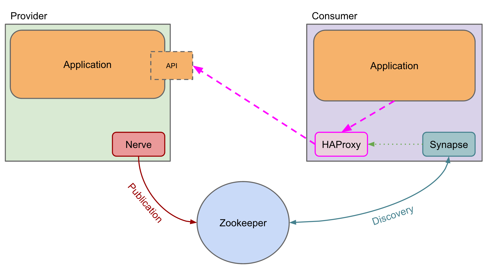

## 内容出处

**Microservices: Service Discovery with Smartstack and Docker**

https://engineering.poppulo.com/microservices-service-discovery-with-smartstack-and-docker/

2015年8月

-----

在Poppulo，我们在Docker容器中部署我们的微服务。我们的构建产生了Docker镜像，用于在Kubernetes集群上启动容器。Kubernetes使我们能够轻松地管理部署、扩展、滚动更新，并通过复制确保服务的高可用性。

这些服务的外部可用性不应受到它们所组成的底层docker容器的短暂性质的影响。它们应该在单个容器的更新和宕机中幸存下来。在这种情况下，我们要确保请求不再被路由到不可用的容器上，而是由新的容器开始为请求服务。服务发现使这成为可能。

## 什么是服务发现？

一个基于微服务的系统是由许多负责非常具体任务的小服务组成的。显然，这些服务必须相互通信，这可能不是件容易的事，因为服务实例的寿命很短（更新、故障转移、扩展......）。

服务发现旨在考虑到这些问题，允许服务动态地发现其他服务并与之通信。

## 保持发现与服务逻辑的解耦

我们从一开始就决定，我们不想在我们的微服务中直接实现服务发现。由于我们的目标是具有单一责任的服务，因此在我们的代码中撒上通用的服务发现逻辑是没有意义的。同样，我们也不希望每次都为我们使用的不同技术编写这种逻辑。

## 我们的选择:Smartstack

当我们面临服务发现的问题时，我们探索了一些不同的选择，如Smartstack、SkyDNS/Skydock或Kubernetes服务的内置发现功能。我们选择了Smartstack，因为我们非常喜欢它的简单性，而且在我们的技术高峰期，它已经被证明是非常稳定和可靠的。此外，Smartstack所需要的唯一基础设施元素（Zookeeper）已经在我们的堆栈中到位，所以没有额外的设置成本。

Smartstack是一个由Airbnb开发和开源的服务发现框架。它是一个简单而优雅的解决方案，基于两个名为Nerve和Synapse的服务。它依靠Zookeeper来存储发现数据，并依靠HAProxy来进行路由。

Nerve负责注册/取消注册一个微服务；基于健康状态（通常是检查/健康端点）。Nerve通过创建一个包含服务名称和可以访问其API的znode，将微服务发布到Zookeeper。

Synapse是负责查找Microservice实例的服务。使用Zookeeper观察，Synapse会在发生变化时被自动通知，并将更新本地HAProxy配置，以将流量路由（和负载平衡）到所发现的实例。

## 使用Smartstack与Docker容器

为了在我们的容器中实施这个解决方案，我们建立了包含Nerve和Synapse的基础Docker镜像。然后，我们的服务被构建在这些镜像之上，并从服务发现中受益。

......

## 总结

当我们开始微服务的旅程时，服务发现对我们来说是一个全新的领域。Smartstack实际上已经使服务发现成为微服务架构难题中最容易解决的部分之一。通过将Synapse和Nerve集成到我们的微服务基础Docker镜像中，我们已经从我们的服务核心中拿走了发现的责任，同时允许它们通过简单的配置轻松地发现和被其他服务所发现。

## 相关的其他资料

