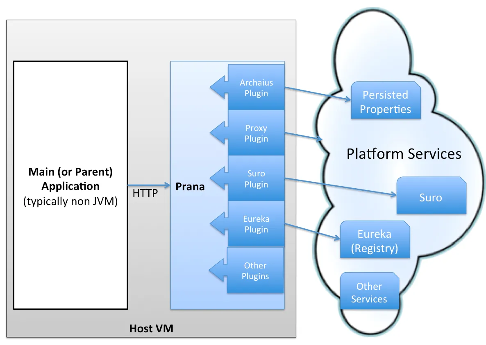

## 内容出处

Prana: A Sidecar Application for Netflix OSS-based Services

https://www.infoq.com/news/2014/12/netflix-prana/

2014年

------

Netflix已经发布了Prana，这是一个开源的 "sidecar" 应用程序，该公司开发的目的是让异构的微服务应用程序使用基于JVM的NetflixOSS平台支持库。

Prana被部署到每个服务实例上，在概念上与 "父" 服务相连，就像摩托车副驾与摩托车相连一样。它作为第二个进程与服务一起运行，并提供通过HTTP API暴露的平台基础设施功能，如服务发现、动态配置和弹性的服务间通信。

Netflix的博客说，在Netflix内外，特别是在运营和管理一个严重基于微服务的生态系统时，使用 Sidecar 应用已经得到了普及。像Prana这样的边车应用可以为那些在实施和部署技术方面日益异质化的服务提供一个同质化的平台基础设施接口。

通过HTTP与Prana进行跨进程通信，使用其他语言（如Python和Node.js）编写的应用程序或Memcached、Spark和Hadoop等服务能够利用Netflix OSS库提供的功能，而无需为目标语言或平台重新编写库。

Prana为附属于 sidecar 应用程序的父服务提供以下功能:

- 通过Eureka服务进行服务注册和发现。这使得父服务可以被其他基于 Netflix OSS的组件 "发现"，并且还提供了一个健康检查的HTTP端点。
- 动态配置，由Archaius提供。这允许父服务接收动态属性的更新。
- 弹性的服务间通信。Prana sidecar使用 Hystrix/Ribbon 代理对其他微服务的请求，这使得父服务可以利用这些库提供的断路器、批量标题和回退功能来调用其他服务。
- 通过一个嵌入式管理控制台，对服务实例和相应的环境进行运行时的洞察和诊断。

Prana还被设计成允许添加额外的自定义插件以实现可扩展性，尽管这一功能的实现目前在项目的Github页面上被列为一个开放问题。核心的Prana应用是建立在Netflix的微服务模板Karyon和Netflix的异步事件驱动网络应用框架RxNetty的反应式扩展（Rx）适配器上。

Prana 的架构图，来自 Netflix 博客:

在Netflix之外使用sidecar应用程序，也被称为 "大使" 应用程序，包括Andrew Spyker的基于Acme Air Netflix OSS的演示程序，用于动态配置，Docker用于跨容器链接，以及AirBnB的SmartStack应用套件用于服务发现。

Prana sidecar应用可以通过遵循该项目Github "入门 "页面中的说明集成到服务中。
