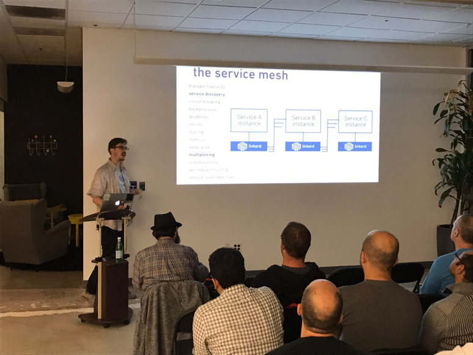
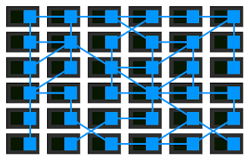
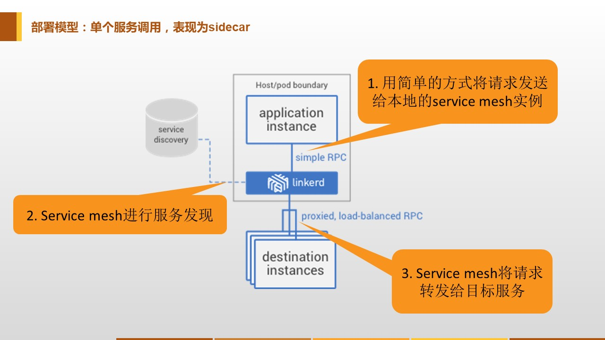
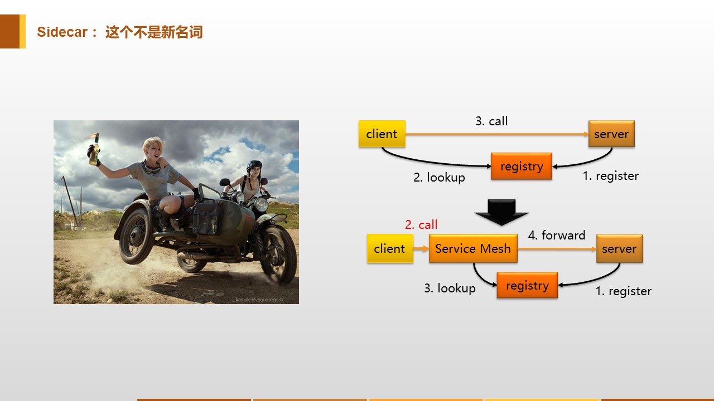
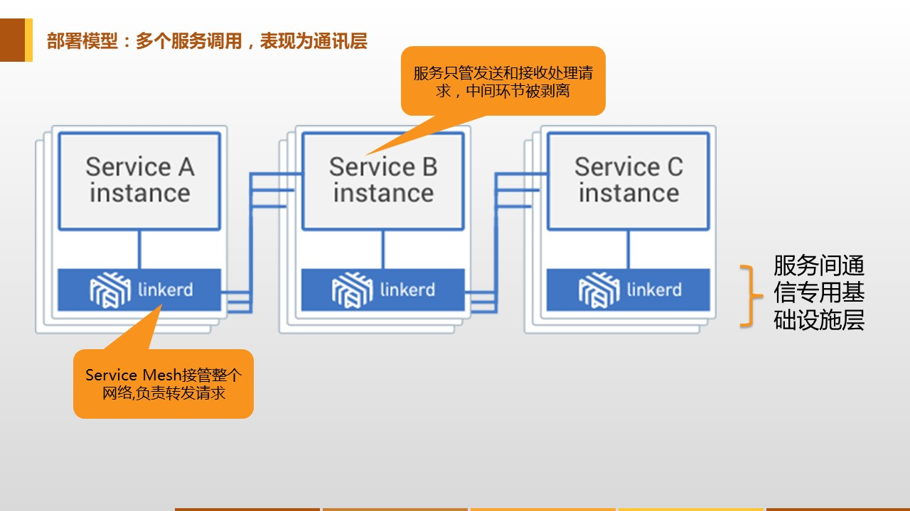
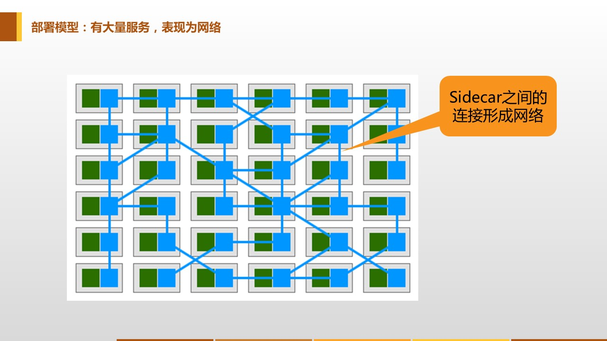
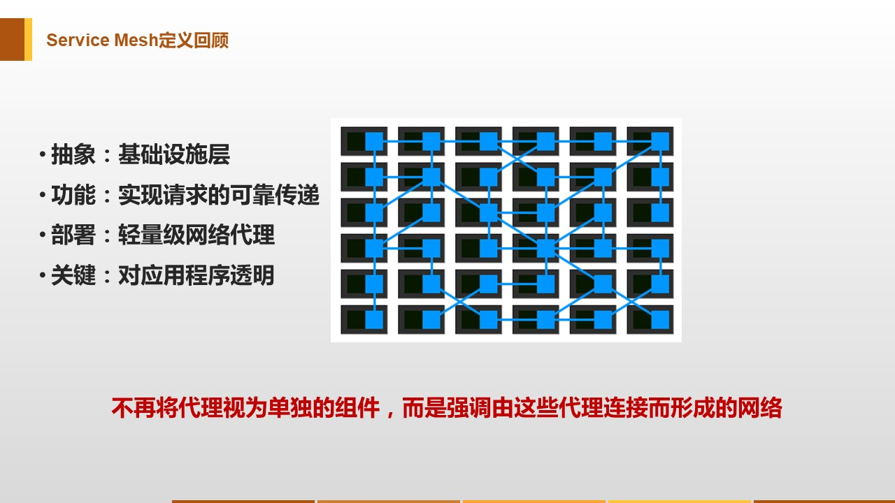

Service Mesh是新兴的微服务架构，被誉为下一代微服务，是云原生技术栈的代表技术之一。

## Service Mesh的由来

2016年1月，离开Twitter的基础设施工程师William Morgan和Oliver Gould，在github上发布了Linkerd 0.0.7版本，他们同时组建了一个创业小公司Buoyant，业界第一个Service Mesh项目就此诞生。

在2016年初，Service Mesh还只是Buoyant公司的内部词汇，而之后，随着Linkerd的开发和推广，Service Mesh这个名词开始逐步走向社区并被广泛接受、喜爱和推崇：

- 2016年9月29日在SF Microservices上，"Service Mesh"这个词汇第一次在公开场合被使用。这标志着"Service Mesh"这个术语，从Buoyant公司正式走向社区。

  

- 2016年10月，Alex Leong开始在Buoyant公司的官方博客中开始"[A Service Mesh for Kubernetes](https://blog.buoyant.io/2016/10/04/a-service-mesh-for-kubernetes-part-i-top-line-service-metrics/)"系列博客的连载。随着"The services must mesh"口号的喊出，Buoyant和Linkerd开始Service Mesh的布道。

- 2017年1月23日，Linkerd加入CNCF，类型为"Service Mesh"。这是Service Mesh重要的历史事件，代表着CNCF社区对Service Mesh理念的认同。

- 2018年7月，CNCF社区正式发布了Cloud Native的定义1.0版本，非常明确的指出云原生代表技术包括容器、服务网格、微服务、不可变基础设施和声明式API，将Service Mesh技术放在了一个前所未有的高度。

至此，从2016到2018，在两年左右的时间内，Service Mesh这个名词实现了从无到有，再到被社区广泛接受乃至炙手可热的过程。

### 中文名的小插曲

2017年初，随着Linkerd的传入，Service Mesh进入国内技术社区的视野。早期翻译不统一，有人取字面意义翻译为"服务网格"，有人觉得和"Service Grid"无法区分所以翻译为"服务啮合层"，有些混乱。

个人觉得"服务啮合层"这个词过于拗口，而根据过往IT届的各种惨痛经历我得出的结论是：一个太生僻的名字会毁了一个大有前途的技术。考虑到"服务网格"简单易懂，朗朗上口，符合英文原语"Service Mesh"，容易被理解和记忆。最重要的，网格一词生动的体现了这个技术的内涵，如下图所示(摘自Phil Calçado的经典文章[Pattern: Service Mesh](http://philcalcado.com/2017/08/03/pattern_service_mesh.html))：

因此，我大力倡导并坚持使用"服务网格"，也得到了很多Service Mesh技术爱好者的认可和赞同。随着Service Mesh中国技术社区的组建和发展，"Service Mesh"一词在社区的推广下，基本统一翻译为"服务网格"，包括各种技术媒体。

有关这个话题，可以浏览InfoQ的这个帖子的留言部分：

http://www.infoq.com/cn/news/2017/05/istio

比较有代表性的是，InfoQ这个文章最初发布的时候名字叫做"Istio：用于微服务的服务啮合层"，被大量转载，大家google或者百度可以找到各种历史记录。后来社区统一为"服务网格"之后，InfoQ与时俱进的修改了标题（非常有担当的技术媒体，赞一个！）。

## Service Mesh的定义

Service Mesh的定义最早是由出品Linkerd的Buoyant公司CEO William在他的经典博客文章 [What’s a service mesh? And why do I need one?](https://blog.buoyant.io/2017/04/25/whats-a-service-mesh-and-why-do-i-need-one/) 给出来的。Linkerd是业界第一个Service Mesh项目，而Buoyant则创造了Service Mesh这个词汇的。作为Service Mesh全球第一个布道师，William给出的这个定义是非常官方和权威的：

> A service mesh is a dedicated infrastructure layer for handling service-to-service communication. It’s responsible for the reliable delivery of requests through the complex topology of services that comprise a modern, cloud native application. In practice, the service mesh is typically implemented as an array of lightweight network proxies that are deployed alongside application code, without the application needing to be aware. 
>
> 服务网格是一个**基础设施层**，用于处理服务间通讯。现代云原生应用有着复杂的服务拓扑，服务网格负责在这些拓扑中**实现请求的可靠传递**。在实践中，服务网格通常实现为一组**轻量级网络代理**，它们与应用程序部署在一起，而**对应用程序透明**。

我们来深入ServiceMesh具体的部署模型和工作方式，以便更好的理解Service Mesh的含义。

## Service Mesh详解

### 单个服务调用

这是单个服务调用下的Service Mesh部署模型，当发起一个请求时，作为请求发起者的客户端应用实例，会首先用简单方式将请求发送到本地的Service Mesh代理实例。注意此时应用实例和代理是两个独立的进程，他们之间是远程调用，而不是代码层面的方法调用。

然后，Service Mesh的代理会完成完整的服务间通讯的调用流程，如服务发现、负载均衡等基本功能，熔断、限流、重试等容错功能，各种高级路由功，安全方面的认证、授权、鉴权和加密等，最后将请求发送给目标服务。最终表现为Sidecar模式，实现和传统类库类似甚至更完备的功能。

Sidecar这个词中文翻译为"边车"，或者"车斗"。Sidecar 模式则早在Service Mesh出现前就在软件开发领域使用，它的灵感来源于实物，通过在原有的两轮摩托的一侧增加一个边车来实现对现有功能的扩展：

Service Mesh通过在请求调用的路径中增加Sidecar，将原本由客户端（通常通过类库）完成的复杂功能，下沉到Sidecar中，实现对客户端的简化和服务间通讯控制权的转移。

### 多个服务调用

当多个服务依次调用时，Service Mesh表现为一个单独的通讯层。在服务实例之下，Service Mesh接管整个网络，负责所有服务间的请求转发，从而实现让服务只需简单发送请求和处理请求的业务处理，不再负责传递请求的具体逻辑。中间服务间通讯的环节被剥离出来，呈现出一个抽象层，被称为**服务间通讯专用基础设施层**。

### 大量服务调用

当系统中存在大量服务时，服务间的调用关系，就会表现为网状。如图所示，左边绿色的是应用程序，右边蓝色的是Service Mesh的Sidecar，蓝色之间的线条是表示服务之间的调用。可以看到Sidecar之间的服务调用关系形成一个网络，这也就是Service Mesh/服务网格名字的由来。

此时Service Mesh体现出来的依然是一个通讯层，只是这个通讯层内部更加复杂，不是简单的顺序调用关系，而是彼此相互调用，形成网状。

### Service Mesh定义回顾

回顾Servicemesh的定义：

> 服务网格是一个**基础设施层**，用于处理服务间通讯。现代云原生应用有着复杂的服务拓扑，服务网格负责在这些拓扑中**实现请求的可靠传递**。在实践中，服务网格通常实现为一组**轻量级网络代理**，它们与应用程序部署在一起，而**对应用程序透明**。

再来详细理解什么是Service Mesh：

- 抽象：Service Mesh是一个抽象层，负责完成服务间通讯。但是和传统类库方式不同的是，Service Mesh将这些功能从应用中剥离出来，形成了一个单独的通讯层，并将其下沉到基础设施。
- 功能：Service Mesh负责实现请求的可靠传递，从功能上说，和传统的类库方式并无不同，原有的功能都继续提供，甚至可以做的更多更好。
- 部署：Service Mesh在部署上体现为轻量级网络代理，以Sidecar的模式和应用程序一对一部署，两者之间的通讯是远程调用，但是走的是localhost。
- 透明：Service Mesh是应用程序是透明的，其功能实现完全独立于应用程序。应用程序无需关注Service Mesh的具体实现细节，甚至对Service Mesh的存在也可以无感知。带来的一个巨大优势是Service Mesh可以独立的部署升级，扩展功能修复缺陷而不必改动应用程序。

需要注意的是，上面的图中，如果把左边的应用程序去掉，只呈现出来Sidecar和它们之间的调用关系，这个时候Service Mesh的概念就会特别清晰：Sidecar和调用关系形成完整的网络，代表服务间复杂的调用关系，承载着系统内的所有应用。

这是Service Mesh定义中非常重要的一点，和传统的Sidecar模式不同的地方：Service Mesh不再将代理视为单独的组件，而是强调由这些代理连接而形成的**网络**。Service Mesh非常强调服务间通讯网络的整体，而不是简单的以个体的方式单独看待每个代理。

至此，我们描述了Service Mesh的定义并做了详细的解释，希望可以帮助大家了解到什么是Service Mesh。在下一章中，我们将给大家详细介绍Service Mesh技术的由来和发展历程。

