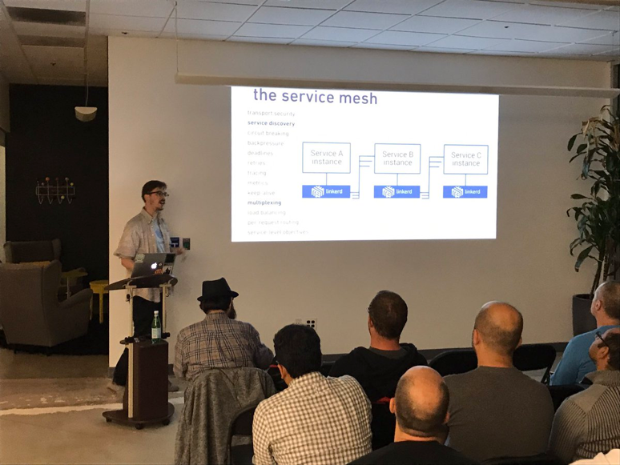
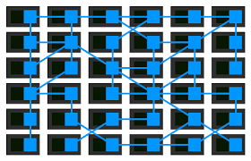

Service Mesh是新兴的微服务架构，被誉为下一代微服务，是云原生技术栈的代表技术之一。

## Service Mesh的由来

2016年1月，离开Twitter的基础设施工程师William Morgan和Oliver Gould，在github上发布了Linkerd 0.0.7版本，他们同时组建了一个创业小公司Buoyant，业界第一个Service Mesh项目就此诞生。

在2016年初，Service Mesh还只是Buoyant公司的内部词汇，而之后，随着Linkerd的开发和推广，Service Mesh这个名词开始逐步走向社区并被广泛接受、喜爱和推崇：

- 2016年9月29日在SF Microservices上，"Service Mesh"这个词汇第一次在公开场合被使用。这标志着"Service Mesh"这个术语，从Buoyant公司正式走向社区。

  

- 2016年10月，Alex Leong开始在Buoyant公司的官方博客中开始"[A Service Mesh for Kubernetes](https://blog.buoyant.io/2016/10/04/a-service-mesh-for-kubernetes-part-i-top-line-service-metrics/)"系列博客的连载。随着"The services must mesh"口号的喊出，Buoyant和Linkerd开始Service Mesh的布道。

- 2017年1月23日，Linkerd加入CNCF，类型为"Service Mesh"。这是Service Mesh重要的历史事件，代表着CNCF社区对Service Mesh理念的认同。

- 2018年7月，CNCF社区正式发布了Cloud Native的定义1.0版本，非常明确的指出云原生代表技术包括容器、服务网格、微服务、不可变基础设施和声明式API，将Service Mesh技术放在了一个前所未有的高度。

至此，从2016到2018，在两年左右的时间内，Service Mesh这个名词实现了从无到有，再到被社区广泛接受乃至炙手可热的过程。

### 中文名的小插曲

2017年初，随着Linkerd的传入，Service Mesh进入国内技术社区的视野。早期翻译不统一，有人取字面意义翻译为"服务网格"，有人觉得和"Service Grid"无法区分所以翻译为"服务啮合层"，有些混乱。

个人觉得"服务啮合层"这个词过于拗口，而根据过往IT届的各种惨痛经历我得出的结论是：一个太生僻的名字会毁了一个大有前途的技术。考虑到"服务网格"简单易懂，朗朗上口，符合英文原语"Service Mesh"，容易被理解和记忆。最重要的，网格一词生动的体现了这个技术的内涵，如下图所示(摘自Phil Calçado的经典文章[Pattern: Service Mesh](http://philcalcado.com/2017/08/03/pattern_service_mesh.html))：

因此，我大力倡导并坚持使用"服务网格"，也得到了很多Service Mesh技术爱好者的认可和赞同。随着Service Mesh中国技术社区的组建和发展，"Service Mesh"一词在社区的推广下，基本统一翻译为"服务网格"，包括各种技术媒体。

有关这个话题，可以浏览InfoQ的这个帖子的留言部分：

http://www.infoq.com/cn/news/2017/05/istio

比较有代表性的是，InfoQ这个文章最初发布的时候名字叫做"Istio：用于微服务的服务啮合层"，被大量转载，大家google或者百度可以找到各种历史记录。后来社区统一为"服务网格"之后，InfoQ与时俱进的修改了标题（非常有担当的技术媒体，赞一个！）。

