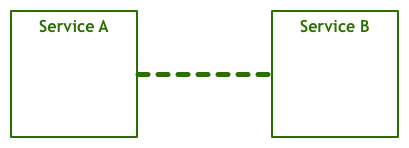
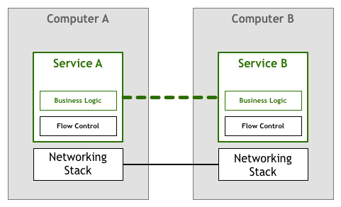
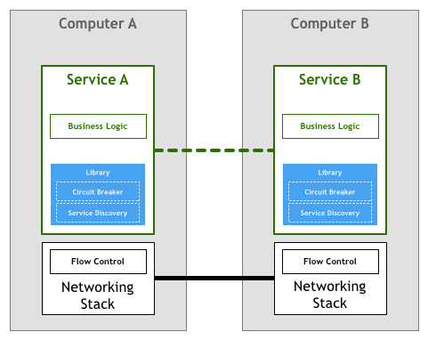

{}
Phil Calçado 编写的博客 Pattern: Service Mesh，这是早期讲述 servicemesh 和 sidecar 最透彻的文章。
{}

## 前言

Pattern: Service Mesh 的英文原文发表于 Phil Calçado 的个人博客网站：

https://philcalcado.com/2017/08/03/pattern_service_mesh.html

网上找到的中文翻译：

- https://segmentfault.com/a/1190000015593617
- http://walkerdu.com/2020/02/26/service_mesh_introduction/
- https://www.sohu.com/a/198248408_355135：相比之下这篇翻译的质量比较好。

以下内容为转载自最后一篇的翻译内容加我的少许修改。

--------

自从几十年前第一次引入分布式系统以来，我们了解到分布式系统能够实现我们以前根本想象不到的用例，但它们也带来了各种新的问题。

当这些系统还很少见和简单的时候，工程师们通过尽量减少远程交互来处理增加的复杂性。处理分布式的最安全方式是尽可能地避免使用分布式，即使这意味着在各个系统中存在重复的逻辑和数据。

但行业需求推动我们前进，分布式系统从几台较大的中央计算机演变为成百上千的小型服务。在这个新的世界里，我们必须解决问题，应对新的挑战和开放性问题，首先是以个案的方式完成的临时解决方案，随后是更复杂的东西。首先，具体问题具体分析，针对某个问题给出有针对性的解决办法，然后再提供更先进更复杂的解决方案。随着我们对问题领域越来越熟悉、提出的解决办法越来越好，我们开始将一些最常见的需求总结归纳为模式、库，以及最终的平台。

## 第一次计算机联网

由于人们首先想到的是让两台或多台电脑相互通讯，因此，他们就设想出了这样的东西：

互相之间可以通讯的两个服务可以满足最终用户的一些需求。但这个示意图显然过于简单了，缺少了包括通过代码操作的字节转换和在线路上收发的电信号转换在内的多个层。虽然，一定程度上的抽象对于我们的讨论是必需的，但还是让我们来添加网络协议栈组件以增加一点细节内容吧：

上述模型的变种自20世纪50年代以来一直使用至今。一开始，计算机很稀少，也很昂贵，所以两个节点之间的每个链接都精心制作和维护。随着计算机变得越来越便宜，越来越流行，连接的数量和通过它们的数据量急剧增加。随着人们越来越依赖网络系统，工程师们需要确保他们构建的软件能够达到用户所要求的服务质量。

而为了达到预期的质量水平，有许多问题急需解决。人们需要找到解决方案让机器互相发现、通过同一条线路同时处理多个连接、允许机器在非直连的情况下互相通信、在网络上路由数据包、加密流量等等。

在这其中，有一种叫做流量控制的东西，下面我们以此为例。流量控制是一种机制，防止服务器发送的数据包超过下游服务器可以承受的上限。这是必要的，因为在一个联网的系统中，你至少有两个不同的、独立的计算机，彼此之间互不了解。计算机A以给定的速率向计算机B发送字节，但不能保证B可以连续地以足够快的速度来处理接收到的字节。例如，B可能正在忙于并行运行其他任务，或者数据包可能不按顺序到达，并且B可能被阻塞以等待本应该先到达的数据包。这意味着A不仅不知道B的预期性能，而且还可能让事情变得更糟，因为这可能会让B过载，B现在必须对所有这些传入的数据包进行排队处理。

一段时间以来，大家寄希望于建立网络服务和应用程序的开发者能够通过编写代码来解决上面提出的挑战。在我们的这个流程控制示例中，应用程序本身必须包含某种逻辑来确保服务不会因为数据包而过载。这种重度联网逻辑与业务逻辑一样重要。在我们的抽象示意图中，它是这样的：

幸运的是，技术的发展日新月异，随着像TCP/IP这样的标准的横空出世，流量控制和许多其他问题的解决方案被融入进了网络协议栈本身。这意味着这些流量控制代码仍然存在，但已经从应用程序转移到了操作系统提供的底层网络层中：

这个模型相当地成功。几乎任何一个组织都能够使用商业操作系统附带的TCP/IP协议栈来驱动他们的业务，即使有高性能和高可靠性的要求。

## 第一次使用微服务

多年以来，计算机变得越来越便宜，并且到处可见，而上面提到的网络协议栈已被证明是用于可靠连接系统的事实上的工具集。随着节点和稳定连接的数量越来越多，行业中出现了各种各样的网络系统，从细粒度的分布式代理和对象到由较大但重分布式组件组成的面向服务的架构。

这样的分布式系统给我们带来了很多有趣的更高级别的案例和好处，但也出现了几个难题。其中一些是全新的，但其他的只是我们在讨论原始网络时遇到难题的更高版本而已。

在90年代，Peter Deutsch和他在Sun公司的同事工程师们撰写了“分布式计算的八大错误”一文，其中列出了人们在使用分布式系统时通常会做出的一些假设。Peter认为，这些假设在更原始的网络架构或理论模型中可能是真实的，但在现代世界中是不成立的：

1. 网络是可靠的
2. 延迟为零
3. 带宽是无限的
4. 网络是安全的
5. 拓扑是不变的
6. 有一个管理员
7. 传输成本为零
8. 网络是同构的

大家把上面这个列表斥为“谬论”，因此，工程师们不能忽视这些问题，必须明确地处理这些问题。

为了处理更复杂的问题，需要转向更加分散的系统（我们通常所说的微服务架构），这在可操作性方面提出了新的要求。之前我们已经详细讨论了一些内容，但下面则列出了一个必须要处理的东西：

1. 计算资源的快速提供
2. 基本的监控
3. 快速部署
4. 易于扩展的存储
5. 可轻松访问边缘
6. 认证与授权
7. 标准化的RPC

因此，尽管数十年前开发的TCP/IP协议栈和通用网络模型仍然是计算机之间相互通讯的有力工具，但更复杂的架构引入了另一个层面的要求，这再次需要由在这方面工作的工程师来实现。

例如，对于服务发现和断路器，这两种技术已用于解决上面列出的几个弹性和分布式问题。

历史往往会重演，第一批基于微服务构建的系统遵循了与前几代联网计算机类似的策略。这意味着落实上述需求的责任落在了编写服务的工程师身上。

服务发现是在满足给定查询条件的情况下自动查找服务实例的过程，例如，一个名叫 Teams 的服务需要找到一个名为 Players 的服务实例，其中该实例的 environment 属性设置为 production。你将调用一些服务发现进程，它们会返回一个满足条件的服务列表。对于更集中的架构而言，这是一个非常简单的任务，可以通常使用DNS、负载均衡器和一些端口号的约定（例如，所有服务将HTTP服务器绑定到8080端口）来实现。而在更分散的环境中，任务开始变得越来越复杂，以前可以通过盲目信任 DNS 来查找依赖关系的服务现在必须要处理诸如客户端负载均衡、多种不同环境、地理位置上分散的服务器等问题。如果之前只需要一行代码来解析主机名，那么现在你的服务则需要很多行代码来处理由分布式引入的各种问题。

断路器是由Michael Nygard在其编写的“Release It”一书中引入的模式。我非常喜欢Martin Fowler对该模式的一些总结：

> 断路器背后的基本思路非常简单。将一个受保护的函数调用包含在用于监视故障的断路器对象中。一旦故障达到一定阈值，则断路器跳闸，并且对断路器的所有后续调用都将返回错误，并完全不接受对受保护函数的调用。通常，如果断路器发生跳闸，你还需要某种监控警报。

这些都是非常简单的设备，它们能为服务之间的交互提供更多的可靠性。然而，跟其他的东西一样，随着分布式水平的提高，它们也会变得越来越复杂。系统发生错误的概率随着分布式水平的提高呈指数级增长，因此即使简单的事情，如“如果断路器跳闸，则监控警报”，也就不那么简单了。一个组件中的一个故障可能会在许多客户端和客户端的客户端上产生连锁反应，从而触发数千个电路同时跳闸。而且，以前可能只需几行代码就能处理某个问题，而现在需要编写大量的代码才能处理这些只存在于这个新世界的问题。

事实上，上面举的两个例子可能很难正确实现，这也是大型复杂库，如 **Twitter 的 Finagle 和 Facebook 的 Proxygen**，深受欢迎的原因，它们能避免在每个服务中重写相同的逻辑。

大多数采用微服务架构的组织都遵循了上面提到的那个模型，如 Netflix、Twitter 和 SoundCloud。随着系统中服务数量的增加，他们发现了这种方法存在着各种弊端。

即使是使用像 Finagle 这样的库，项目团队仍然需要投入大量的时间来将这个库与系统的其他部分结合起来，这是一个代价非常高的难题。根据我在 SoundCloud 和 DigitalOcean 的经验，我估计在100-250人规模的工程师组织中，需要有1/10的人员来构建模型。有时，这种代价很容易看到，因为工程师被分配到了专门构建工具的团队中，但是更多的时候，这种代价是看不见的，因为它表现为在产品研发上需要花费更多的时间。

第二个问题是，上面的设置限制了可用于微服务的工具、运行时和语言。用于微服务的类库通常是为特定平台编写的，无论是编程语言还是像JVM这样的运行时。如果开发团队使用了类库不支持的平台，那么通常需要将代码移植到新的平台。这浪费了本来就很短的工程时间。工程师没办法再把重点放在核心业务和产品上，而是不得不花时间来构建工具和基础架构。那就是为什么一些像 SoundCloud 和 DigitalOcean 这样的中型企业认为其内部服务只需支持一个平台，分别是 Scala 或者 Go。

这个模型最后一个值得讨论的问题是管理方面的问题。类库模型可能对解决微服务架构需求所需功能的实现进行抽象，但它本身仍然是需要维护的组件。必须要确保数千个服务实例所使用的类库的版本是相同的或至少是兼容的，并且每次更新都意味着要集成、测试和重新部署所有服务，即使服务本身没有任何改变。

## 下一个逻辑

类似于我们在网络协议栈中看到的那样，大规模分布式服务所需的功能应该放到底层的平台中。

人们使用高级协议（如HTTP）编写非常复杂的应用程序和服务，甚至无需考虑TCP是如何控制网络上的数据包的。这种情况就是微服务所需要的，那些从事服务开发工作的工程师可以专注于业务逻辑的开发，从而避免浪费时间去编写自己的服务基础设施代码或管理整个系统的库和框架。

将这个想法结合到我们的图表中，我们可以得到如下所示的内容：

不幸的是，通过改变网络协议栈来添加这个层并不是一个可行的任务。许多人的解决方案是通过一组代理来实现。这个的想法是，服务不会直接连接到它的下游，而是让所有的流量都将通过一个小小的软件来透明地添加所需功能。

在这个领域第一个有记载的进步使用了边车（sidecars）这个概念。“边车”是一个辅助进程，它与主应用程序一起运行，并为其提供额外的功能。在2013年， Airbnb 写了一篇有关 Synapse 和 Nerve 的文章，这是“边车”的一个开源实现。一年后，Netflix 推出了 Prana，专门用于让非JVM应用程序从他们的Netflix OSS 生态系统中受益。在 SoundCloud，我们构建了可以让遗留的 Ruby 程序使用我们为JVM微服务构建的基础设施的“边三轮”。

虽然有这么几个开源的代理实现，但它们往往被设计为需要与特定的基础架构组件配合使用。例如，在服务发现方面，Airbnb 的 Nerve 和 Synapse 假设了服务是在 Zookeeper 中注册，而对于 Prana，则应该使用 Netflix 自己的 Eureka 服务注册表。

随着微服务架构的日益普及，我们最近看到了一波新的代理浪潮，它们足以灵活地适应不同的基础设施组件和偏好。 这个领域中第一个广为人知的系统是Linkerd，它由 Buoyant 创建出来，源于他们的工程师先前在 Twitter 微服务平台上的工作。很快，Lyft 的工程团队宣布了 Envoy 的发布，它遵循了类似的原则。

## Service Mesh

在这种模式中，每个服务都配备了一个代理“边车”。由于这些服务只能通过代理“边车”进行通信，我们最终会得到类似于下图的部署方案：

Buoyant的首席执行官威廉·摩根表示，代理之间的互连形成了服务网格。2017年初，威廉写下了这个平台的定义，并称它为服务网格：

> 服务网格是用于处理服务到服务通信的专用基础设施层。它负责通过复杂的服务拓扑来可靠地传递请求。实际上，服务网格通常被实现为与应用程序代码一起部署的轻量级网络代理矩阵，并且它不会被应用程序所感知。

这个定义最强大的地方可能就在于它不再把代理看作是孤立的组件，并承认它们本身就是一个有价值的网络。

随着微服务部署被迁移到更为复杂的运行时中去，如Kubernetes和Mesos，人们开始使用一些平台上的工具来实现网格网络这一想法。他们实现的网络正从互相之间隔离的独立代理，转移到一个合适的并且有点集中的控制面上来。

最近公布的Istio项目是这类系统中最著名的例子。

完全理解服务网格在更大规模系统中的影响还为时尚早，但这种架构已经凸显出两大优势。首先，不必编写针对微服务架构的定制化软件，即可让许多小公司拥有以前只有大型企业才能拥有的功能，从而创建出各种有趣的案例。第二，这种架构可以让我们最终实现使用最佳工具或语言进行工作的梦想，并且不必担心每个平台的库和模式的可用性。
