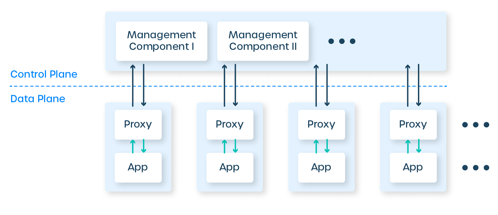
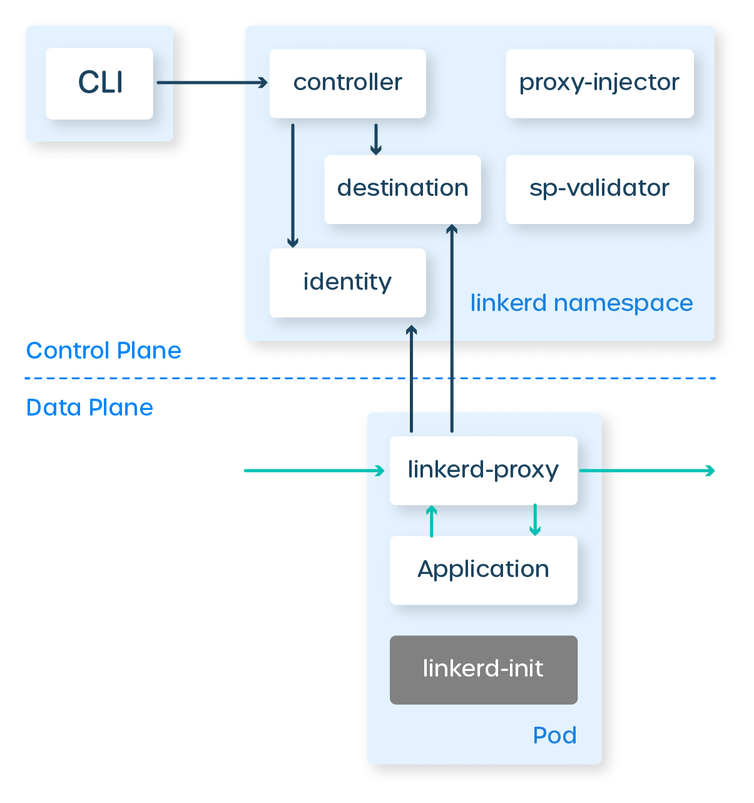

## 前言

**The Service Mesh**

What every software engineer needs to know about the world’s most over-hyped technology

William Morgan, 发表时间未知，从过度炒作这个梗猜测是2021年。

https://buoyant.io/service-mesh-manifesto/

服务网格：每位软件工程师需要了解的世界上最被过度炒作的技术

没找到中文翻译，以下内容为自行翻译。

--------

## 介绍

如果你是工作在后端系统的软件工程师，在过去几年中你可以经常听到"服务网格"这个词。由于一系列奇怪的事件，这个词像一个巨大的雪球一样在行业内滚动，粘附在越来越喧哗的营销和炒作上，并且没有任何迹象表明很快就会停止。

服务网格诞生于云原生生态系统阴暗而充满趋势的水域中，不幸的是，这意味着大量的服务网格内容从 "低营养的废话" 到使用一个技术术语--"基本上是废话"。但是，如果你能穿透所有的噪音，服务网格也有一些真实、具体和重要的价值。

在本指南中，我将尝试这样做：为服务网格提供一个诚实、深入、以工程师为中心的指南。我不仅要介绍什么，还要介绍为什么，以及现在为什么。最后，我将尝试描述为什么我认为这项特殊技术吸引了如此疯狂的炒作，这本身就是一个有趣的故事。

## 我是谁？

大家好,我是威廉-摩根, Linkerd 的创建者之一，Linkerd 是第一个服务网格项目，也是服务网格这个词的诞生地。(对不起！）我也是 Buoyant 的首席执行官，Buoyant是一家创业公司，建立了像 Linkerd 和 Buoyant Cloud 这样很酷的服务网格。

正如你可能想象的那样，我非常有偏见，对这个话题有一些强烈的看法。也就是说，所以我将尽力把社论化的东西降到最低（除了一个部分，"为什么人们对这个问题谈得这么多？"，在那里我将揭开一些观点），我将尽力以尽可能客观的方式来写这个指南。当我需要具体的例子时，我将主要依靠 Linkerd，但当我知道与其他网格实现的差异时，我将会把它们指出来。

好的，现在开始!

## 什么是服务网格？

对于所有的炒作，服务网格是非常简单的。它只不过是一堆用户空间的代理，卡在你的服务的"旁边"（我们稍后会讨论 "旁边" 的意思），加上一套管理流程。代理被称为服务网格的数据平面，而管理进程被称为控制平面。数据平面拦截服务间的调用，并对这些调用进行"处理"；控制平面协调代理的行为，并为运维人员提供API，以操纵和测量整个网格。

这些代理是什么？它们是7层感知的TCP代理，就像 haproxy 和 NGINX 一样。代理的选择各不相同：Linkerd 使用的是 Rust 的"微代理"，简称 `Linkerd-proxy`，是我们专门为服务网格建立的。其他网格使用不同的代理：Envoy是一个常见的选择。但代理的选择是一个实现细节。(2020年1月编辑：请参阅《为什么Linkerd不使用Envoy》以了解为什么 Linkerd 使用 Linkerd2-proxy 而不是 Envoy。)

这些代理是做什么的？当然，他们代理服务的调用。(严格地说，它们既是"代理"，也是"反向代理"，处理传入和传出的调用）。它们实现了一个专注于服务间调用的功能集。这种对服务间流量的关注是服务网格代理与API网关或Ingress代理的不同之处，后者关注从外部世界到整个集群的调用。

所以，这就是数据平面。控制平面更简单：它是一组组件，提供数据平面所需的任何元件，以协调的方式行事，包括服务发现、TLS证书发放、指标汇总等等。数据平面调用控制平面以告知其行为；控制平面反过来提供一个API，允许用户修改和检查整个数据平面的行为。

下面是 Linkerd 的控制平面和数据平面的图示。可以看到，控制平面有几个不同的组件，包括一个小型的Prometheus实例，它从代理处汇总指标数据，以及destination（服务发现）、identity（证书授权）和 public-api（web和CLI终端）等组件。相比之下，数据平面只是应用实例旁边的单个 linkerd-proxy。这只是逻辑图；在部署时，你可能最终会有每个控制平面组件的三个副本，但有数百或数千个数据平面代理。

(这张图中的蓝色方框代表Kubernetes pod的边界。你可以看到，linkerd-proxy 容器实际上与应用容器运行在同一个pod中。这种模式被称为sidecar容器。)

服务网格有几个重要的影响。首先，由于代理功能集是为服务间调用而设计的，服务网格只有在你的应用被构建为服务时才有意义。你可以把它用在单体上，但要运行一个代理就需要大量的机器，而且功能集也不是很合适。

另一个结果是，服务网格将需要很多很多的代理。事实上，Linkerd 为每个服务的每个实例添加一个 linkerd-proxy。(其他一些网格的实现也会为每个节点/主机/虚拟机添加一个代理。无论哪种方式都是很多的）。) 这种大量使用代理的做法本身就有一些影响：

- 不管这些数据平面代理是什么，它们一定要快。每一次调用都会增加两跳，一个在客户端，一个在服务器端。

- 另外，代理需要小而轻。每一个代理都会消耗内存和CPU，而且这种消耗会随着你的应用线性扩展。

- 需要一个系统来部署和更新大量的代理。你不希望必须用手来做这件事。

但是，至少在10,000英尺的水平上，这就是服务网格的全部内容：部署了大量的用户空间代理来对内部的、服务间流量进行"处理"，使用控制平面来改变它们的行为并查询它们产生的数据。

现在让我们继续讨论为什么。

## 为什么服务网格有意义？

如果你是第一次遇到服务网格的想法，你可以原谅你的第一反应是轻微的惊恐。服务网格的设计意味着它不仅会给你的应用程序增加延迟，还会消耗资源，而且还会引入一大堆机器。前一分钟你还在安装一个服务网格，后一分钟你就突然要负责操作成百上千的代理。为什么会有人想这么做呢？

答案有两部分。首先，由于生态系统正在发生一些其他变化，部署这些代理的运营成本可以大大降低。关于这一点，后面还有更多内容。

更重要的答案是，这种设计实际上是将额外的逻辑引入系统的一个好方法。这不仅是因为有大量的功能你可以在那里添加，而且还因为你可以在不改变生态系统的情况下添加它们。事实上，整个服务网格模型是建立在这个洞察力之上的：在一个多服务系统中，无论单个服务实际做什么，它们之间的流量是一个理想的功能插入点。

例如，Linkerd，像大多数网格一样，有一个第七层的功能集，主要集中在HTTP调用，包括HTTP/2和gRPC：

1. **可靠性特性**：请求重试、超时、金丝雀（流量拆分/转移）等。

2. **可观察性特性**：每个服务或单个路由的成功率、延迟和请求量的汇总；服务拓扑图的绘制；等等。

3. **安全特性**：双向TLS、访问控制等。

这些功能中有许多是在请求层面操作的（因此是"L7代理"）。例如，如果服务 Foo 对服务 Bar 进行HTTP调用，Foo 一方的 `linkerd-proxy` 可以根据观察到的每个实例的延迟，在 Bar 的所有实例中智能地平衡该调用；如果请求失败，它可以重试，如果它是幂等的；它可以记录响应代码和延迟；等等。同样地，Bar那边的 `linkerd-proxy` 可以拒绝调用，如果它不被允许，或者超过了速率限制；它可以从自己的角度记录延迟；等等。

代理人也可以在连接层面上"做事情"。例如，Foo 的 `linkerd-proxy` 可以启动TLS连接，Bar 的 `linkerd-proxy` 可以终止它，而且双方都可以验证对方的TLS证书。这不仅提供了服务间的加密，而且提供了服务身份的加密安全形式--Foo和Bar可以"证明"它们是它们所说的人。

不管是在请求层面还是在连接层面，需要注意的重要问题是，服务网格的功能都是操作性的。Linkerd 中没有任何关于转换请求有效载荷语义的内容，例如，向JSON blob 添加字段或转换 protobuf。这是一个重要的区别，当我们谈论 ESB 和中间件时，会再次触及。

所以，这就是服务网格可以提供的一系列功能。但为什么不直接在应用程序中实现它们呢？为什么还要麻烦代理呢？

## 为什么服务网格是个好主意？

虽然功能集很有趣，但服务网格的核心价值其实并不在功能上。毕竟，我们可以直接在应用程序本身中实现这些功能。(事实上，我们将在后面看到这是服务网格的起源。) 如果我不得不把它归结为一句话，服务网格的价值可以归结为以下几点：**服务网格提供了对运行现代服务器端软件至关重要的功能，这些功能在堆栈中是统一的，并与应用程序代码解耦。**

让我们一点一点地看。

**对运行现代服务器端软件至关重要的功能。**如果你正在构建一个连接到公共互联网的事务性服务器端应用程序，接受来自外部世界的请求，并在较短的时间内对其作出响应--想想Web应用、API服务器和大部分现代服务器端软件--如果你正在将这个系统作为一个服务的集合，以同步的方式相互交谈，如果你正在不断地修改这个软件以增加更多的功能，如果你的任务是在修改这个系统的同时保持其运行，那么恭喜你，你正在构建现代服务器端软件。而上面列出的所有这些光荣的功能实际上对你来说都是至关重要的。该应用程序必须是可靠的；必须是安全的；而且必须能够观察到它在做什么。而这正是服务网格能提供帮助的地方。

(好吧，我在这里偷偷地说了一个观点：这种方法是构建服务器端软件的现代方式。今天世界上有一些人正在构建单体或 "反应式微服务" 以及其他不符合上述定义的东西，他们持有不同的观点。)

**在堆栈中是统一的**。服务网格不仅仅提供关键的功能，它们还能适用于应用程序中的每一个服务，无论服务是用什么语言编写的，使用什么框架，由谁编写，如何部署，或任何其他开发或部署的细节。

**与应用程序代码解耦**。最后，服务网不只是在你的堆栈中统一提供功能，它是以一种不需要改变应用的方式提供的。服务网格功能的基本所有权--包括配置、更新、操作、维护等方面的操作所有权--纯粹是在平台层面，独立于应用程序。应用程序可以在不涉及服务网格的情况下改变，而服务网格也可以在不涉及应用程序的情况下改变。

简而言之：服务网格不仅提供重要的功能，而且是以一种全局的、统一的、独立于应用程序的方式提供的。因此，尽管服务网格的功能可以在服务代码中实现（甚至作为一个库被链接到每个服务中），但这种方法不会提供解耦和统一性，而这正是服务网格价值的核心所在。

而你所要做的就是增加大量的代理! 我保证，我们很快就会讨论增加所有这些代理的运营成本。但首先，我们需要稍息，从人的角度来研究这个解耦的想法。

## 服务网格能帮助谁？

尽管可能很不方便，但事实证明，为了使技术真正产生影响，它必须被人类采用。那么，谁采用了服务网格？谁会从中受益？

如果你正在构建我上面所说的现代服务器软件，你可以大致认为你的团队分为服务所有者和平台所有者，前者从事构建业务逻辑的工作，后者则是构建这些服务所运行的内部平台。在小型组织中，这些人可能是同一个人，但随着组织规模的扩大，这些角色通常会变得更加明确，甚至进一步细分。(这里还有很多关于devops的变化性质、微服务的组织影响等的内容。但现在让我们把这些描述作为一个既定的事实）。)

从这个角度看，服务网格的直接受益者是平台所有者。毕竟，平台团队的目标是建立内部平台，让服务所有者可以在上面运行他们的业务逻辑，并且以一种让服务所有者尽可能独立于操作细节的方式来实现。服务网格不仅提供对实现这一目标至关重要的功能，而且其方式不会反过来引起对服务所有者的依赖。

服务所有者也受益，尽管是以更间接的方式。服务所有者的目标是在构建业务逻辑时尽可能地富有成效，而他们需要担心的运维机制越少，就越容易实现。他们不需要为实施重试策略或TLS而操心，而是可以纯粹地关注业务逻辑问题，并相信平台会处理好其他问题。这对他们来说也是一个很大的好处。

平台和服务所有者之间解耦的组织价值怎么强调都不过分。事实上，我认为这可能是服务网格有价值的关键原因。

当我们最早的 Linkerd 采用者之一告诉我们他们采用服务网格的原因时，我们学到了这个教训：因为它允许他们 "不必与人交谈"。这是一家大公司的平台团队，正在向 Kubernetes 迁移。由于他们的应用程序处理敏感信息，他们希望对集群上的所有通信进行加密。有数百个服务和数百个开发团队，他们不希望说服每个开发团队将 TLS 添加到他们的路线图中。通过安装 Linkerd，他们将该功能的所有权从开发人员手中转移到了平台团队手中，因为对他们来说，这是一个强加的任务。Linkerd 并没有为他们解决一个技术问题，而是解决了一个组织问题。

简而言之，服务网格与其说是一个技术问题的解决方案，不如说是一个社会技术问题的解决方案。

## 服务网格是否能解决我所有的问题？

是的。呃，不是!

如果你看一下上面概述的三类功能--可靠性、安全性和可观察性--应该很清楚，服务网格不是这些领域的完整解决方案。虽然 Linkerd 可以在知道请求是无效的情况下重试，但它不能决定在服务完全中断的情况下向用户返回什么--应用程序必须做出这些决定。虽然 Linkerd 可以报告成功率等，但它不能查看服务内部并报告内部指标--应用程序必须有工具。虽然 Linkerd 可以 "免费" 做双向TLS这样的事情，但安全解决方案的内容远不止这些。

在这些领域中，服务网格提供的功能子集是属于平台功能的。我的意思是这些功能：

1. **独立于业务逻辑**。为 Foo 和 Bar 之间的调用计算流量延迟直方图的方式与 Foo 首先调用 Bar 的原因完全无关。

2. **难以正确实现**。Linkerd的重试是用重试预算等复杂的东西来设置参数的，因为对重试的天真做法是导致 "重试风暴" 和其他分布式系统故障模式的必经之路。

3. **统一实施时最有效**。互相TLS的机制只有在每个人都在做的时候才真正有意义。

因为这些功能是在代理层实现的，而不是在应用层，服务网格在平台而不是应用层面提供这些功能。服务用什么语言编写，或使用什么框架，或由谁编写，或如何得到的，都不重要。代理的功能独立于所有这些，而且这种功能的所有权--包括配置、更新、操作、维护等方面的操作所有权--纯粹是在平台层面。

## 服务网格的示例特征

|                    | 可观察性             | 可靠性                   | 安全性                     |
| :----------------- | :------------------- | :----------------------- | :------------------------- |
| 服务网格           | 服务成功率           | 请求重试                 | 所有服务之间都是双向TLS    |
| 平台（非服务网格） | 日志聚合             | 数据集的多个副本         | 静止状态下的数据加密       |
| 应用程序           | 内部功能使用的仪表化 | 处理整个组件宕机时的故障 | 确保用户只能访问自己的数据 |

总结：服务网格并不是可靠性、或可观察性、或安全性的完整解决方案。这些领域更广泛的所有权必然涉及服务所有者、运维和SRE团队以及组织的其他部分。服务网格只能提供每个领域的平台层"切片"。

## 为什么服务网格现在有意义了？

在这一点上，你可能会对自己说：好吧，如果这个服务网格的东西这么棒，为什么十年前我们没有在我们的堆栈中玩转数百万个代理？

对此有一个浅显的答案，那就是十年前大家都在构建单体，所以没有人需要服务网格。这是事实，但我认为忽略了问题的关键。甚至在十年前，"微服务"的概念作为构建大规模系统的可行方式被广泛讨论，并在 Twitter、Facebook、Google 和 Netflix 等公司公开付诸实践。至少在我所接触到的部分行业中，普遍的看法是，微服务是构建大规模系统的"正确方式"，即使它们做起来真的很痛苦。

当然，虽然十年前就有公司在运维微服务，但他们基本上没有到处安装代理来形成服务网格。不过，如果你仔细观察，他们在做一些相关的事情：许多这些组织强制要求使用特定的内部库来进行网络通信（有时称为"胖客户端"库）。Netflix 有 Hysterix，谷歌有 Stubby 库，而 Twitter 有 Finagle。例如，Finagle 是 Twitter 的每项新服务都必须使用的，它同时处理客户端和服务器端的连接，并实现重试、请求路由、负载平衡和仪表等。它为整个 Twitter 堆栈提供了一个一致的可靠性和可观察性层，与服务本身的实际工作无关。当然，它只适用于JVM语言，而且它有一个编程模型，你必须围绕它建立整个应用程序，但它提供的操作功能几乎与服务网格的功能完全相同。

因此，十年前，我们不仅有了微服务，还有了原生的服务网格库，解决了许多今天服务网格所解决的问题。但我们还没有服务网格。首先需要改变一些别的东西。

而这正是更深层次的答案所在，它埋藏在过去十年发生的另一个差异中：部署微服务的成本大幅降低。我在上面列出的那些十年前公开使用微服务的公司--Twitter、Netflix、Facebook、Google--都是规模巨大、资源丰富的公司。他们不仅有需求，而且有人才来构建、部署和运维重要的微服务应用。Twitter从单体迁移到微服务所花费的工程时间和精力之多，让人难以想象。

对比今天，你可能会遇到微服务与开发人员比例为5:1甚至10:1的初创公司，更重要的是，他们有能力处理这个问题。如果运行50个微服务对于一个5人的初创公司来说是一个合理的方法，那么显然有什么东西降低了采用微服务的成本。

> 备注：这张图片来自 https://twitter.com/JackKleeman/status/1190407465659183104，在 monzo 有1500个微服务，150个工程师，蓝色线条代表容许网络规则容许的流量。

微服务运维成本的大幅降低的结果是：容器和容器编排器的采用率上升。而这正是什么变化使服务网格得以实现这一问题的更深层次答案所在。使得服务网格在运维上可行的，也使得微服务在运维上可行的东西是：Kubernetes 和 Docker。

为什么？嗯，Docker解决了一件大事：打包问题。通过允许将应用及其（非网络）运行时的依赖打包到一个容器中，应用现在是一个可替换的单元，可以被扔到任何地方并运行。同样，Docker使运行多语言堆栈变得更加容易：因为容器是原子执行单元，对于部署和操作来说，容器内是什么并不重要，不管它是JVM应用还是Node应用，还是Go、Python或Ruby。你只需运行它。

Kubernetes解决了下一步的问题：现在我有一堆"可执行的东西"，我也有一堆"可以执行这些可执行的东西"（也就是机器），我需要它们之间的映射关系。从广义上讲，你给 Kubernetes 一堆容器和一堆机器，它就能找出这种映射。(当然，这是一个动态的和不断变化的东西，因为新的容器在系统中滚动，机器进入和退出操作，等等。但是，Kubernetes会把它弄清楚。)

一旦有了 Kubernetes，运行一个服务的部署时间成本与运行十个服务没有太大区别，实际上与100个服务没有太大区别。结合容器作为鼓励多语言实现的打包机制，结果是大量的新应用被实现为用各种语言编写的微服务--正是服务网格最适合的环境。

因此，最后我们来看看为什么服务网格现在是可行的：Kubernetes为服务提供的统一性也直接适用于服务网格的运维挑战。把代理打包到容器中，告诉Kubernetes把它们贴在任何地方，然后就可以了！你得到了一个服务网格，所有的部署时间机制都由Kubernetes为你处理。

总结一下：与10年前相比，现在的服务网格之所以有意义，是因为 Kubernetes 和 Docker 的兴起不仅极大地增加了运行服务网格的需求，使你的应用可以轻松地构建成一个多角化的微服务架构，而且通过提供部署和维护 sidecar 代理机群的机制，极大地降低了运行服务网格的成本。

## 为什么人们对服务网格谈论得如此之多？

内容警告：在本节中，我采用了推测、猜想、仅是个人观点。

人们只需要搜索"服务网格"，就会遇到一个kafka式的热梦景观，充斥着了混乱的项目、低热量的循环内容和普遍的回声室扭曲。所有闪亮的新技术都有一定程度的这种情况，但服务网格似乎特别糟糕。为什么会这样？

嗯，部分原因是我的错。我已经尽了最大的努力，一有机会就谈论 Linkerd 和服务网格，在无数的博客文章、播客和像这样的文章中。但我并没有那么强大。要真正回答这个问题，我必须谈一谈服务网格。如果不谈一个特别的项目，就不可能谈及这个景观。Istio是一个开源的服务网格，是谷歌、IBM和Lyft之间的合作。

Istio 的显著之处在于两点。首先，谷歌在其背后付出了巨大的营销努力。据我估计，今天知道这个服务网格的大多数人都是通过Istio介绍的。第二件了不起的事情是Istio的反响有多差。显然，我在利益相关者，但在我看来，Istio已经形成了相当大的公众反响，这对一个开源项目来说是不常见的（虽然不是闻所未闻的）。

撇开我的个人理论不谈，我相信谷歌的参与才是服务网格被炒得如此火热的真正原因。具体来说，a）Istio被谷歌大力推广；b）其相应的乏善可陈；以及 c）最近Kubernetes的陨落让每个人都记忆犹新，这些因素结合在一起，形成了一种令人陶醉的无氧环境，理性思考的能力被扼杀，只剩下一种奇怪的云原生郁金香狂热。

当然，从 Linkerd 的角度来看，这是......我想我会将其描述为一种混合的祝福。我的意思是，现在服务网格是一个"东西"，这很好--2016年Linkerd刚刚起步时，情况并非如此，而且真的很难让人注意到。我们现在没有这个问题了！但糟糕的是，服务网格如此混乱，甚至很难理解哪些项目是服务网格，更不用说哪个项目最适合你的用例。这对每个人都是一种伤害。(当然，在某些情况下，Istio或其他项目会是比Linkerd更正确的选择--它远不是一个万能的解决方案。)

在Linkerd方面，我们的策略是忽略这些噪音，继续专注于为我们的社区解决真正的问题，并基本上等待整个事情的结束。炒作的程度最终会消退，我们都可以继续我们的生活。

不过，在此期间，我们都将不得不一起承受这一切。

## 那么...我，一个卑微的软件工程师，应该关心服务网格吗？

如果你是一个软件工程师，以下是我对你是否应该关心服务网的基本评判标准。

**如果你是一个纯粹的业务逻辑实施的开发者角色**。不，你真的不需要关心服务网。我的意思是，我们当然欢迎你去关心，但理想情况下，服务网格不会直接影响你的生活。继续建立甜蜜的商业逻辑，让你周围的人都得到报酬。

**如果你在一个正在使用Kubernetes的组织中担任平台角色**。是的，你100%应该关心。除非你采用K8s纯粹是为了运行一个单体或做批处理（在这种情况下，我会认真地问为什么要用K8s），否则你最终会遇到这样的情况：你有很多微服务，都是由其他人编写的，都在相互访问，都被捆绑在一起，成为一个运行时依赖的邪恶捆绑，你需要一种方法来处理这些。由于你是在Kubernetes上，你将有几个服务网格的选择，你应该对哪些服务网格，甚至你是否想要任何一个服务网格有一个明智的看法。(从Linkerd开始)

**如果你在一个不使用Kubernetes的组织中担任平台角色，但却在"做微服务"**。是的，你应该关心，但这将是复杂的。当然，你可以通过在各处部署大量的代理来获得服务网格的价值，但Kubernetes的优点是部署模式，如果你必须自己管理这些代理，你的投资回报率方程将看起来非常不同。

**如果你在一个"做单体"的组织中担任平台角色**。不，你可能不需要关心。如果你正在运维一个单体，甚至是一个"单体的集合"，有明确的和不经常变化的通信模式，那么服务网格不会增加很多，你可以忽略它并希望它消失。

## 结论

服务网格可能实际上并不拥有 "世界上最被过度炒作的技术" 的称号--这个可疑的称号可能是属于比特币或人工智能。也许它只是排在前五名。但是，如果你能穿过层层噪音，对于在Kubernetes上构建应用程序的人来说，有一些真正的价值可以利用。

最后，我很想让你试试 Linkerd--在Kubernetes集群上安装它应该需要60秒，甚至只是在你的笔记本电脑上安装一个Minikube，你可以自己看看我到底在说什么。

