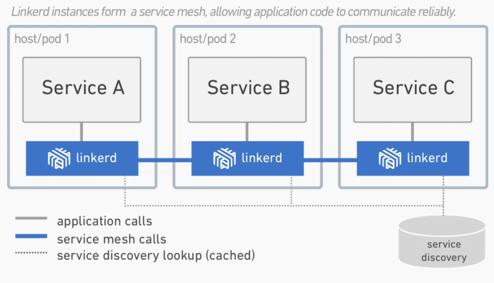

## 前言

**What’s a service mesh? And why do I need one?**

William Morgan, 发表于2017年4月24日

https://buoyant.io/what-is-a-service-mesh

https://linkerd.io/2017/04/25/whats-a-service-mesh-and-why-do-i-need-one/

中文翻译 by 薛命灯

https://www.infoq.cn/news/2017/11/WHAT-SERVICE-MESH-WHY-NEED/

--------

Service Mesh（服务网格）是一个基础设施层，让服务之间的通信更安全、快速和可靠。如果你在构建云原生应用，那么就需要 Service Mesh。

在过去的一年中，Service Mesh 已经成为云原生技术栈里的一个关键组件。很多拥有高负载业务流量的公司都在他们的生产应用里加入了 Service Mesh，如 PayPal、Lyft、Ticketmaster 和 Credit Karma 等。今年一月份，Service Mesh 组件 Linkerd 成为 CNCF（Cloud Native Computing Foundation）的官方项目。不过话说回来，Service Mesh 到底是什么？为什么它突然间变得如此重要？

在这篇文章里，我将给出 Service Mesh 的定义，并追溯过去十年间 Service Mesh 在应用架构中的演变过程。我会解释 Service Mesh 与 API 网关、边缘代理（Edge Proxy）和企业服务总线之间的区别。最后，我会描述 Service Mesh 将何去何从以及我们可以作何期待。

## 什么是 Service Mesh？

Service Mesh 是一个基础设施层，用于处理服务间通信。云原生应用有着复杂的服务拓扑，Service Mesh 保证请求可以在这些拓扑中可靠地穿梭。在实际应用当中，Service Mesh 通常是由一系列轻量级的网络代理组成的，它们与应用程序部署在一起，但应用程序不需要知道它们的存在。

随着云原生应用的崛起，Service Mesh 逐渐成为一个独立的基础设施层。在云原生模型里，一个应用可以由数百个服务组成，每个服务可能有数千个实例，而每个实例可能会持续地发生变化。服务间通信不仅异常复杂，而且也是运行时行为的基础。管理好服务间通信对于保证端到端的性能和可靠性来说是非常重要的。

## Service Mesh 是一种网络模型吗？

Service Mesh 实际上就是处于 TCP/IP 之上的一个抽象层，它假设底层的 L3/L4 网络能够点对点地传输字节（当然，它也假设网络环境是不可靠的，所以 Service Mesh 必须具备处理网络故障的能力）。

从某种程度上说，Service Mesh 有点类似 TCP/IP。TCP 对网络端点间传输字节的机制进行了抽象，而 Service Mesh 则是对服务节点间请求的路由机制进行了抽象。Service Mesh 不关心消息体是什么，也不关心它们是如何编码的。应用程序的目标是“将某些东西从 A 传送到 B”，而 Service Mesh 所要做的就是实现这个目标，并处理传送过程中可能出现的任何故障。

与 TCP 不同的是，Service Mesh 有着更高的目标：为应用运行时提供统一的、应用层面的可见性和可控性。Service Mesh 将服务间通信从底层的基础设施中分离出来，让它成为整个生态系统的一等公民——它因此可以被监控、托管和控制。

## Service Mesh 可以做什么？

在云原生应用中传输服务请求是一项非常复杂的任务。以[ Linkerd ](https://linkerd.io/?__hstc=9342122.7fc40e795bc41e98c124e7eafc8390e9.1505880836696.1506500063447.1506583708581.5&__hssc=9342122.2.1506583708581&__hsfp=1652785730)为例，它使用了一系列强大的技术来管理这种复杂性：回路断路器、负载均衡、延迟感知、最终一致性服务发现、重试和超时。这些技术需要组合在一起，并互相协调，它们与环境之间的交互也非常微妙。

举个例子，当一个请求流经 Linkerd 时，会发生如下的一系列事件。

1. Linkerd 根据动态路由规则确定请求是发给哪个服务的，比如是发给生产环境里的服务还是发给 staging 环境里的服务？是发给本地数据中心的服务还是发给云端的服务？是发给最新版本的服务还是发给旧版本的服务？这些路由规则可以动态配置，可以应用在全局的流量上，也可以应用在部分流量上。
2. 在确定了请求的目标服务后，Linkerd 从服务发现端点获取相应的服务实例。如果服务实例的信息出现了偏差，Linkerd 需要决定哪个信息来源更值得信任。
3. Linkerd 基于某些因素（比如最近处理请求的延迟情况）选择更有可能快速返回响应的实例。
4. Linkerd 向选中的实例发送请求，并把延迟情况和响应类型记录下来。
5. 如果选中的实例发生宕机、没有响应或无法处理请求，Linkerd 就把请求发给另一个实例（前提是请求必须是幂等的）。
6. 如果一个实例持续返回错误，Linkerd 就会将其从负载均衡池中移除，并在稍后定时重试（这个实例有可能只是临时发生故障）。
7. 如果请求超时，Linkerd 会主动放弃请求，不会进行额外的重试。
8. Linkerd 以度量指标和分布式日志的方式记录上述各种行为，然后将度量指标发送给中心度量指标系统。

除此之外，Linkerd 还能发起和终止 TLS、执行协议升级、动态调整流量、在数据中心之间进行失效备援。

Linkerd 的这些特性可以保证局部的弹性和应用层面的弹性。大规模分布式系统有一个共性：局部故障累积到一定程度就会造成系统层面的灾难。Service Mesh 的作用就是在底层系统的负载达到上限之前通过分散流量和快速失效来防止这些故障破坏到整个系统。

## 为什么我们需要 Service Mesh？

Service Mesh 并非新出现的功能。一直以来，Web 应用程序需要自己管理复杂的服务间通信，从过去十多年间应用程序的演化就可以看到 Service Mesh 的影子。

2000 年左右的中型 Web 应用一般使用了三层模型：应用逻辑层、Web 服务逻辑层和存储逻辑层。层与层之间的交互虽然也不算简单，但复杂性是很有限的，毕竟一个请求最多只需要两个跳转。虽然这里不存在“网格”，但仍然存在跳转通信逻辑。

随着规模的增长，这种架构就显得力不从心了。像 Google、Netflix、Twitter 这样的公司面临着大规模流量的挑战，他们实现了一种高效的解决方案，也就是云原生应用的前身：应用层被拆分为多个服务（也叫作微服务），这个时候层就变成了一种拓扑结构。这样的系统需要一个通用的通信层，以一个“富客户端”包的形式存在，如 Twitter 的[ Finagle ](https://twitter.github.io/finagle/)、Netflix 的[ Hystrix ](https://github.com/Netflix/Hystrix)和 Google 的 Stubby。

一般来说，像 Finagle、Stubby 和 Hystrix 这样的包就是最初的 Service Mesh。云原生模型在原先的微服务模型中加入了两个额外的元素：容器（比如 Docker）和编排层（如 Kubernetes）。容器提供了资源隔离和依赖管理，编排层对底层的硬件进行抽象池化。

这三个组件让应用程序在云环境中具备了伸缩能力和处理局部故障的能力。但随着服务和实例的数量增长，编排层需要无时不刻地调度实例，请求在服务拓扑间穿梭的路线也变得异常复杂，再加上可以使用任意语言来开发不同的服务，所以之前那种“富客户端”包的方式就行不通了。

这种复杂性和迫切性催生了服务间通信层的出现，这个层既不会与应用程序的代码耦合，又能捕捉到底层环境高度动态的特点，它就是 Service Mesh。

## Service Mesh 的未来

尽管 Service Mesh 在云原生系统方面的应用已经有了快速的增长，但仍然存在巨大的提升空间。无服务器 (Serverless) 计算（如 Amazon 的 Lambda）正好需要 Service Mesh 的命名和链接模型，这让 Service Mesh 在云原生生态系统中的角色得到了彰显。服务识别和访问策略在云原生环境中仍显初级，而 Service Mesh 毫无疑问将成为这方面不可或缺的基础。就像 TCP/IP 一样，Service Mesh 将在底层基础设施这条道上更进一步。

## 结论

Service Mesh 是云原生技术栈中一个非常关键的组件。Linkerd 项目在启动一年多之后正式成为 CNCF 的官方项目，并拥有了众多的贡献者和用户。Linkerd 的用户横跨初创公司（如 Monzo）到大规模的互联网公司（如 PayPal、Ticketmaster、Credit Karma），再到拥有数百年历史的老牌公司（如 Houghton Mifflin Harcourt）。

