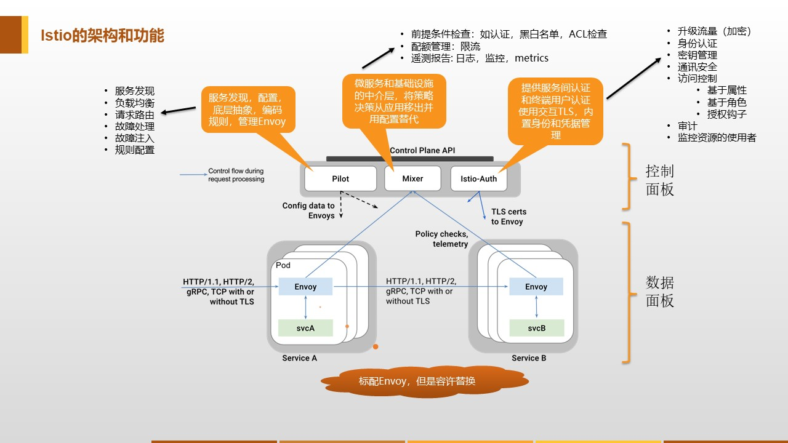

在前面的章节中，我们详细介绍了Service Mesh是什么，能解决什么问题，是如何一步一步演进而来，也给大家详细介绍了当前Service Mesh的主要产品和市场竞争情况。现在我们开始将关注点放在Istio这个开源项目上，详细给大家介绍Istio的架构和各个主要组件的功能，帮忙大家进一步深入了解Service Mesh技术。

## Istio是什么？

Istio是Google/IBM/Lyft联合开发的开源Service Mesh项目，官方文档对Istio的定义为:

**Istio：一个连接，管理和保护微服务的开放平台。**

在前面的Service Mesh介绍内容中，我们已经了解到Istio的很多信息，总结一下：

- Istio是Google主导的第二代Service Mesh产品，和第一代的Linkerd、Envoy最大的不同是引入了控制平面，功能强大
- Istio在2017年5月发布第一个版本0.1.0，在2018年6月底发布1.0.0版本，目前准备发布1.1.0版本，产品已经接近成熟。
- Istio在Service Mesh市场竞争中占据优势，有望成为下一代微服务开发的主流技术

## Istio有哪些功能？

按照官方文档的描述，Istio的主要功能是连接、保护、控制和观测服务：

- 连接：智能控制服务之间的流量和 API 调用，进行一系列测试，并通过红/黑部署逐步升级。
- 保护：通过托管身份验证、授权和服务之间通信加密自动保护您的服务。
- 控制：应用策略并确保其执行使得资源在消费者之间公平分配。
- 观测：通过丰富的自动跟踪、监控和记录所有服务，了解正在发生的情况。

下图简单列举了Istio的主要功能列表：

后面章节会详细介绍Istio的核心功能。

## Istio的设计目标

了解Istio的设计目标，对了解Istio的设计思路和使用方式会有很大帮助，以下内容摘自Istio官方文档：

Istio 的架构设计中有几个关键目标，这些目标对于使系统能够应对大规模流量和高性能地服务处理至关重要。

- **最大化透明度**：若想 Istio 被采纳，应该让运维和开发人员只需付出很少的代价就可以从中受益。为此，Istio 将自身自动注入到服务间所有的网络路径中。Istio 使用 sidecar 代理来捕获流量，并且在尽可能的地方自动编程网络层，以路由流量通过这些代理，而无需对已部署的应用程序代码进行任何改动。在 Kubernetes中，代理被注入到 pod 中，通过编写 iptables 规则来捕获流量。注入 sidecar 代理到 pod 中并且修改路由规则后，Istio 就能够调解所有流量。这个原则也适用于性能。当将 Istio 应用于部署时，运维人员可以发现，为提供这些功能而增加的资源开销是很小的。所有组件和 API 在设计时都必须考虑性能和规模。
- **增量**：随着运维人员和开发人员越来越依赖 Istio 提供的功能，系统必然和他们的需求一起成长。虽然我们期望继续自己添加新功能，但是我们预计最大的需求是扩展策略系统，集成其他策略和控制来源，并将网格行为信号传播到其他系统进行分析。策略运行时支持标准扩展机制以便插入到其他服务中。此外，它允许扩展词汇表，以允许基于网格生成的新信号来执行策略。
- **可移植性**：使用 Istio 的生态系统将在很多维度上有差异。Istio 必须能够以最少的代价运行在任何云或预置环境中。将基于 Istio 的服务移植到新环境应该是轻而易举的，而使用 Istio 将一个服务同时部署到多个环境中也是可行的（例如，在多个云上进行冗余部署）。
- **策略一致性**：在服务间的 API 调用中，策略的应用使得可以对网格间行为进行全面的控制，但对于无需在 API 级别表达的资源来说，对资源应用策略也同样重要。例如，将配额应用到 ML 训练任务消耗的 CPU 数量上，比将配额应用到启动这个工作的调用上更为有用。因此，策略系统作为独特的服务来维护，具有自己的 API，而不是将其放到代理/sidecar 中，这容许服务根据需要直接与其集成。

为了帮助大家更好的理解，结合实践情况和对这几个设计目标的感悟，个人点评如下：

- **最大化透明度**：还记得Service Mesh定义中的**对应用程序透明**吗？为了不侵入应用程序，而又能将客户端发出的请求进行转发，需要完成的第一件事情就是捕获流量，或者更直白一些，劫持流量，即将客户端发出的请求劫持到sidecar的端口上。为了保证性能，避免应用程序和代理之间出现远程网络通讯的开销，这些sidecar是以一对一的方式和应用程序一起部署然后通过localhost进行调用，这也就是Service Mesh定义中的**轻量级网络代理**的含义。Istio在实践中，是通过自动在应用所在的pod中诸如sidecar并修改 iptables 规则来实现。这个方式当然有一些诟病，后续可能会尝试改良，比如引入Cilium和eBPF技术。
- **增量**：这是在讨论可扩展性，虽然Istio本身已经原生提供了非常丰富的功能，但是考虑到实际需求尤其各种集成类需求，提供额外的扩展机制比必须的。Istio在扩展性上做的非常好，甚至有些好的过头，以至于影响到性能。后面在介绍Mixer模式时会介绍如何扩展策略系统。
- **可移植性**：不得不说，虽然Istio在设计目标中明确的提出要能够以最少的代价运行在任何云或预置环境中，但是实践中，在k8s以外的环境下要运行Istio是件非常不容易的事情，至少当前1.0版本的Istio基本上还是k8s only的状态。当然Istio在设计上还是充分考虑了移植到k8s环境外的场景，比如Pilot模块的Platform Adapter设计，但是在实施中，当前的Istio版本的实际表现离这个设计目标还有很大的差距。
- **策略一致性**：解释了对资源应用策略的重要性。但是结论是不应该将策略系统放到sidecar中，有些牵强。不过这一点涉及到策略系统架构设计的深层思考，刚接触Istio的同学不必深究。

虽然这几个设计目标在实践中有些小的偏差，不过整体上看Istio还是在设计和架构上对这几个目标有深入的考量。

下一章我们详细介绍Istio的架构设计和核心组件。