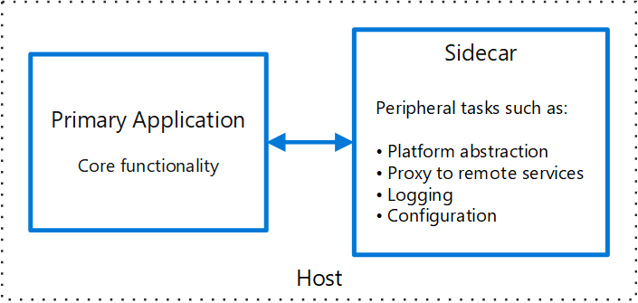

## 前言

https://docs.microsoft.com/en-us/azure/architecture/patterns/sidecar

网上没找到的中文翻译，以下是自行翻译。

--------

## Sidecar 模式

将应用程序的组件部署到单独的进程或容器中，以提供隔离和封装。这种模式也可以使应用程序由异构的组件和技术组成。

这种模式被命名为 Sidecar，因为它类似于连接在摩托车上的边车。在该模式中，sidecar 连接到父级应用，并为该应用提供支持功能。sidecar 与父级应用共享相同的生命周期，与父级应用一起被创建和销毁。sidecar 模式有时被称为 sidekick 模式，是一种解耦模式。

## 上下文和问题

应用程序和服务经常需要相关的功能，如监控、日志、配置和网络服务。这些外围任务可以实现为独立的组件或服务。

如果它们被紧密地集成到应用程序中，它们可以与应用程序在同一进程中运行，有效地利用共享资源。然而，这也意味着它们没有被很好地隔离，其中一个组件的中断会影响其他组件或整个应用程序。另外，它们通常需要使用与父级应用相同的语言来实现。因此，组件和应用程序之间有密切的相互依赖关系。

如果应用程序被分解成服务，那么每个服务可以使用不同的语言和技术来构建。虽然这提供了更多的灵活性，但这意味着每个组件都有自己的依赖关系，需要特定语言的类库来访问底层平台和与父级应用共享的任何资源。此外，将这些功能作为单独的服务来部署会增加应用程序的延迟。管理这些特定语言接口的代码和依赖性也会增加相当的复杂性，特别是在托管、部署和管理方面。

## 解决方案

将一组有凝聚力的任务与主应用程序放在一起，但将它们放在自己的进程或容器中，为跨语言的平台服务提供一个同质化的接口。

Sidecar 服务不一定是应用程序的一部分，但与它相连。父应用程序到哪里，它就到哪里。Sidecar 支持进程或服务，与主应用程序一起部署。在一辆摩托车上，sidecar 连接到摩托车上，每辆摩托车都可以有自己的 sidecar。以同样的方式，sidecar 服务共享其父级应用的命运。对于应用程序的每一个实例，都部署有一个 sidecar 实例，并与它一起托管。

使用 sidecar 模式的优点是：

- 在运行时环境和编程语言方面，sidecar 是独立于其主要应用的，所以不需要为每种语言开发 sidecar。

- Sidecar 可以访问与主应用程序相同的资源。例如，Sidecar 可以监控 Sidecar 和主应用程序所共同使用的系统资源。

- 由于它贴近主应用程序，在它们之间进行通信时没有明显的延迟。

- 即使是那些不提供可扩展性机制的应用程序，你也可以使用 sidecar 来扩展功能，把它作为自己的进程附加到与主应用程序相同的主机或子容器中。

sidecar模式经常与容器一起使用，被称为 sidecar 容器或 sidekick 容器。

## 问题和考虑因素

- 考虑用于部署服务、进程或容器的部署和打包格式。容器特别适合于 sidecar 模式。

- 当设计 sidecar 服务时，要谨慎决定进程间的通信机制。尽量使用与语言或框架无关的技术，除非性能要求迫不得已。

- 在把功能放到 sidecar 中之前，考虑它是作为一个单独的服务还是作为一个更传统的守护程序来工作会更好。

- 还要考虑该功能是否可以作为类库或使用传统的扩展机制来实现。特定语言的类库可能有更深的集成度，而且网络开销更少。

## 何时使用此模式

在以下情况下使用该模式：

- 主应用程序使用一组异构的语言和框架。位于 sidecar 服务中的组件可以被使用不同语言和不同框架的应用程序所调用。

- 组件被远程团队或不同的组织所拥有。

- 组件或功能必须与应用程序共同位于同一主机上

- 需要一个与主应用程序共享整个生命周期，但可以独立更新的服务。

- 需要对特定资源或组件的资源限制进行精细的控制。例如，可能想限制特定组件使用的内存量。你可以将该组件部署为 sidecar，并独立于主应用程序管理内存使用。

这种模式可能不适合于：

- 当进程间通信需要优化时。父应用程序和 sidecar 服务之间的通信有一些开销，特别是调用中的延迟。对于苛刻的界面来说，这可能不是一个可接受的折衷。

- 对于小型应用来说，隔离带来的优势不足以抵消为每个实例部署一个 sidecar 服务的资源成本。

- 当服务需要以不同于或独立于主要应用程序的方式进行扩展时。如果是这样，将该功能部署为一个单独的服务可能更好。

## 示例

sidecar模式适用于许多场景。一些常见的例子：

- 基础设施 API。基础设施开发团队创建了服务，与每个应用程序一起部署，而不是用特定语言的客户端类库来访问基础设施。该服务作为 sidecar 加载，并为基础设施服务提供一个公共层，包括日志、环境数据、配置存储、发现、健康检查和看门狗服务。sidecar 还监控父应用程序的主机环境和进程（或容器），并将信息记录到一个集中的服务。

- 管理NGINX/HAProxy。用 sidecar 服务来部署NGINX，该服务监控环境状态，然后更新NGINX配置文件，并在需要改变状态时回收该进程。

- Ambassador sidecar。部署 Ambassador 服务作为 sidecar。应用程序通过 Ambassador 调用，Ambassador 处理请求记录、路由、断路和其他与连接有关的功能。

- 卸载代理。在 node.js 服务实例前放置 NGINX 代理，以处理服务的静态文件内容。

