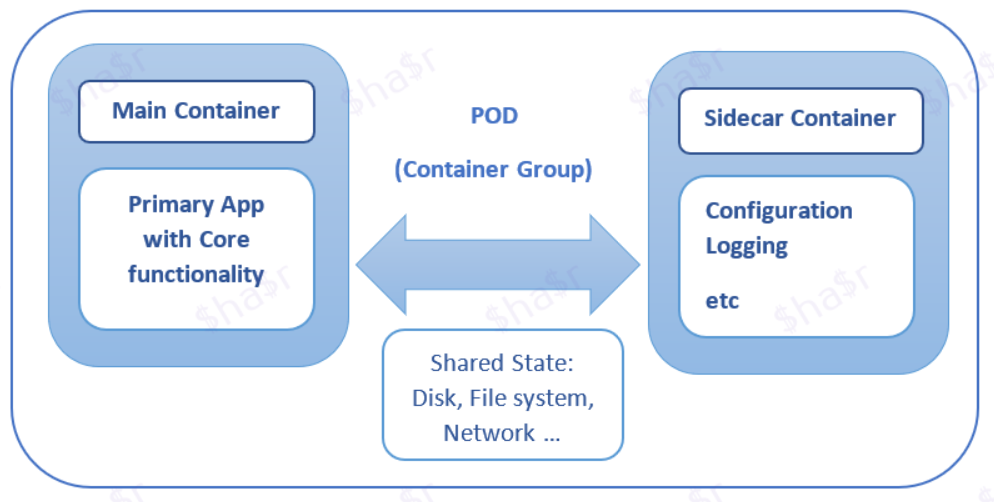
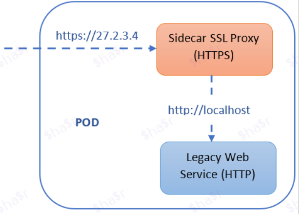
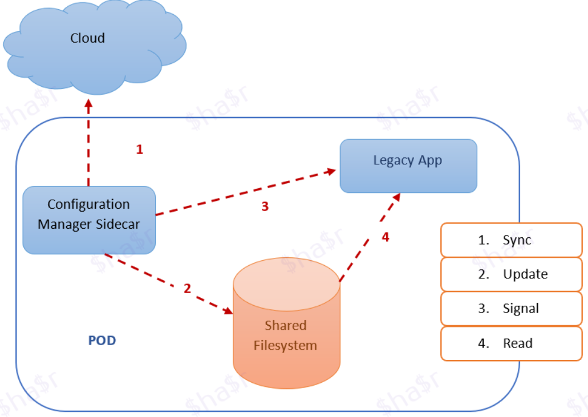
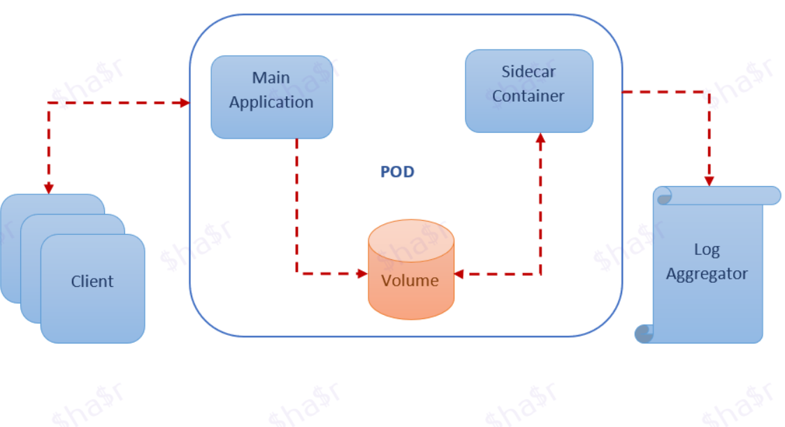

---

title: "微软架构之 Sidecar 模式"
linkTitle: "微软架构之 Sidecar 模式"
weight: 11550
date: 2021-10-28
description: >
  微软架构之 Sidecar 模式
---

## 前言

https://medium.com/nerd-for-tech/microservice-design-pattern-sidecar-sidekick-pattern-dbcea9bed783

以下是内容翻译。

---------------

微软架构：sidecar 模式

在微服务架构中，有多个服务/应用经常需要通用的功能，如日志、配置、监控和网络服务，这是非常常见的。这些功能可以作为一个单独的服务在同一个容器内或在一个单独的容器内实现和运行。

- 在同一个应用程序中实现核心逻辑和支持功能：

    当它们在同一个应用程序中实现时，它们通过有效利用共享资源，紧密联系并在同一进程中运行。在这种情况下，这些组件没有被很好地隔离，它们是相互依赖的，这可能会导致一个组件的失败，进而影响另一个组件或整个应用程序。

- 在一个单独的应用程序中实现核心逻辑和支持功能：

    当应用程序被分离成服务时，每个服务都可以用不同的语言和技术来开发最适合的功能。在这种情况下，每个服务都有自己的依赖关系/库，以访问底层平台和与主应用程序的共享资源。当我们在不同的主机上部署两个应用程序时，它还会增加应用程序的延迟，并在托管、部署和管理方面增加复杂性。

## Sidecar模式（或）Sidekick模式？

Kubernetes 中的 Sidecar 概念越来越流行。它是容器世界中的一个通用原则，即容器应该解决一个单一的问题，并且应该把它做好。Sidecar 模式通过将核心业务逻辑与扩展原始功能的额外任务解耦来实现这一原则。

Sidecar模式是一个由两个容器组成的单节点模式：

- 第一个是应用容器，它包含了应用的核心逻辑（主应用）。没有这个容器，应用程序就不会存在。

- 此外，还有一个Sidecar容器，通过在同一容器组（Pod）上并行运行另一个容器来扩展/增强主应用程序的功能。由于sidecar与主应用容器在同一个Pod上运行，它共享资源--文件系统、磁盘、网络等。

- 它还允许将同一个应用程序的组件（用不同的技术实现）部署到一个独立的、隔离的和封装的容器中。当在整个微服务架构中共享公共组件（如：日志、监控、配置属性等）有优势时，它被证明非常有用。

## 什么是Pod？

Pod 是 Kubernetes（K8S）中部署的一个基本原子单元。

在K8S中，Pod是一组具有共享存储和网络的一个或多个容器。Sidecar 在 pod 中充当一个实用工具容器，它与主要的应用容器松散地耦合在一起。Pod可以被认为是运行多个容器的消费者组（用Kafka术语）。

## 什么时候Sidecar模式是有用的？

- 当服务/组件是用多种语言或技术实现的。

- 服务/组件必须位于同一个容器组（pod）或主要应用程序运行的主机上。

- 服务/组件由远程团队或不同的组织拥有。

- 服务可以在不依赖主应用程序的情况下独立更新，但与主应用程序共享相同的生命周期。
- 如果我们需要控制某个组件或服务的资源限制。

## 示例

1. 将HTTPS添加到一个传统的服务中
2. 使用 sidecar 的动态配置
3. 使用Sidecar的日志聚合器

### 为传统服务添加HTTPS

考虑到一个传统的网络服务，它通过未加密的HTTP服务请求。我们有一个要求，即在未来加强同一遗留系统，为HTTPS的请求提供服务。

遗留应用被配置为只在 localhost 上提供请求，这意味着只有与服务器共享本地网络的服务能够访问遗留应用。除了主容器（遗留应用程序），我们还可以添加 Nginx Sidecar 容器，它与主容器运行在同一个网络命名空间，这样它就可以访问运行在localhost上的服务。

同时，Nginx在pod的外部IP地址上终止HTTPS流量，并将该流量委托给传统应用程序。

### 使用Sidecars的动态配置

当遗留应用程序启动时，它从文件系统加载其配置。

当配置管理器启动时，它检查存储在本地文件系统上的配置与存储在云上的配置之间的差异。如果存在差异，那么配置管理器就会将新的配置下载到本地文件系统，并通知传统应用程序使用新的配置重新配置自己（例如：可以使用EDD或协调机制来挑选新的配置变化）。

### 带有Sidecar的日志聚合器

考虑到我们有一个Web服务器，它正在生成访问/错误日志，这些日志在特定的时间间隔/内存空间之外，并不那么关键，不需要在卷上持久保存。然而，访问/错误日志有助于调试应用程序的错误/漏洞。

根据关注点分离原则，我们可以通过部署一个单独的容器来实现Sidecar模式，以捕获并将访问/错误日志从网络服务器传输到日志聚合器。

网络服务器很好地完成了它的任务，为客户请求提供服务，而Sidecar容器则处理访问/错误日志。由于容器运行在同一个pod上，我们可以使用一个共享卷来读/写日志。

