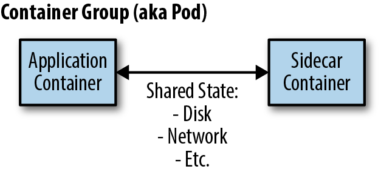

## 前言

https://www.oreilly.com/library/view/designing-distributed-systems/9781491983638/ch02.html

以下是内容翻译。

--------

## 第二章 Sidecar 模式

第一个单节点模式是 sidecar 模式。Sidecar 模式是一个由两个容器组成的单节点模式。第一个是应用容器。它包含了应用程序的核心逻辑。没有这个容器，应用程序就不会存在。除了应用容器之外，还有一个 sidecar 容器。sidecar的作用是增强和改进应用容器，通常是在应用容器不知情的情况下。在其最简单的形式中，sidecar 容器可以用来为可能难以改进的容器增加功能。Sidecar 容器通过原子容器组（如 Kubernetes 中的 pod API 对象）被共同调度到同一台机器上。除了被调度到同一台机器上之外，应用容器和 sidecar 容器还共享一些资源，包括文件系统部分、主机名和网络，以及许多其他命名空间。图 2-1 是这种 sidecar 模式的通用图像：

图2-1. 通用sidecar模式

### Sidecar的例子: 给传统服务添加HTTPS

例如，考虑一个传统的网络服务。几年前，当它被建立时，内部网络安全对公司来说并不那么重要，因此，应用程序只通过未加密的HTTP而不是HTTPS来服务请求。由于最近的安全事件，...

