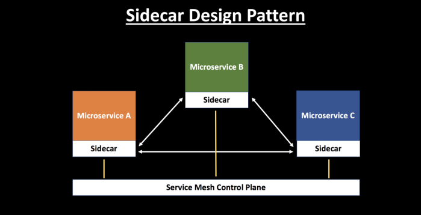

---

title: "Sidecar 模式"
linkTitle: "Sidecar 模式"
weight: 11560
date: 2021-10-28
description: >
  magalix 博客文章：Sidecar 模式
---

## 前言

Sidecar Design Pattern in Your Microservices Ecosystem

讨论 sidecar 模式背后的概念，它如何适合微服务，以及它如何在应用中发挥作用。

https://dzone.com/articles/sidecar-design-pattern-in-your-microservices-ecosy-1

以下是内容翻译。

--------

Sidecar 设计模式在社区内越来越受欢迎，并被广泛采用。构建一个高度可扩展、有弹性、安全和可观察的微服务架构是具有挑战性的。服务网格的演变改变了游戏规则。它将与微服务架构相关的复杂性转移到一个独立的基础设施层，并提供了很多功能，如负载均衡、服务发现、流量管理、断路、遥测、故障注入等。

阅读我的上一篇文章，了解服务网背后的概念，为什么你的云原生应用需要它，以及它流行的原因：[服务网格的崛起](https://dzone.com/articles/the-rise-of-service-mesh-architecture?preview=true)。

## 什么是Sidecar模式？

将应用程序的功能分离到一个单独的进程中，可以被看作是一种 Sidecar 模式。sidecar 设计模式允许你为你的应用程序增加一些功能，而不需要为第三方组件增加配置代码。

就像一辆摩托车上挂着一个 sidecar 一样，在软件架构中，sidecar 也是挂在一个父级应用上，并扩展/增强其功能。Sidecar与主程序是松散耦合的。

让我用一个例子来解释这个问题。想象一下，你有六个微服务在互相交谈，以便确定一个包的成本。

每个微服务都需要有可观察性、监控、日志、配置、断路器等功能。所有这些功能都是在每个微服务内部使用一些行业标准的第三方库实现的。

但是，这难道不是多余的吗？它不会增加你的应用程序的整体复杂性吗？如果你的应用程序是用不同的语言编写的，会发生什么情况呢？你如何纳入第三方库，这些库通常是特定于某种语言的，如.NET、Java、Python等？

## 使用Sidecar模式的好处

- 通过将常见的基础设施相关功能抽象到不同的层，减少了微服务代码的复杂性。

- 减少了微服务架构中的代码重复，因为你不需要在每个微服务中编写配置代码。

- 在应用程序代码和底层平台之间提供松散耦合。

## Sidecar模式是如何工作的？

服务网格层可以运行在一个与你的应用程序一起运行的 sidecar 容器中。同一个 sidecar 的多个副本被部署在每个应用程序旁边。

来自单个服务的所有传入和传出的网络流量都流经 sidecar 代理。因此，sidecar 管理着微服务之间的流量，收集遥测数据，并执行策略。在某种意义上，服务不知道网络，只知道连接的sidecar代理。这确实是 sidecar 模式工作的本质--它将网络的依赖性抽象并转移到 sidecar 上。

在服务网格中，我们有数据平面和控制平面的概念：

- 数据平面的职责是处理网格内的服务间通信，并负责服务发现、负载均衡、流量管理、健康检查等功能。

- 控制平面的职责是管理和配置 sidecar 代理，以执行策略和收集遥测数据。

- 在 Kubernetes 和 Istio 的世界里，你可以在 pod 里面注入 sidecar。Istio 使用的是以 Envoy 为代理的 sidecar 模型。

来自 Lyft 的 Envoy 是最流行的开源代理，专为云原生应用设计。Envoy 与每个服务一起运行，并以一种与平台无关的方式提供必要的功能。所有流向服务的流量都流经 Envoy 代理。

从单体到微服务的转变使企业能够独立和大规模地部署应用。在容器和 Kubernetes 世界中，sidecar 设计模式更加兼容。sidecar从应用中抽象出复杂性，并处理服务发现、流量管理、负载均衡、断路等功能。

你可以在这里了解更多关于sidecar模式的信息。

- https://docs.microsoft.com/en-us/azure/architecture/patterns/sidecar

- [Distributed Systems and the Sidecar Pattern](https://dzone.com/articles/distributed-systems-sidecar-pattern)

