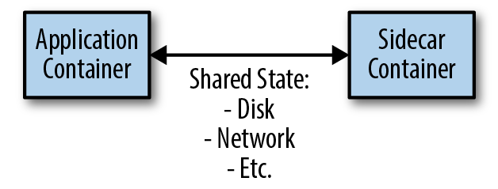

---

title: "系统设计中的Sidecar设计模式"
linkTitle: "系统设计中的Sidecar设计模式"
weight: 11580
date: 2021-10-28
description: >
  系统设计中的Sidecar设计模式
---

## 前言

Sidecar Design Pattern in System Design

https://iq.opengenus.org/sidecar-design-pattern/

以下是内容翻译。

--------

在这篇文章中，我们探讨了系统设计中的Sidecar设计模式，以及它的优点和缺点，还有一个使用Sidecar设计模式的真实系统设计例子。

## 介绍

容器的受欢迎程度正在上升，因为它可以帮助打包一个应用程序，开发人员可以在任何地方移动和部署应用程序，而不需要太多的麻烦。容器有助于减少劳动强度，提高灵活性，提供敏捷性，总的来说使应用程序的管理变得更加容易。

然而，我们如何知道我们是否在有效地使用容器，这就是设计模式发挥作用的地方。设计模式的存在是为了帮助解决容器的常见问题，因为它提供了一个有计划的应用程序的架构，以便每个人都能理解正在发生的事情。

在这篇文章中，我们将探讨容器中的 sidecar 设计模式。

## 传统设计模式的问题

多个应用程序通常需要一些共同的功能，如监控、日志、配置等。如果它们在主应用程序中紧密耦合，服务之间就没有隔离，应用程序的停机会导致所有服务的停机。

这就导致了应用程序内部紧密的相互依存关系。

此外，让我们假设两个应用程序A和B在每个应用程序中都有一个监控服务，并与主应用程序互锁，为了升级监控服务，每个应用程序的监控服务都必须被升级，在停机的情况下，整个应用程序的服务都会停机。

考虑到上面的图片，应用程序A和B有相同的服务集成在它们里面，它们是紧密耦合的（虚线代表功能）。为了升级我们的监控服务，我们必须单独升级监控A和监控B（它们是同一类型的服务），如果应用程序A或B中的一个出现故障，与它们相关的其他服务也会出现故障。这个系统很容易发生故障，而且不灵活。

## 什么是SideCar设计模式？

将应用程序的功能分离成不同的进程可以被看作是sidecar模式。sidecar模式允许开发者在主程序中不需要任何额外的配置或第三方组件的情况下为应用程序添加多种能力。

sidecar模式的最简单的例子是一个单节点双容器架构。第一个容器是应用容器，它包含主应用或应用的核心逻辑。没有这个容器，应用程序将无法运行。第二个容器是sidecar容器，它为应用程序容器增加了功能。sidecar容器与应用容器共享一些资源，如卷、网络等。

sidecar 容器可以提供一些功能，如为传统的应用程序添加HTTPS，执行监控或记录等。

容器之间的通信是通过共享公共资源来实现的，最流行的是共享卷或网络。

## 共享卷

当主应用程序容器和 sidecar 容器使用一个共同的卷或磁盘时，它被称为共享卷。一个很好的例子是使用 fluentd 从主应用容器中读取日志，fluentd 会读取日志并以更简洁的格式生成。

在这个例子中，作为主应用程序的 file-app 容器写下了它的日志，而 fluentd 则解析了这些日志并以更好的模式输出。两个容器都共享主机中的文件目录。

## 共享网络

当主应用程序容器和 sidecar 容器共享同一个网络来进行通信时，这就是共享网络的例子。一个很好的例子是使用像 flask 这样的网络服务器和 rabbitmq 这样的消息队列。

在这里，flask 服务器在5000端口运行，rabbitmq容器在同一网络中与之并行（docker compose中的容器默认共享同一网络）。

## SideCar设计的优势

- sidecar容器是独立于主应用容器的，它不依赖于主容器所使用的框架或语言，因此没有必要为每一种语言创建不同的sidecar容器。

- sidecar能够访问与主应用程序相同的资源。

- sidecar在应用程序代码和平台之间提供松散的耦合。

- 在微服务架构中，由于不需要在每个容器内编写配置代码，所以代码的重复性会降低。

- 即使主应用程序可能出现停机，Sidecar容器仍在运行。

## SideCar设计的缺点

- 容器之间有很多通信，在进程间的通信中很难调试或发现问题。
- 这种模式只能用于基于容器的环境。
- 由于大量的容器作为 sidecar 容器，内存需求非常高。

## 系统设计实例

让我们来看看这个设计的一个简单实现:

这是一个数据处理应用程序，主应用程序在中心，它连接到一个数据库。有两个sidecar容器，日志收集器与主应用程序共享一个公共卷。主应用程序将它的日志写入公共卷，而 sidecar 容器则读取日志并以GUI格式显示。

由于应用程序必须做大量的数据处理和建模，这是一个非常繁重的任务，它有一个数据处理器 sidecar 容器连接到它，它处理和清理数据，对其进行建模，并将结果返回给主应用程序。

