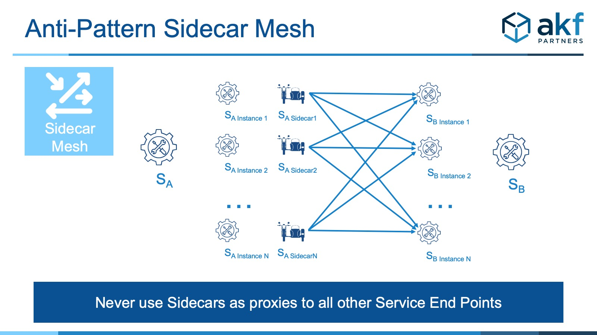

---

title: "Sidecar模式：该做的和不该做的"
linkTitle: "Sidecar模式：该做的和不该做的"
weight: 11570
date: 2021-10-28
description: >
  Sidecar模式：该做的和不该做的
---

## 前言

https://akfpartners.com/growth-blog/sidecar-pattern-the-dos-and-donts-of-the-sidecar-or-sidekick-pattern

以下是内容翻译。

--------

SIDECAR PATTERN: THE DOS AND DON’TS

## sidecar模式概述

sidecar模式旨在允许将应用程序的组件部署到独立的、隔离的和封装的进程或容器中。当微服务之间共享共同的组件有好处时，这种模式就特别有用，如日志工具、监控工具、配置例程等。

Sidecar 模式的名字是一个比喻，表示有时会在摩托车旁边栓上单座汽车。

## Sidecar的优点

Sidecar有很多好处:

- 为每个组件使用多语言（polyglot）或技术。 如果一种语言在某一必要领域特别强大（例如，Python用于机器学习，或者R用于统计工作），或者如果可以利用开源解决方案来消除内部专业化（例如，使用 NGINX 来实现某些网络相关的功能），这一点就特别有用。

- 分离本来是一个单体的东西，如果使用得当，可以对相关服务进行故障隔离。

- 组件之间的概念上很容易的交互，类似于库所提供的交互，或者微服务之间的服务调用。

- 比传统的服务调用 "其他" 服务的延迟更低，因为 Sidecar 运行在相同的处理环境中（虚拟机或物理服务器）--尽管通常在一个单独的容器中。

- 类似于库的使用，允许个人团队的所有权和较大团队的组织扩展性。

- 与动态加载库的使用类似，允许团队独立发布各种共享使用组件。

## Sidecar的缺点

不管是哪种实现方式（多语言或者单体），Sidecar与使用库相比都有一些缺点：

- 较高的进程间通信延迟--因为大多数实现都是服务调用，与通过内存的调用流的传输相比，系统上的环回接口（127.0.0.1）会增加延迟。

- 大小 - 特别是在多语言实现中，但即使是在单语言实现中 - 容器化导致类似库的多个副本，相对于使用库的可比操作，内存使用增加。

- 环境--如果没有容器化技术，就很难用 Sidecar 创建任何故障隔离的概念。 虚拟机技术（Sidecar在独立于主机或调用解决方案的虚拟机中）不是一种选择，因为它是一种 Fan Out 或Mesh 反模式，而不是本地调用。

## 何时使用Sidecar

对于那些与本地服务信息传递相关的延迟增加不会影响终端用户响应时间的情况，Sidecar是一个令人信服的替代库。 这方面的例子有异步记录、带外监控和异步消息传递功能。 断路器（基于时间的请求/响应超时）也是Sidecar实施的一个很好的例子。

## 何时应避免使用Sidecar

对于必须在生成用户响应之前完成的同步活动，千万不要使用 Sidecar 模式。这样做会给终端用户的响应时间增加一些延迟。

AKF还建议不要将 Sidecar 用于服务间的同步通信，因为这样做需要 Sidecar 知道每个服务的所有端点。 我们建议反对的一个具体例子是，让服务A的每个端点（实例）（如添加到购物车）知道服务B的每个端点（实例）（如取消-SKU）。 下面是这个例子的图片：

上面的图形表示的只是两个服务和组成该服务的实例之间的协调。 想象一下所有的服务都可以相互通信的情况（如更广泛的Mesh反模式）。试图隔离故障变得几乎不可能。

如果服务A有时在调用服务B时发生故障，你怎么知道哪个组件发生了故障？ 是服务A、服务A的Sidecar Proxy还是服务B的故障？ 更简单的方法是让更少的代理（尽管由于非本地通信，延迟成本较高）处理事务，从而更容易识别故障。

## 后记

我对这篇文章的部分观点表示不赞成。

