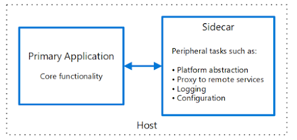

---

title: "Sidecar 模式"
linkTitle: "Sidecar 模式"
weight: 11580
date: 2021-10-28
description: >
  Diego Pacheco 技术博客：Sidecar 模式
---

## 前言

Sidecar Pattern

http://diego-pacheco.blogspot.com/2020/07/sidecar-pattern.html

以下是内容翻译。

--------

当我们需要分发一个共享软件时，有几种架构模式可以遵循。我最喜欢和默认的模式是服务模式(Service Pattern)。然而，也有其他的软件分发模式。例如，如果我们考虑到初创企业，有一个流行的工具叫精益商业画布，在那里你可以对你的初创企业的商业模式进行建模，那里有许多维度，但有一个特别的维度叫 "分销渠道"，与本博文的主题高度相关。作为工程师，我们常常只考虑到一个维度，即服务或二进制共享库。然而，我们还可以探索其他维度。其他的选择有：工具、内部服务/自助服务平台、运行时平台和服务网格。所以在这篇博文中，我想多介绍一点 Sidecar 模式。

## 新现实中的旧想法

对于 Linux 来说，我们总是有非常小的、专门的程序在后台运行，等待对特定的任务做出反应，这些程序通常被称为 "daemons/守护进程"。对我来说，"daemon" 可能就是最早的 "sidecar"。所以，你可能会想，为什么我们不把守护进程放在首位，而要让自己开心呢？好吧，用C语言编写代码并遵循Linux模式不会给你带来什么，因为有一个不同的现实。现实是，我们在专门的空间和专门的硬件中运行软件。因此，大多数人（在云计算市场上占30%）都在云端运行工作负载，用计算解决方案运行软件，通常是虚拟化的（EC2或谷歌云计算）。然而，现在的趋势和现实是在容器（Docker、Kubernetes、RKT、OCI/OCR等）或甚至 MicroVMs/Serverless 中运行一些工作负载。因此，你有一个专门的内核/操作系统，用于你的软件或甚至专门的硬件。因此，Sidecar 意味着让我们在那里运行一个协同进程，即你将有两个进程。你的应用程序和 Sidecar。

Sidecar 不是解决所有问题的方法。而且，它们也不只适用于 Kubernetes。当然，Kubernetes 使得使用 sidecars 容易得多，因为在 POD 中，sidecar 只是另一个 Docker 容器。 然而，你可以在虚拟机中运行 sidecars。就像 Netflix 多年来使用 Priam、Dynomite Manager、Raigad，以及最近 Lyft 使用 Envoy 那样。

## Sidecar架构

为了拥有 sidecar，你可以在你的 sidecar "内部" 拥有任何架构。你可以是RPC，事件驱动，IPC，或者任何你想要的，只要你是从应用运行时路径中剥离出来的。Sidecar 也可以用于瘦客户机模式，这很好，但请记住，Sidecar 的定义是在另一个进程中运行，因此不是嵌入在你的应用程序中。

Sidecars 不是嵌入式的，但也不是远程的。Sidecars 不是微服务，根本不是服务。然而，Sidecar 可以有 HTTP/REST 接口，可以通过 "sudo remote call" 被应用程序调用。我指的是sudo，因为对于应用程序来说，它看起来就像一个远程调用，但是因为 sidecar 是在应用程序的 sidecar 机器上运行，所以延迟要小得多。

## Sidecar的优点

Sidecar架构模式有几个好处，比如：

* 隔离：sidecar 和应用程序不在同一个 "运行时进程空间" 中。
* 解耦: sidecar 不与应用程序的选择相耦合，反之亦然。
* 提供安全复用: 意味着没有二进制耦合（共享jar和框架的问题）。
* 封闭性：我们可以有封装的通用代码，可以输送到所有的服务/应用程序。
* 避免二进制耦合：对我来说，这是一个巨大的胜利，因为在规模上二进制耦合是很痛苦的。
* 技术多样性：可以自由选择任何语言、堆栈、lib或框架。
* 更新/部署的独立性：它们可以在应用的CI/CD生命周期中分开发生。
* 没有单点故障：因为每个服务/微服务都有1个sidecar，我们没有单点故障。
* 避免大规模的迁移：由于应用程序代码没有与sidecar耦合，所以没有大规模的代码迁移。

最后，我只想指出，Sidecars 与容器/Kubernetes 完美配合，因为以k8s为例，部署单元是 POD。POD 只是一组共享相同资源的容器，如网络接口和磁盘。这使得创建 sidecar 变得非常容易，因为它只是另一个 docker 容器。

然而，就像我之前说的，你可以在没有容器的情况下拥有 sidecar。这需要你付出更多的部署努力，但并不是不可能或很难。 

## Sidecar的缺点

就像软件架构中的所有东西一样，也是有取舍的。因此，sidecar 肯定有缺点。让我们来看看其中的一些：
 * 如果不在K8s中，就会有更多的部署复杂性（EC2）。
 * 需要有很好的可观察性，否则 sidecar 会变成黑盒子。
 * 难以对应用进行调试。比方说，sidecar 是用RUST写的，而应用程序是用Java或Go写的。 
 * 可靠性路径： sidecar 现在成为可靠性路径的一部分。这意味着停机时间可能是一个大问题。

Sidecar 的使用范围很窄，比如说你不会用它来取代SOA中的服务，用于你的商业应用。然而，有一些问题使 Sidecar 成为很好的选择，如代理、路由、可观察性、审计、安全等等。然而，如果你能做一个适当的共享库，并注意依赖性，他们可能是一个更简单和有效的解决方案。

IMHO 拥有像 Go、Rust、Java、Python、C++ 这样的高技术多样性，肯定会使用 sidecar。但是如果你大量使用一种语言，比如说Java，你需要确保这是正确的使用情况。不同的语言和不同的库有不同的优势，所以要仔细分析权衡，因为离开默认语言可能是一个问题。

默认语言（比如说Java）通常意味着你有训练有素的人员来部署、监控、调整和处理复杂的工作负载或云，所以引入另一种语言可能意味着你将是孤独的，或者需要在内部建立这种能力，这超出了纯粹的技术决定，意味着还有更多。

## 何时使用sidecar

一个好的指标是有一个跨领域的关注，而不是你的业务逻辑，如可观察性、安全性、性能、可靠性、审计和基础设施/运维。另一个考虑点是，你可能想避免与应用程序的二进制耦合。另外，假设你真的会获得性能，或者你有其他语言的工具更适合这项工作，或者更快、更简单。

如果你的用例符合我上面描述的要求和架构目标，那么我认为你真的应该考虑把 sidecar 作为你的解决方案。

## 何时应避免使用边车

如果你需要极强的性能和超低的延迟，做一个 lib 肯定会比 sidecar 快，因为你会在应用程序上运行嵌入式。你需要仔细分析这些权衡，因为还有其他的东西可以让你的 sidecar 高效，比如使用IPC、反应式编程、像Rust这样的高性能语言。另一个避免使用 sidecar 的标准可能是，最终的解决方案并不复杂，或者 sidecar 的基础设施价格并不划算（假设你不是在K8s上运行，而是在Ec2上）。 

如果你需要在应用程序之外扩展 sidecar，使用 sidecar 可能不是一个好主意。然而，你总是可以使用其他的外部组件来获得扩展性，如数据库和缓存，但你仍然需要考虑这个问题。特别是当工作负载主要发生在 sidecar 上的时候。

Sidecar是一个非常有趣的架构模式，我们可以在云原生应用程序中使用。然而，我们需要重新考虑使 "sidecar所有的东西"，否则我们不会有好处。请记住，没有一个放之四海而皆准的东西。

