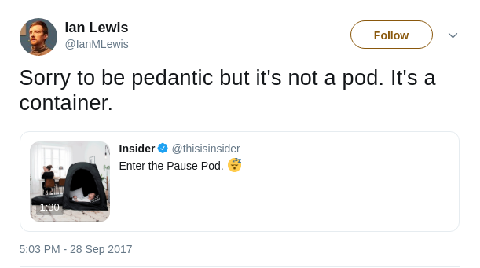
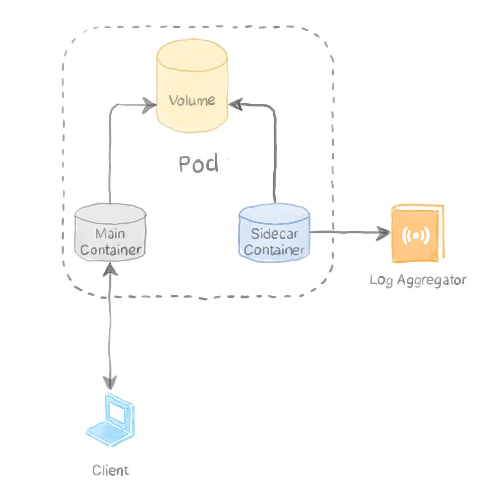

---

title: "Sidecar 模式"
linkTitle: "Sidecar 模式"
weight: 11560
date: 2021-10-28
description: >
  magalix 博客文章：Sidecar 模式
---

## 前言

https://www.magalix.com/blog/the-sidecar-pattern

以下是内容翻译。

--------

Sidecar Pattern

## 做一件事，做到最好

**Do One Thing, Do it Best**

设计 UNIX 的基本思想是不要让一个复杂的单体工具做所有的事情。相反，UNIX使用了一些小的、可插拔的组件，这些组件单独使用并没有什么用。但是，当它们结合在一起时，可以执行强大的操作。

让我们以 ps 命令为例，ps 本身可以显示你的 UNIX/Linux 上当前运行的进程。它有相当数量的标志，允许你显示进程的许多方面。比如说:

- 启动进程的用户。

- 每个正在运行的进程正在使用多少CPU？

- 用来启动进程的命令是什么，还有很多。

`ps` 命令在显示运行进程的信息方面做得很好。然而，没有任何 `ps` 标志可以过滤其输出。缺乏这种功能并不是该工具的功能缺失，这是故意的。

有另一个工具可以很好地过滤输入的文本: `grep`。因此，使用管道（`|`）字符，你可以过滤 `ps` 的输出，只显示系统中运行的 SSH 进程，如：`ps -ef | grep -i ssh`。`ps` 工具关注的是显示运行进程的每一个可能的方面。`grep` 命令关注的是提供过滤文本的能力，以许多不同的方式过滤任何文本。做一件事并把它做到最好，这就是 UNIX 的建立方式。

由于 UNIX 的强大和简单，除了操作系统之外，这一原则还被用于许多其他领域。例如，在 Kubernetes 中，每个容器应该只做一件事，而且要做得好。你可能想问，如果容器的工作需要额外的程序来帮助它或加强它呢？没有什么可担心的，因为就像我们把 `ps` 命令的输出管道到 `grep` 一样，我们可以用另一个容器放在同一个 Pod 中的主容器旁边。第二个容器执行第一个容器所需的辅助逻辑，使其正常运行。这第二个容器通常被称为 Sidecar。

## Sidecar容器有什么作用？

Pod 是 Kubernetes 部署的基本原子单位。通常情况下，一个 Pod 包含一个容器。然而，多个容器也可以放在同一个 Pod 中。在同一个 Pod 上运行的所有容器都共享 Pod 的同一个卷和网络接口。实际上，Pod本身就是一个执行 `pause` 命令的容器。它的唯一目的是持有网络接口和运行其他容器所需的Linux命名空间。



Sidecar容器是添加到Pod定义中的第二个容器。为什么它必须被放在同一个Pod中，因为它需要使用主容器所使用的相同资源。让我们举个例子来证明这种模式的使用情况。

### 情景: 输送日志的sidecar



在这个场景下，我们有一个运行 nginx 镜像的 webserver 容器。webserver 产生的访问和错误日志并不重要，可以放在一个持久化的卷中。然而，开发人员需要访问过去24小时的日志，以便他们能够追踪问题和bug。因此，我们需要将网络服务器的访问和错误日志输送到日志聚合服务中。根据关注点分离原则，我们通过部署第二个容器来实现 Sidecar 模式，该容器从 nginx 发送错误和访问日志。Nginx只做一件事，而且做得很好：为网页服务。第二个容器也专注于它的任务：输送日志。由于容器运行在同一个Pod上，我们可以使用一个共享的 emptyDir 卷来读取和写入日志。这样Pod的定义文件可能看起来如下：

```yaml
apiVersion: v1
kind: Pod
metadata:
  name: webserver
spec:
  volumes:
    - name: shared-logs
      emptyDir: {}

  containers:
    - name: nginx
      image: nginx
      volumeMounts:
        - name: shared-logs
          mountPath: /var/log/nginx

    - name: sidecar-container
      image: busybox
      command: ["sh","-c","while true; do cat /var/log/nginx/access.log /var/log/nginx/error.log; sleep 30; done"]
      volumeMounts:
        - name: shared-logs
          mountPath: /var/log/nginx
```

上面的定义是标准的 Kubernetes Pod 定义，只是它在同一个 Pod 中部署了两个容器。sidecar容器通常在定义中排在第二位，这样当你发出 kubectl 执行命令时，你就默认以主容器为目标。

主容器是一个 nginx 容器，它被指示将其日志存储在挂载于 `/var/log/nginx` 的卷上。在这个位置挂载一个卷，可以防止 Nginx 将其日志数据输出到标准输出，并迫使它将其写入 `access.log` 和 `error.log` 文件。

#### 关于日志聚合的附带说明

请注意，Nginx 镜像的默认行为是将其日志存储到标准输出，以便被 Docker 的日志收集器选中。Docker将这些日志存储在主机上的 `/var/lib/docker/containers/container-ID/container-ID-json.log` 中。在同一台主机上运行多个容器（来自不同的Pod），并使用相同的位置来存储它们的日志，你可以使用 `DaemonSet` 来部署一个日志收集器容器，如 `Filebeat` 或 `Logstash` 来收集这些日志，并将它们发送到 `ElasticSearch` 等日志聚合器。你需要把 `/var/lib/docker/containers` 作为 `hostPath` 卷挂到 `DaemonSet` Pod上，以便让日志收集器容器访问日志。

sidecar 容器与 nginx 容器在同一个Pod上运行。这使得 sidecar 容器能够访问与web服务器相同的卷。在上面的例子中，我们用cat命令来模拟每隔30秒将日志数据发送到一个日志收集器。

## 总结

- Sidecar模式需要设计模块化的容器。模块化的容器可以插在多个地方而不怎么需要改动。

- sidecar只是一个与应用容器运行在同一个Pod上的容器，因为它与主容器共享相同的volume和网络，它可以 "帮助" 或增强应用的运行方式。

- Sidecar容器的常见例子有：日志输送、日志观察者、监控代理等等。

- 有一个单独的容器用于辅助任务，可以让你获得健康检查、自动重启以及 Kubernetes 为容器提供的其他功能。

- 在遵循 Sidecar 模式时，你应该考虑制作一个不消耗太多资源的小型 Sidecar 容器。如果你发现 sidecar 容器的逻辑越来越复杂和/或与主应用容器的耦合越来越紧密，那么它可能最好与主应用的代码集成在一起。记住，sidecar 容器的强项在于它的小型和可插拔的能力。
