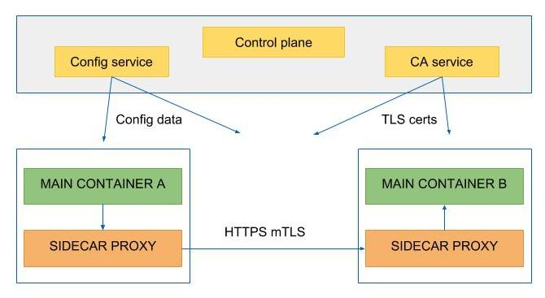

---

title: "安全领域中的Sidecar模式"
linkTitle: "安全领域中的Sidecar模式"
weight: 11710
date: 2021-10-28
description: >
  从IT安全的角度分析一些最有趣的使用案例
---

## 前言

Sidecar Pattern in Security

在容器的新世界中，sidecar 模式显示出它是一个非常强大的工具，并且可以在一些使用案例中找到。在这篇文章中，我们着重从IT安全的角度分析一些最有趣的使用案例。

https://www.bbva.com/en/sidecar-pattern-in-security/

以下是内容翻译。

--------

## sidecar是什么？

sidecar 模式被用来扩展和/或改善进程（主程序）的功能，通过并行运行其他辅助进程，这些进程之间几乎没有耦合。我们不使用库来实现功能，而是使用一些内置了这种功能的进程或容器，这为我们提供了更大的隔离性和封装性。在运行时，sidecar共享相同的生命周期（它与主进程一起启动和停止）以及其他计算资源（存储、网络...）。它是一个独立的组件，有自己的软件生命周期，在部署时被主应用程序的团队纳入。

这种模式在容器兴起之前就已经存在了（通过使用 netcat 和 ssh tunnels, pipes、rotatelog ......），但它的实现并不像容器的出现那样顺利和完整。

传统上，扩展应用程序的两种方法是库和服务，但随着容器的到来，我们现在有了另一种方法。让我们看看不同的可用方法的优点和缺点:

- 进程内（类库）

	*  有效地使用资源
	* `+` 无延时
	* `-` 缺少隔离性。一个组件的缺陷可能影响其他组件
	* `-` 每种语言都需要一个版本
	* `-` 依赖性管理，集成问题，...

- 服务

	* `+` 允许使用最适合的语言/技术
	* `+` 依赖性管理
	* `-` 延迟
	* `-` 不同的运行周期，集成问题（接口）。
	* `-` 安全性，访问控制，...

- Sidecar模式

	* `+` 相同的运行周期，但允许独立更新。
	* `+` 依赖性管理
	* `+` 不共享，没有集成问题
	* `+` 透明（几乎所有），没有集成问题
	* `-` 资源竞争

## 什么时候使用它？

Sidecar模式并不是银弹，有几个标准可以帮助我们决定什么时候选择这种模式是个好主意，什么时候不鼓励使用它:

* `+` 支持多语言架构（并正在使用）时
* `+` 该组件由一个远程团队拥有
* `+` 主容器和 sidecar 容器都需要在同一主机上运行
* `+` 主应用程序还没有扩展机制
* `+` 始终有一个容器编排器
* `+` 当需要同时进行相同的运行时生命周期和单独更新时
* `-` 当延迟是一种权衡时
* `-` 当资源成本不值得隔离的优势时
* `-` 当应用程序和侧设备必须以不同方式扩展时

## 使用案例

Sidecar模式使我们能够为我们的应用程序提供大量不同的功能，例如:

- 应用管理。Sidecar观察环境的变化，并重新启动或通知主应用程序，以更新其配置。

- 基础设施服务（证书管理、配置管理、DNS、适配器、安全、访问控制...）。

- 监测（资源、网络流量...）。

- 协议适配器

## 分析

经过初步分析，从安全角度来看，共有三个用例似乎很有趣，我们将在下面描述所有这些用例：

### 证书管理

sidecar 被用来检索访问一个应用程序的外部服务所需的证书，证书被存储在文件中，所以主应用程序可以获得它们，以建立通信通道。这给了主应用程序一个非常简单的接口来访问证书（读取文件），这与实际的证书提供者无关。

有两种变体；一种是在应用程序启动时检索证书，然后在存储它们之后，sidecar就会死亡；另一种是sidecar继续观察证书的变化。在这两种情况下，两个容器都共享一个卷，在它们运行的docker主机中，证书也被存储在其中。

从安全的角度来看，这种情况下的威胁是，未经授权的人可以访问存储的证书；我们的攻击机制是。

- docker主机的管理员可以获得对证书的未授权访问。
- 被授权部署应用程序的人可以获得对证书的未授权访问。

为了进行分析，我们测试了两个不同的产品，用于主要的应用程序部署和其sidecar，以检查所有的攻击机制。

- docker-compose（和Swarm，因为它们有非常相似的行为）。用两个容器创建一个项目（Swarm中的堆栈）。
- Kubernetes部署。包含一个带有两个容器的pod。

我们使用了两个容器来测试它是如何工作的。一个Nginx容器作为主程序，一个Alpine容器作为副程序，将秘密写入一个文件。

......(细节略过)

## 结论

通过这两个解决方案，我们认识到，如果用户有正确的权限（就像平台管理员一样），就有可能通过docker主机的文件系统获得对证书的访问，这只是一个搜索一下（通过使用docker inspect）找到文件所在的路由并获得对其内容的访问。在Compose的情况下，我们有另一个问题，因为在默认情况下，删除项目并没有删除卷，这些卷将留在docker主机中，直到prune命令将它们删除。在删除项目时，我们必须使用-v参数，以便删除容器使用的卷和存储在上面的敏感信息。

在第二种情况下，我们可以看到Kubernetes给了我们一个更好的隔离，即使在一个命名空间内，也不可能在pod之间访问资源，因为描述符中没有允许这种交叉访问的命名模式。使用docker-compose，当使用命名卷时，我们可以在一个恶意项目中声明一个卷为外部，并使用compose提供的名称（projectName_volumeName）来获得对它的访问。直到3.0版本，我们可以使用匿名卷（用volume-from导入）来避免这个问题，因为它们没有名字，不可能在本地项目之外访问它们。

正如我们所看到的，在这种情况下，使用sidecar模式会导致证书被破坏，要么是直接访问docker主机文件系统，要么是部署一个恶意的容器（当使用Compose时），这使得它的使用并不可取。

## 替代方案

作为使用共享存储的 sidecar 模式的替代方案，可以提出以下选择:

- 避免使用sidecar。执行容器的进程，该进程被包裹在一个脚本中，该脚本检索凭证，并使用环境变量将其提供给应用程序。通过这种方式，我们继续保持与应用程序的简单接口，同时消除凭证的启示风险。这个方案只有在凭证长期保持不变的情况下才有效。

- 使用一个暴露服务的sidecar来检索证书，这样主程序就会访问一个URL而不是一个文件。和前面的方案一样，我们消除了证书的启示风险，因为没有数据存储，但作为回报，它迫使我们保持sidecar容器的运行，即使我们不需要更新证书。

- 使用内置的协调器机制，允许我们将以后暴露给容器的秘密定义为环境变量或tmpfs文件。

- 不要在应用程序中使用证书...;-)，最安全的凭证是不存在的。我们稍后会看到如何做到这一点...

## TLS代理（适配器模式)

适配器模式允许我们向外部消费者展示我们应用程序的不同观点。在这种情况下，我们向消费者提供一个HTTPS接口，而不需要修改我们的容器（或其配置），继续通过HTTP暴露其功能。这种部署模式给我们带来了很多好处，因为密钥对和证书不是由开发团队或CI/CD工具管理的，而是在启动时检索的。这种方法对每个人来说都更容易，并赋予安全团队权力，因为他们可以定义每一个TLS参数，管理证书的撤销和更新，并能完全控制分发。

在这个用例中，sidecar负责在启动时检索必要的配置（密钥对、证书、TLS配置、代理配置......），并充当传入连接的代理，一旦TLS隧道建立，就会重定向到主容器。

在这项研究中，我们测试了两种不同的选择。

- Istio
- Linkerd 2.0

这两个产品都实现了服务网格结构，并允许我们在部署中注入sidecar，提供网络管理、安全、监控、日志等功能。Istio已经完全集成了TLS管理，Linkerd的集成处于实验阶段。

作为解决方案的一部分，部署了一个证书机构，它将提供证书和密钥对。每次在服务网中部署一个组件时，sidecar都会与控制平面连接，并为代理检索所有需要的配置。由于两个容器共享网络堆栈，代理管理传入的连接，一旦TLS隧道建立，它将通过环回接口转发主容器的流量。

有了这个解决方案，开发人员部署他们的应用程序，只暴露HTTP端口。安全团队的责任是建立和发布sidecar镜像以及配置所有需要的参数，这只需要做一次，所以他们的任务被简化了，因为他们不需要审查/配置每一个部署，只需要配置sidecar镜像。在检测到漏洞的情况下，只有一个镜像必须打补丁，而且替换几乎是即时的，只需要用新的版本重新启动sidecar。

## AuthN y AuthZ (大使模式)

大使(ambassador)模式允许我们为我们的应用程序提供它所消费的外部服务的一个不同但更简单的视图。同样，通过使用 sidecar，我们允许应用程序与他们的外部服务连接，而不需要明确地提供凭证。通信被 sidecar 中的代理拦截，它是建立通信和通过恢复凭证进行认证的代理，一旦通道被打开，应用程序和外部服务之间的数据流就开始了。

在这个用例中，这个选项只存在于 Istio 中（在Linkerd 2.2中是实验性的），并且只支持 mTLS。服务网格的控制平面允许我们配置哪些服务可以相互对话。为了实现这一点，我们为每个服务分配了一个身份，它将被用来管理 AuthN 和 AuthZ。

在成功认证后，RBAC 授权可以通过在网格内的命名空间、服务或方法层面定义相应的规则来启用。

网格中的CA服务向 sidecar 代理提供密钥对和指定身份的证书，sidecar 代理在与对等服务的连接握手中使用它们。这种方式可以建立访问规则，通过只允许服务之间的授权连接来提高集群内的安全性。

目前，几乎所有的服务（包括很多DBMS）都支持基于数字证书的 AuthN 和 AuthZ 机制，这使得这个选项非常有趣，因为它简化了证书管理，因为现在不需要管理秘密，只需要管理身份，因此系统管理员可以完成后端和服务的配置，而不用担心秘密被泄露。

Istio 还支持通过验证传入请求可以持有的JWT令牌来进行来源认证。

