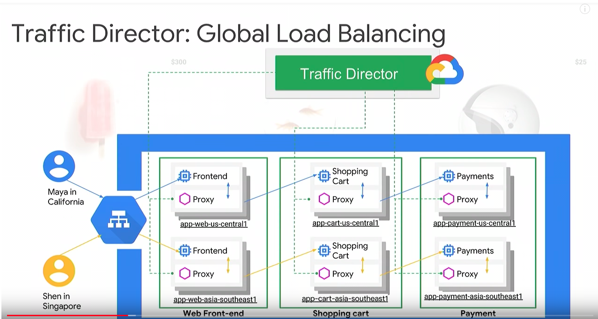

### 背景

2018年7月，google 在 Cloud Next '18 会议上的演讲，介绍 google traffic director：

https://www.youtube.com/watch?time_continue=2759&v=4U4X_OzJaNY

> What if you could deploy hybrid/multi-cloud services seamlessly without having to build or operate the requisite services management infrastructure? What building blocks are available today and what does the road ahead look like? We bring together folks from Google Cloud and Lyft to answer these questions. Google/Google Cloud have decade plus experience in delivering production-grade services like Borg, Cloud Load Balancing, Kubernetes Engine and more recently driving Istio, a fast-growing open source platform for managing (micro)services. Lyft developed and open sourced Envoy, a high performance proxy aiming to make the network transparent to applications, and transformed its own monolithic app into a sophisticated Envoy-based ""service mesh"". In this talk-cum-panel, Google and Lyft bring together unique perspectives on multi-cloud services management and also provide a sneak peek into Google Cloud's new traffic management service for Envoy-powered (micro)services.
>
> 如果可以无缝地部署混合/多云服务而无需构建或运维必需的服务管理基础设施，该怎么办？ 现在有哪些构建模块可用，前方的道路将会是如何？ 我们汇集了Google Cloud和Lyft的人员来回答这些问题。 Google / Google Cloud在提供Borg，云负载均衡，Kubernetes引擎等生产级服务方面拥有十多年的经验，并且最近推动了Istio，这是一个用于管理（微）服务的快速增长的开源平台。 Lyft开发并开源Envoy，一个高性能代理，旨在使网络对应用程序透明，并将其自己的单体应用转换为复杂的基于Envoy的“服务网格”。 在这个谈话中，Google和Lyft将多云服务管理的独特视角结合在一起，同时也可以先睹为快，看一看Google Cloud为Envoy-powered（微）服务提供的新的流量管理服务。

### 内容摘要

有一个趋势应用拆分。当客户将单体应用拆分到微服务时，客户关注的并不是微服务，或者和微服务相关的各种技术，他们真正关注的是什么？是微服务可以给他们带来什么。

另一个趋势是：在混合云和多云环境下部署和管理服务。客户可能使用公有云，如gcp和其他，也可能混合使用私有云。

因此，该如何简化混合和多云服务的部署？

需要做的第一件事情是将通用的核心部分从服务中移除，典型如网络通信代码：负载均衡，错误注入，失败恢复。第二件事情是管理所有这些服务，而且不要自己直接管理，而是需要有提供服务托管的基础设施。

引入 Service Mesh 和 控制平面。

envoy 是这个技术设施中非常重要的一部分，envoy 提供了上图中 proxy 列出的功能。以下模块都会使用 envoy 的能力。

比较重要的几点：最终一致的服务发现/API 驱动/为可观测性设计。

Traffic Director 用来帮助管理服务。前面谈到，客户真正关心的是应用逻辑或者业务逻辑，希望剩余部分可以由其他人提供。

首先是托管在 GCP 上，其次这是一个企业就绪的控制平面，用于前面我们提到的服务代理。更重要的是，可以让service mesh跨区域，可以支持全局负载均衡。提供中央化健康检查，这意味着不用每个代理都彼此相互检查。还提供流量驱动的自动伸缩。

Traffic Director 和 proxy 之间使用开放API，即 xDS v2 API。

跨区域部署，就近访问：

如果发生故障，则failover到另外一个region：

istio介绍

Traffic Director 将取代 Pilot 的位置，所有pilot能提供的功能，Traffic Director 都将提供。这也是采用 open xDS v2 API的原因，以便在 pilot 和 traffic director 之间切换。

Google 和 Google Cloud 将 all-in on hybird，希望 hybird 的服务也可以从 Traffic Director 中受益。因此，Traffic Director 不仅仅给运行在 GCP 中的proxy提供服务，也要提供服务给 on-prem（本地）部署。

### 采访

Envoy 使用的API非常类似google 内部API

