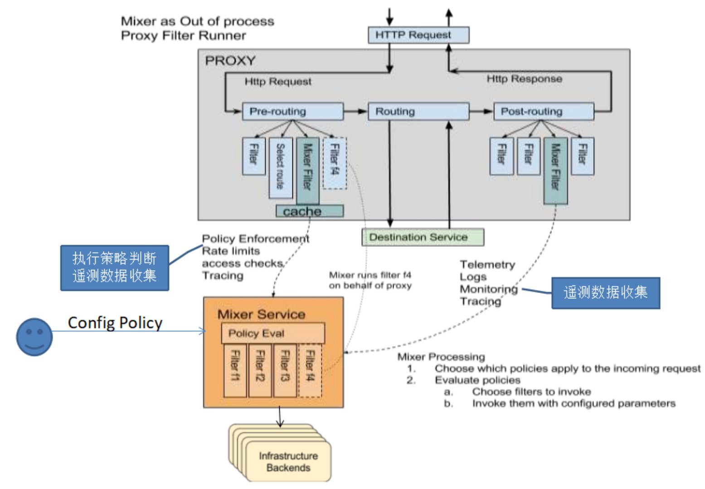

## 整体架构

在前面的Service Mesh介绍中，我们谈到Istio作为第二代Service Mesh产品，带来的最大革新在于增加了控制平面，从而极大的增加了控制力。

现在我们来详细看一下Istio的整体架构，从逻辑上，Istio分为**数据平面**和**控制平面**两个部分：

- **数据平面**是以 sidecar 方式部署的智能代理，Istio默认集成的是Envoy。数据平面用来控制微服务之间的网络通讯，以及和Mixer模块通信。
- **控制平面**负责管理和配置数据平面，控制数据平面的行为，如代理路由流量，实施策略，收集遥测数据，加密认证等。控制平面分为Pilot、Mixer、Citadel三个组件，后面再详细介绍。

下图是Istio官方文档中的配图，详细描述了数据平面和控制平面的组成、调用关系和主要职责：

## Envoy

Envoy是由Lyft开发并开源，基于c++的高性能代理。在前面的Service Mesh介绍中，我们陆续介绍到Envoy的一些情况，汇总如下：

- 2016年，Matt Klein在Lyft开始Envoy的开发
- 2016年9月13日，Matt Klein宣布Envoy在github开源，直接发布1.0.0版本
- 2016年底，Google和IBM联手启动Istio项目，在数据平面上没有选择全新开发，而是联合Lyft直接在Envoy的基础上扩展
- 2017年9月14日，Envoy加入CNCF，成为CNCF的第二个Service Mesh项目
- Envoy在2017年有条不紊地陆续发布了1.2、1.3、1.4和1.5版本，在2018年发布了1.6、1.7、1.8版本，稳步地完善自身，表现非常稳健

在Istio中，使用的是Envoy的扩展版本，被称为`Istio Proxy`，github仓库为`istio/proxy`，可以理解成为在标准版本的Envoy基础上，扩展了Istio独有的功能，典型如和Mixer的集成。

在Istio中，Envoy用于调解服务网格中所有服务的所有入站和出站流量，Envoy的大量功能在Istio中被使用。简单说，Envoy 提供的主要是服务间通讯的能力，包括各种网络通讯协议的支持(以下均可支持TLS)：

- HTTP/1.1
- HTTP/2
- gRPC
- TCP Proxy
- 新加入的Thrift协议，和可能稍后加入的Dubbo协议

以及和网络通讯直接相关的各种功能：

- 服务发现：从Pilot得到服务发现信息
- 负载均衡
- 健康检查
- 熔断器
- 高级路由：路由规则由Polit下发，包括Content Based Routing和Version Based Routing
- 基于百分比的流量拆分
- 加密和认证: TLS certs来自 istio-Auth
- 故障注入，以方便测试

此外, Envoy还要完成对请求属性的提取，这些属性可以通过 Istio Proxy 的 Mixer Filter 发送给 Mixer，用于执行策略决策、配额检查等行为。

类似的，Envoy 也输入各种数据给 Mixer，并通过 Mixer 发送给集成的各种后端基础设置，以提供整个服务网格行为的信息:

- Metrics
- Logging
- Distribution Trace

Envoy中的 Mixer Filter 和 Mixer 的交互如下图所示： 

## Mixer

### Mixer的功能

Mixer 是负责提供策略控制和遥测收集的组件，在Istio中主要负责三大块的职责：

1. Check：也叫precondition，前置条件检查，允许服务在响应来自服务消费者的请求之前验证一些前提条件。前置条件包括认证，黑白名单，ACL检查等。
2. Quota：使服务能够在多个维度上分配和释放配额。典型例子如限速/RatingLimit。
3. Report：遥测报告，使服务能够上报日志和监控，通常包括Metrics，Logging，Distribution Trace。

Mixer和Envoy的交互如下图所示：

### Mixer的设计

我们的系统通常会基于大量的基础设施而构建, 这些基础设施的后端服务为业务服务提供各种支持功能。包括访问控制系统，遥测捕获系统，配额执行系统，计费系统等。在传统设计中, 服务直接与这些后端系统集成，容易产生硬耦合。

在istio中，为了避免应用程序的微服务和基础设施的后端服务之间的直接耦合，提供了 Mixer 作为两者的通用中介层。

Mixer 的设计，将策略决策从应用层移出并用配置替代，并在运维人员控制下。应用程序代码不再将应用程序代码与特定后端集成在一起，而是与Mixer进行简单的集成，然后 Mixer 负责与后端系统连接。

特别提醒: Mixer**不是**为了在基础设施后端之上创建一个抽象层或者可移植性层。也不是试图定义一个通用的logging API，通用的metric API，通用的计费API等等。Mixer的设计目标是减少业务系统的复杂性，**将策略逻辑从业务的微服务的代码转移到Mixer中**, 并且改为让运维人员控制。

概括说，Mixer 提供：

- **后端抽象**。Mixer 隔离 Istio 的其余部分和各个基础设施后端的实现细节。
- **中介**。Mixer 允许运维对服务网格和基础设施后端之间的所有交互进行细粒度的控制。

### Mixer中的适配器

为了实现Mixer设计中要求的抽象，Mixer采用了适配器的设计，将后端基础设施抽象为通用插件模型，提取为适配器接口。然后为不同的后端基础设施开发适配器的实现，在运行时通过配置开启需要的适配器，然后连接到对应的基础设施后端。

适配器的设计和实现，使Mixer能够对外暴露一致的API，而与具体使用的后端基础设施不直接耦合，方便扩展和运行时动态配置。

下图是当前Istio已经实现的适配器列表：

## Pilot

Pilot 在 Istio 中承担的主要职责是向 Envoy sidecar 发现服务发现信息和各种流量管理和路由规则。另外 Pilot 对外向更高层的用户暴露高级的Rules API，用于接收控制流量行为的高级路由规则，然后转换为特定于 Envoy 的规则配置，并在运行时将它们通过 Envoy API 下发到 Envoy。

Pilot的内部架构和与Envoy的交互如图所示：

以下详细讲解Pilot中各个组成部分的职责：

1. Envoy API负责和Envoy的通讯, 主要是发送服务发现信息和流量控制规则给Envoy
2. Envoy原生提供服务发现，负载均衡池和路由表的动态更新的API（在Envoy中称为XDS API）。这些API将Istio和Envoy的实现解耦。(使得 Linkerd/ngxinmesh/SOFAMosn 等的其他数据平面实现可以平滑接替Envoy)
3. Abstract Model 是 Pilot 定义的服务的抽象模型, 以从特定平台细节中解耦, 为跨平台提供基础。
4. Platform Adapter则是这个抽象模型的实现版本, 用于对接外部的不同平台如k8s/mesos等
5. 最后是 Rules API, 提供接口给外部调用以管理 Pilot, 包括命令行工具Istioctl以及未来可能出现的第三方管理界面

还记得上一章中介绍的，Istio的几个重要设计目标吗？其中的可移植性，是Pilot的设计的重点。

这里涉及到一个"服务规范"的概念，即如何定义一个服务？在不同的底层平台，不同的服务注册和服务发现机制中，对于服务的定义是各不相同的。而Istio为了满足可移植性的设计要求，就必须提供一套服务发现机制的抽象，以便在不同的平台上部署时，依然可以提供统一的服务发现机制和相关的规则配置信息，然后通过Envoy API下发。最终的目标是将底层平台的差异性在Pilot这个层面屏蔽起来，让其他模块不受影响。

Pilot的具体实现方式就是标准的适配器模式：

1. 抽象：将服务网格中的服务（包括管理规则）进行抽象，提供一个规范的表示方式，独立于底层平台，即图中的Abstract Model
2. 实现：为不同的底层平台进行特定的实现，完成平台到Abstract Model的信息填充，即图中的Platform Adapter。最典型的实现就是kubernetes适配器，通过访问和观察Kubernetes API server 中 pod 注册信息来获取服务注册信息。

目前Pilot实现的Platform Adapter主要有kubernetes和Consul。（备注：Istio早期版本有对Eureka的支持，但自从Eureka宣布2.0版本闭源之后Istio就去除了对Eureka的支持）

## Citadel

将服务拆分为微服务之后，在带来各种好处的同时，在安全方面也带来了比单体时代更多的需求，毕竟不同功能模块之间的调用方式从原来单体架构中的方法调用变成了微服务之间的远程调用：

- 加密：为了不泄露信息，为了抵御中间人攻击，需要对服务间通讯进行加密
- 访问控制：不是每个服务都容许被任意访问，因此需要提供灵活的访问控制，如双向 TLS 和细粒度的访问策略
- 审计：如果需要审核系统中哪些用户做了什么，则需要提供审计功能

这些需求适用于所有的微服务体系，而在Istio这种Service Mesh体系下，满足这些需求的方式和侵入式框架有所不同：

- 侵入式框架如果要增加某个功能，比如加密，就需要在客户端和服务器端的类库中增加相应的功能，然后相互通讯的服务之间升级类库版本再通过配置方式开启加密。这不仅仅要实现加解密和证书管理的基础代码，而且由于要分发新版本的类库和升级应用程序，成本比较高。此外还有客户端和服务器端如何协调升级的事宜，操作上比较繁琐。
- Service Mesh在满足加密认证等需求时可谓得天独厚，由于服务间通讯都在Sidecar的控制当中，因此，对于加密的实现，只需要在Sidecar之间实现即可。原有的应用程序，无论是客户端还是服务器端，都可以不用修改。

这也是Service Mesh技术所追求的**对应用程序透明**的典型表现方式：可以在应用程序无感知的情况下，为现有应用增加加密，认证等高级功能。

Istio 的安全架构如下图所示：

Citadel 是 Istio 中负责安全性的组件，但是 Citadel 需要和其他多个组件配合才能完成工作：

- **Citadel**：用于密钥管理和证书管理，下发到Envoy等负责通讯转发的组件
- **Envoy**：使用从Citadel下发而来的密钥和证书，实现服务间通讯的安全，注意在应用和Envoy之间是走Localhost，通常不用加密
- **Pilot**：将授权策略和安全命名信息分发给Envoy
- **Mixer**：负责管理授权，完成审计等

Istio支持的安全类功能有：

- 流量加密：加密服务间的通讯流量
- 身份认证：通过内置身份和凭证管理可以提供强大的服务间和最终用户身份验证，包括传输身份认证和来源身份认证，支持双向 TLS
- 授权和鉴权：提供基于角色的访问控制（RBAC），提供命名空间级别，服务级别和方法级别的访问控制。

## 更多信息

在介绍Service Mesh技术的定义、演进历程和市场竞争之后，我们又粗略的介绍了当前Service Mesh领域最具吸引力的产品Istio，相信大家对Service Mesh和Istio应该有了基本的认知和了解。

由于篇幅所限，Service Mesh庞大的体系和Istio丰富而强大的功能都远未能充分展现，有兴趣的同学可以接下来继续了解，有几个途径推荐给大家：

- Istio官方文档中文版：Istio的文档内容非常丰富，是了解和学习Istio的良好途径，推荐阅读。本章的部分内容，尤其图片，很多都是来自Istio官方文档。目前Servicemesher社区组织翻译了Istio的官方文档并维持更新，可以通过地址 https://istio.io/zh/ 进行访问。
- Servicemesher技术社区：这是我和宋净超联手组建的Service Mesh中国技术社区，主要目的在于传播Service Mesh技术，加强行业内部交流，促进开源文化构建，推动Service Mesh在企业落地。欢迎大家加入和交流，网站地址为：servicemesher.com

