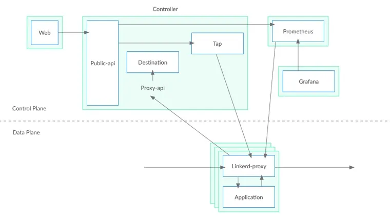
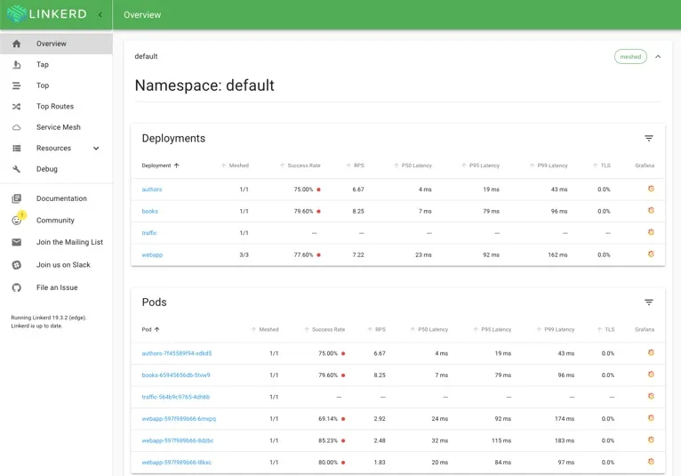

## 内容出处

**Linkerd v2: How Lessons from Production Adoption Resulted in a Rewrite of the Service Mesh**

https://www.infoq.com/articles/linkerd-v2-production-adoption/

作者 William Morgan, CEO - Buoyant，发表于2019年7月

Linkerd v2: 从生产应用中得到的教训如何导致服务网格的重写

https://blog.fleeto.us/post/linkerd-v2-production-adoption/

翻译 崔秀龙

------

## 关键信息

- Linkerd 2.0 在一个被广泛接受的服务网格产品的基础上进行了大量改造，原产品使用 Scala 实现，从 Twitter 的 Finagle RPC 系统中受益良多。
- 新版本产品从 JVM 转为使用 Go（控制平面）和 Rust（数据平面）协作实现。
- Buoyant 团队在 Rust 网络栈方向进行了深入的探索，并简化 UX，提升易用性，降低学习门槛。最终造就了更快、更轻更简单的运维体验。
- Linkerd 2.0 诞生至今已经过了 6 个多月，团队相信这次重写已经开始获得回报，很多从前面对 Linkerd 1.x 感觉无从下手的用户，现在已经满意的开始使用 2.x。

服务网格正成为现代云原生技术栈的重要成员。它把服务间通信（数据中心的惯用语中称之为东西向流量）的机制从应用代码迁移到了平台层，并提供了用于对通信进行度量和处理的工具，让运维人员以及平台所有者得到一个基本独立于应用代码的观察和控制层。

服务网格这个名词的历史还很短，背后的概念却不是那么新潮。这些概念在 Twitter、Netflix 和 Google 等公司中使用了超过十年，一般是通过 [Finagle](https://twitter.github.io/finagle/)、[Hystrix](https://github.com/Netflix/Hystrix) 以及 [Stubby](https://landing.google.com/sre/sre-book/chapters/production-environment/) 这样的胖客户端形式实现的。从技术视角来看，现代服务网格中，部署协作代理（Sidecar）的方式是胖客户端组件的变体，将客户端库换成代理服务器，这种方式因为 Docker 和 Kubernetes 这样的容器和容器编排系统的流行而逐步成为可能。

服务网格的流行趋势始于 [Linkerd](https://linkerd.io/)，它是服务网格的最早产品和项目。在 2016 年发布第一个版本开始，目前有两条并行的开发路线：原始的 1.x 分支，构建在 “Twitter 技术栈” 之上，包含了 Scala、Finagle、Netty 以及 JVM；2.x 分支使用 Rust 和 Go 从头做起。

Linkerd 2.0 的出现，不仅是对底层的重新实现、还因为在多年以来的生产环境中的应用过程中总结了很多经验教训，所以在方法层面也有了很大改观。本文将对这些实践经验进行讨论，并探究其成为 Linkerd 2.0 哲学、设计和实现基础的原因。

## Linkerd 是什么？值得注意么？

Linkerd 是一个开源的服务网格项目，也是 CNCF 成员。它在 2016 年出现，为全球各种规模的公司提供生产级别的架构支持，客户不仅包含 Strava 和 Planet Labs 这样的初创公司，还有 ComCast、Expedia、Ask 和 Chase Bank 等大型企业。

Linkerd 为微服务应用提供了可观察行、韧性和安全性方面的支撑。尤其重要的是，这些功能是属于平台层的。这意味着 Linkerd 的功能是跨越所有服务、独立于实现方式的，这就让平台的所有者能够跳出对开发团队的路线图和路线选择的依赖，进行独立思考。例如 Linkerd 能够在服务之间的通信中加入 TLS，让平台运维人员能够配置证书的生成、分发和验证过程，无需在服务开发团队的路线图中加入 TLS 的相关工作。

Linkerd 是通过在网格中的服务中加入透明的 L5/L7 代理完成工作的。这些代理构成了 Linkerd 的数据平面，负责处理各自代理服务的所有出入流量。数据平面受到控制平面的管理，Linkerd 的控制平面是一组进程，为运维人员提供集中的对流量进行观测和管理的服务。

Linkerd 基于对现实的一个认识：流经微服务的通信，和应用自身的代码一样，都是其运维工作的重要组成部分。Linkerd 无法介入微服务的内部，但是可以通过对成功率、吞吐量以及响应延迟的观测，来报告服务的健康情况。与此类似，Linkerd 无法修改应用的错误处理逻辑，但是可以通过对失败或缓慢的请求进行重试，来提高服务的健康程度。Linkerd 还能对连接进行加密，提供安全的服务身份认证，使用流量迁移的方式完成金丝雀和蓝绿部署等功能。

## Linkerd 1.x

我们在 Twitter 运行的应用，是业界最早、最大规模的微服务应用之一，Linkerd 就诞生于这种运维经验之中。Twitter 从三层的 RoR 应用迁移到了 Mesos 和 JVM 基础之上的类似云原生的架构，这个过程中创建了一个库：[Finagle](https://twitter.github.io/finagle/)，它为每个服务提供了服务发现、重试、监控等功能。Finagle 是 Twitter 进入大规模微服务阶段的重要一步。

Linkerd 1.x 诞生于 2016 年，根植于经过生产考验的 Twitter 技术栈：Finagle、Scala、Netty 和 JVM。我们最初的目标很简单：把 Finagle 的强力语义公诸于世。用 Scala 库的形式提供异步 RPC 支持是很受限的，因此我们将 Finagle 绑定为代理服务器的形式，这样就可以为各种语言编写的应用提供服务了。与此同时，容器和编排系统的快速蹿红，很好的降低了为每个服务实例部署代理的成本。Linkerd 增长强劲，尤其是在快速推进 Docker 和 Kubernetes 之类新技术的云原生社区。

从无到有，Linkerd 和服务网格模型本身都得到了长足的进步。今天 Linkerd 的 1.x 分支正在世界各地的公司中广泛采用，并在持续的发展之中。

## Linkerd 的经验教训

Linkerd 虽然很成功，很多组织还是不想将 Linkerd 部署到生产环境，或者愿意这样做，但是要进行大量投入。

这种情况的形成，有很多方面的原因。有的组织不想把 JVM 引进到自己的环境之中。JVM 的运维较为复杂，有些运维团队因为这样那样的原因，拒绝任何基于 JVM 的软件进入他们的系统——尤其是 Linkerd 这样担任关键角色的系统。

其它的组织不愿意为 Linkerd 分配系统资源。一般来说，Linkerd 1.0 在资源充足的情况下，是很能承受规模负载的——单一进程每秒能够处理几万的的请求；然而对付小负载的能力让人不太满意——单进程的 RSS 很难降低到 150MB 以下。Scala、Netty 和 Finagle 加剧了资源问题——它们的共同目标都是在资源充足的环境下提供最大的吞吐量。

一个组织可能要部署成百上千个 Linkerd 代理，资源消耗颇为可观。作为妥协，我们建议用户为每个节点而非进程部署数据平面，这样用户能够降低资源消耗。然而这样一来就提高了运维的复杂性，限制了 Linkerd 的能力实现，例如为每个服务提供 TLS 证书。

> 最近 JVM 在这方面有了长足的进步。Linkerd 1.x 的资源消耗和尾部延迟在 IBM OpenJ9 上都大有改观，并且 Oracle 的 GraalVM 承诺会作出进一步的改善。

最后一点，还有复杂性方面的问题。Finagle 是一个功能非常丰富的库，我们将其中的很多功能直接通过配置文件的形式暴露给了用户。结果是 Linkerd 1.x 具有很好的定制性和弹性，但是也有了陡峭的学习曲线。其中一个设计失误就是引入了 dtab 这一来自 Finagle 的路由语言作为基础配置原语。任何想要对 Linkerd 行为进行定制的用户都会陷入到 dtab 之中，在投入使用之前都需要进行很多的智力投入。

## 重新开始

尽管 Linkerd 的接受度还在上升之中，我们在 2017 年底得出共识，我们必须重新审视我们的方案。Linkerd 的价值主张无疑是正确的，但是它对运维团队的高要求可能不太必要。当我们反思我们在协助组织采用 Linkerd 的经验时，我们确认了一些面向未来的关键原则：

1. **节省资源**：Linkerd 应该尽可能的降低性能和资源成本，尤其是代理层。
2. **开箱即用**：Linkerd 不应该扰乱现存的应用，也不应该依赖复杂的配置。
3. **简单易用**：Linkerd 应该能够用较低的认知门槛来进行运维。组件应该让用户感觉到清晰，其行为应该易于理解。

每一项需求都是一系列的挑战，为了降低系统资源需求，我们只能告别 JVM。为了开箱即用，我们需要在网络协议检测等复杂技术上进行钻研。最后，简单是最复杂的需求，我们要在每个方面明确的落实极简主义、渐进性和内省的原则。

面对这次重写，我们认为我们首先应该专注于一个初始的用例。我们决定聚焦在 Kubernetes 环境下的通用协议，包括 HTTP、HTTP/2 以及 gRPC，这只是一个起点，以后会突破这些约束进行扩展。

### 目标 1：节省资源

Linkerd 1.x 中，控制平面和数据平面都是同一个平台的产物。然而这两个组件的需求是很不一样的。数据平面会伴随每个服务的每个实例一同部署，处理进出该服务的所有流量，因此必须又快又小。另外它还必须安全：Linkerd 的用户相信它能够用于处理敏感信息，符合 PCI 和 HIPAA 的合规性要求。

而控制平面是单独部署的，并不存在于请求的处理路径之中，对速度和资源的需求较低。它更看重对扩展和迭代的支持。

很明显 Go 是控制平面的理想实现平台。Go 具有运行时支持，以及类似 JVM 的垃圾回收机制，这一平台为现代网络服务而进行了优化，其运行成本大大低于 JVM。相对于 JVM，Go 语言的静态二进制、内存占用和启动时间都是很吸引人的。我们的性能测试结果中，Go 比本地编译的语言稍慢，但是对于控制平面来说就足够快了。最后，Go 的生态系统让我们获得了很多关于 Kubernetes 的相关功能支持，另外我们认为这个语言的低门槛和流行度也都有助于开源社区的贡献。

我们考虑过用 Go 和 C++ 开发数据平面，然而 Rust 注定是最符合我们需求的选择。Rust 专注于安全，尤其是它强大的 Borrow checker，在编译时强制执行安全内存实践，避免了一整类内存相关的安全漏洞，这就使他比 C++ 更有吸引力。它能够被编译为本地代码，并有细粒度的内存管理能力，这使 Rust 比 Go 具有更好的性能和内存控制能力。Rust 兼具丰富功能和表现力的语言特性，对我们的 Scala 程序员很有吸引力，零成本抽象模型声明让我们在不牺牲安全性或性能的情况下提高了表达能力。

Rust 的最大问题是（2017 年）：它的生态系统比其它语言来说相对落后。我们知道选择 Rust，就意味着要在网络方面进行深耕。

### 目标 2：开箱即用

解决了底层平台的决策问题之后，我们就要着手解决下一个设计目标了：开箱即用。对于 Kubernetes 应用，向既有应用中加入 Linkerd 不应破坏原有功能，也不应该依赖复杂的配置。

为了满足这个需要，我们做了很多设计抉择。我们给 Linkerd 的代理加入了协议检测的能力：它能够代理 TCP 流量，与此同时还能自动检测其中的 7 层协议。在 Pod 创建时用 Iptables 设置流量劫持，业务代码中的任何 TCP 连接都会被透明的经过本地的 Linkerd 代理，如果这些连接中使用的是 HTTP、HTTP/2 或者 gRPC，Linkerd 会自动的使用 L7 的方式进行干预——例如报告成功率、重试幂等请求、在请求级进行负载均衡等。这些目标都可以在无需用户配置的情况下完成。

我们还努力提供尽可能多的缺省功能。Linkerd 1.x 中提供了丰富的代理级指标，把聚合和报告留给用户去做。在 Linkerd 2.0 中，我们将 Prometheus 作为控制平面的成员，这样我们就可以在 Grafana 中提供开箱可用的聚合指标视图了。我们使用这套指标构建了一套 UNIX 风格的命令，让运维人员可以在命令行中观察运行中的服务。结合协议检测功能，平台运维人员可以从 Linkerd 获得丰富的服务级的指标，无需进行配置。

> 进出应用的 TCP 连接都被路由到 Linkerd 的数据平面（Linkerd-proxy），Linkerd 数据平面让这些流量可以被控制平面进行观测和管理。

### 目标 3：简单易用

这是最重要的目标，简单和易用在某种程度上是矛盾的（感谢 [Rich Hickey 的 《Simple Made Easy》](https://www.infoq.com/presentations/Simple-Made-Easy/)，让我们茅塞顿开）。我们意识到，Linkerd 是一款面向运维的产品，也就是说，这并不是一个云厂商代你运维的服务网格产品，我们希望你会自己运行自己的 Linkerd。这样的话，减小 Linkerd 的运维面是一个重点。幸运的是，几年来帮助用户采纳 Linkerd 1.x 的经验，给我们很大帮助：

- Linkerd 不应藏在幕后或过于神奇。
- Linkerd 的内部状态应该是可观察的。
- Linkerd 的组件应该具备良好的定义、充分解耦并具备清晰的边界。

为了这个目标，我们在服务中做了很多的设计决策。我们放弃了把控制平面集成到单一进程中的尝试，而是使用其自然形态进行了边界拆分：一个提供 Web 界面的 Web 服务；一个 Proxy API 服务来和数据平面进行通信等。我们在 Linkerd 的仪表盘上向用户直接公开了这些组件，我们还设计了符合 Kubernetes 生态系统中惯用的仪表盘和命令行客户端的界面：`linkerd install` 命令会输出一个 Kubernetes 清单文件，使用 `kubectl apply` 提交之后就能进行安装，Linkerd 仪表盘的观感和 Kubernetes 仪表盘类似。

我们还用加入约束的方式来避免复杂性。我们在 Kubernetes 核心名词，例如 Deployment 和 Pod 的基础上进行工作，尽量少定义自己的名词。我们尽可能的使用 Kubernetes 的自有功能，例如 Secret 和 Admission Controller。我们限制对 CRD 的使用，因为我们深知，CRD 也是重要的复杂性的来源。

最后，我们加入了扩展检测，让运维人员能够观测到 Linkerd 的内部状态并进行校验。我们把控制平面也加入了网格，这样运维人员就可以使用 Linkerd 丰富的遥测数据来观测和了解 Linkerd 的内部状态了。我们还加入了 `linkerd endpoints` 命令，用于导出 Linkerd 的内部服务发现信息，以及用于验证 Kubernetes 集群和 Linkerd 设置的 `linkerd check` 命令。

简而言之，我们尽了最大的努力，希望 Linkerd 能够清晰可见，而非简陋或奇幻。

## 今天的 Linkerd 2.0

在经过了接近一年的内部投入之后，在 2018 年 9 月，我们启动了 Linkerd 2.0。虽然有着基本相同的价值主张，但是我们对易用性、可运维以及降低资源用量的关注，催生了一个和 1.x 截然不同的产品。六个月后，我们已经得到了回报，许多无法采用 1.x 的用户已经开始采用 2.x。

我们对Rust的选择引起了极大的兴趣；虽然这最初是一场赌博（事实上，我们以 "Conduit "的名义发布了早期版本，害怕玷污Linkerd的品牌），但现在很明显，这场赌博已经得到了回报。自2017年以来，我们对核心Rust网络库进行了大量投资，如Tokio、Tower和Hyper。我们已经调整了Linkerd 2.0的代理（简单地称为 "linkerd2-proxy"），以便在请求终止时有效地释放分配给请求的内存，允许令人难以置信的尖锐延迟分布，因为内存分配和取消分配在请求流中被摊销。Linkerd的代理现在的特点是p99延迟小于1毫秒，内存足迹远低于10MB，比Linkerd 1.x小一个数量级。

目前 Linkerd 的用户和贡献者社区正在蓬勃发展，未来一片光明。2.x 分支有 50 多个贡献者，每周都能规律的完成发布，还有积极友好的 Slack 频道可以进行沟通。我们为我们的努力深感自豪，并期待为我们的用户继续解决实际问题，同时也会继续坚持我们的设计理念。

