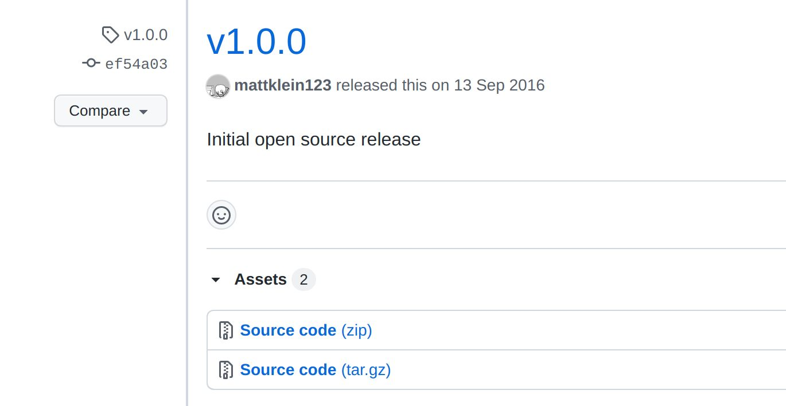

{}
2016年，Matt Klein在Lyft默默的进行Envoy的开发。Envoy诞生的时间其实要比Linkerd更早一些，只是在Lyft内部不为人所知。
{}

## 年度动态

### 2016-09-13 Envoy1.0.0版本发布

https://github.com/envoyproxy/envoy/releases/tag/v1.0.0

2016年9月13日，Matt Klein宣布Envoy在github开源，直接发布1.0.0版本。版本说明只有四个单词: Initial open source release.

### 2016-12-01 Envoy1.1.0版本发布

https://github.com/envoyproxy/envoy/releases/tag/v1.1.0

[版本更新列表](https://www.envoyproxy.io/docs/envoy/latest/version_history/v1.1.0): 

- Switch from Jannson to RapidJSON for our JSON library (allowing for a configuration schema in 1.2.0).
- Upgrade [recommended version](https://www.envoyproxy.io/docs/envoy/v1.5.0/install/building#install-requirements) of various other libraries.
- Configurable DNS refresh rate for DNS service discovery types.
- Upstream circuit breaker configuration can be [overridden via runtime](https://www.envoyproxy.io/docs/envoy/v1.5.0/configuration/cluster_manager/cluster_runtime#config-cluster-manager-cluster-runtime).
- [Zone aware routing support](https://www.envoyproxy.io/docs/envoy/v1.5.0/intro/arch_overview/load_balancing#arch-overview-load-balancing-zone-aware-routing).
- Generic header matching routing rule.
- HTTP/2 graceful connection draining (double GOAWAY).
- DynamoDB filter [per shard statistics](https://www.envoyproxy.io/docs/envoy/v1.5.0/configuration/http_filters/dynamodb_filter#config-http-filters-dynamo) (pre-release AWS feature).
- Initial release of the [fault injection HTTP filter](https://www.envoyproxy.io/docs/envoy/v1.5.0/configuration/http_filters/fault_filter#config-http-filters-fault-injection).
- HTTP [rate limit filter](https://www.envoyproxy.io/docs/envoy/v1.5.0/configuration/http_filters/rate_limit_filter#config-http-filters-rate-limit) enhancements (note that the configuration for HTTP rate limiting is going to be overhauled in 1.2.0).
- Added [refused-stream retry policy](https://www.envoyproxy.io/docs/envoy/v1.5.0/configuration/http_filters/router_filter#config-http-filters-router-x-envoy-retry-on).
- Multiple [priority queues](https://www.envoyproxy.io/docs/envoy/v1.5.0/intro/arch_overview/http_routing#arch-overview-http-routing-priority) for upstream clusters (configurable on a per route basis, with separate connection pools, circuit breakers, etc.).
- Added max connection circuit breaking to the [TCP proxy filter](https://www.envoyproxy.io/docs/envoy/v1.5.0/intro/arch_overview/tcp_proxy#arch-overview-tcp-proxy).
- Added [CLI](https://www.envoyproxy.io/docs/envoy/v1.5.0/operations/cli#operations-cli) options for setting the logging file flush interval as well as the drain/shutdown time during hot restart.
- A very large number of performance enhancements for core HTTP/TCP proxy flows as well as a few new configuration flags to allow disabling expensive features if they are not needed (specifically request ID generation and dynamic response code stats).
- Support Mongo 3.2 in the [Mongo sniffing filter](https://www.envoyproxy.io/docs/envoy/v1.5.0/configuration/network_filters/mongo_proxy_filter#config-network-filters-mongo-proxy).
- Lots of other small fixes and enhancements not listed.

个人小结：

- 各种类库更新，bug fix，性能优化
- 新增区域感知路由支持，通用的头匹配路由规则，HTTP/2优雅连接耗尽（双GOAWAY），故障注入HTTP过滤器，增加了拒绝流重试策略，上游集群的多个优先级队列，为TCP代理过滤器增加了最大连接断路功能

## Envoy的历史追溯

> 备注：内容节选自文章 [网络代理 Envoy 开源五周年](https://cloudnative.to/blog/envoy-oss-5-year/), 英文原文为 [5 years of Envoy OSS](https://mattklein123.dev/2021/09/14/5-years-envoy-oss/)

### 加入 Lyft 和创建 “Lyft 代理”

我在 2015 年春天离开了 Twitter，部分原因是下线事件的影响，部分原因是对没有得到晋升的挫败感，部分原因是想尝试新的东西。我跟着我的老板从 Twitter 到了 Lyft，还有我在 Twitter 的其他同事。

当我加入 Lyft 时，公司规模相对较小（少于 100 名工程师），并且正在努力从单体架构迁移到微服务架构。我已经[多次](https://mattklein123.dev/appearances/)谈到了 Envoy 的这部分历程，所以我不会再重述，在此简短的总结下，Lyft 遇到了所有典型的微服务迁移问题，主要是源于网络和可观察性。此外，Lyft 已经是 “多面手”（使用多种语言和框架），所以使用基于库的解决方案来解决这些问题似乎不切实际。因此，根据我以前建立 TSA 的经验和观察服务间通信在 Twitter 的工作方式，由于得到在 Lyft 的前 Twitter 同事们的信任，我提议建立一个新的应用网络系统，称为 “Lyft 代理”。

经过一些激烈的讨论，包括新的代理是否应该用 Python 构建（是的，真的），我们就项目的大致轮廓达成一致，并决定使用 C++ 作为实现语言。在当时，C++ 似乎是唯一合理的选择。今天我还会选择 C++ 吗？然而，如今已经不是 2015 年初了。

如果不说 “Envoy” 这个名字的由来，这部分的历史就不完整了。我们正在为这个项目建立最初的开发脚手架的时候，一个有远见的同事（Ryan Lane）说，我们不能把这个新项目叫做 “Lyft 代理”，我们必须选择一个更好的名字。我总是很实际，就去找辞典，查了一下 “代理”，然后决定用 Envoy 作为新名字。

### 在 Lyft 上线

直到 2015 年夏天，我才开始认真地研究 Envoy 的源代码。那几个月是我职业生涯中最有趣的几个月。我们应该珍惜这段初创时期，因为它不会持续很久。我花了很长时间，争取在合理的时间内（根据我的定义，这种类型的项目需要 3-4 个月的时间）做出能给 Lyft 带来价值的东西。俗话说，Lyft 给了我大量的绳子来吊死自己，而我致力于确保这种吊死不会发生。

当然，我的效率主要归功于刚从压缩的开发时间表和许多错误（主要是我自己的）中走出来，在 Twitter 的 TSA。我知道哪些错误是不能犯的，哪些抽象是需要的，哪些测试有效，哪些无效，等等。

2015 年秋天准备投入生产的 Envoy 的最初版本只包含了该项目今天所包含的功能和复杂性的一小部分。它不支持 TLS，只支持 HTTP/1，并且有极其简单的路由和弹性功能。它所拥有的是你今天所看到的东西的骨架。在这个项目的历史上，很少有重大的重构，主要是因为，正如我之前所说的，我知道将要发生什么，以及为了支持这些功能，需要有哪些抽象。Envoy 从一开始就拥有一流的可观察性输出，以指标和日志的形式。在 2021 年，这种类型的网络可观察性是桌面上的赌注（这在很大程度上要归功于 Envoy 的成功），但在当时却不是这样。

Envoy 最初是作为边缘代理在 Lyft 上线的，位于提供 TLS 终止的 AWS ELB 后面。到 2015 年秋末，Envoy 为 Lyft 的 100% 流量提供服务，该系统产生的边缘仪表盘立即得到了回报（例如，提供 API 调用百分点延迟直方图，每个终端的成功率和请求率等）。

在最初推出后不久，另一位 Twitter 同事（Bill Gallagher）加入了我的项目，我们迅速增加了一些功能，如 TLS 终止、HTTP/2 支持、更多路由和负载平衡功能等。

与此同时，Lyft 基于 Envoy 的 “服务网格 " 也开始成形了。首先，Envoy 被部署在 PHP 单片机旁边，以取代 HAProxy 及其一些固有的运维问题（例如，当时 HAProxy 仍然是单线程的），以帮助 MongoDB 的代理。可以毫不夸张地说，Envoy 的早期开发有很大一部分是针对 MongoDB 的稳定性（负载均衡、速率限制、可观察性等）。

基于 Envoy 的边缘机群和单体之间的直接观察能力的好处是非常明显的。不久之后，我们在一些高 RPS 分解的微服务旁边部署了 Envoy，以帮助排除网络问题。这方面的价值也得到了证明。随着时间的推移，我们超越了对可观察性的关注，增加了帮助系统可靠性的功能，如直接连接和服务发现（跳过内部 ELB）、异常值检测、健康检查、重试、断路等。Lyft 的基于负载的重大事件的数量从每 1-2 周一次慢慢减少。当然，Envoy 不能将所有此类事件的减少归功于此，但它提供的网络抽象确实有很大的帮助。

2016 年初，我们决定推动一个 100% 覆盖的服务网格。最初，我们认为这将是一个艰难的过程，需要自上而下的授权。在实践中，**团队报名参加了迁移，因为他们将得到的好处是显而易见的**。“胡萝卜 “式的迁移几乎总是成功的。而 “大棒” 式的迁移则很少成功，或者即使成功了，也会在组织内留下眼泪和愤怒。

到 2016 年中期，Envoy 被用于 Lyft 的所有网络通信，包括边缘服务、服务间通信、数据库、外部合作伙伴等。无论从哪个角度来看，该项目都取得了巨大的成功，帮助 Lyft 完成了微服务的迁移，提高了整体的可靠性，并对网络进行了抽象，使大多数工程师不需要了解真实的系统拓扑结构。此后，Bill 离开了这个项目，在 Lyft 从事其他工作，接替他的是 Roman Dzhabarov 和 Constance Caramanolis 加入我的团队。我们的小团队为整个 Lyft 开发和运维 Envoy。

### 开放源码

到 2016 年夏天，我们开始认真讨论开源 Envoy 的问题。早期的 Lyft 员工对开源和它为公司所做的事情很欣赏。很明显，Envoy 并不是 Lyft 的主要业务，那么为什么不把它放在那里并给予回报呢？我可以坦率地说，我们都带着不同的目标和期望来对待开放源代码的过程，以及对项目获得巨大成功后会发生什么感到非常天真。

在加入 Envoy 之前，我已经使用了相当多的开源软件，但我几乎没有开源贡献的经验，也没有维护者的经验。（虽然我在 Linux 内核中有过[一次提交](https://github.com/torvalds/linux/commit/00370b8f8dd6e3171b8202f9c5187a5f73e99497)！）开源 Envoy 似乎是一个很好的机会，可以扩展我的技能组合，学习新的东西，可能会促进我的职业生涯，坦率地说，我不希望有一个 TSA v3 在第三家公司出现。对于 Lyft 来说，Envoy 是一个重要的工程项目，领导层认为，开放源代码将使 Lyft 作为一个工程组织具有可信度，并有助于招聘工作。正如我之前所说，我们所有人都对创建成功的开源，更重要的是在它获得成功的情况下培育它所需要的东西感到天真。

但是，我们决定给它一个机会。我们在 2016 年夏天花了很大一部分时间来编写文档（Jose Nino 在这个时候加入了团队，他的第一个任务就是阅读并帮助改进所有的文档），清理存储库，使其 " 不那么尴尬”，制作网站，发布博文等等。我真的很感谢这段时间里我在 Lyft 的同事，他们不仅支持我们，还帮助我们完成了无数的任务，包括网站设计、logo 等等。即使在这个早期阶段，我们也觉得第一印象很重要，如果我们要在开源领域有所作为，就必须通过高质量的文档、网站等给人留下良好的第一印象。

在此期间，我们还利用我们的行业关系，与 Lyft 的一些 “同行公司”（湾区的 “独角兽 " 互联网创业公司）会面，向他们展示我们在 Envoy 方面所做的工作，并获得他们的反馈，我们认为如果我们在正式开源前成功获得一个启动合作伙伴，这将是对项目的一个重大帮助。所有这些会议都非常友好，总的来说，所有与我们会面的公司都对我们所取得的成就印象深刻。但是，事后看来，他们都表示，以他们的小型基础设施团队，不可能马上采用 Envoy。他们祝愿我们在开放源代码方面取得最好的成绩，并说他们以后会回来看看。我们不禁对这些会议的结果感到沮丧，但我们还是向前推进了。

2015 年 8 月，我与谷歌进行了第一次友好的会面。一个 Lyft 的同事（Chris Burnett）在一个 gRPC 聚会上发言，提到了 Envoy，因为它与 Envoy 的 [gRPC 桥接](https://www.envoyproxy.io/docs/envoy/latest/intro/arch_overview/other_protocols/grpc#grpc-bridging)支持有关。我不知道的是，谷歌在发现 Envoy 的时候，正准备在 NGINX 的基础上推出 Istio。一次会议引出了另一次会议，然后是更多的会议，在 Envoy 开源之前，大量的谷歌员工已经看到了源代码和文档。(稍后会有更多关于这方面的内容）。

到 9 月初，我们已经准备好了，并将开源日定为 9 月 14 日。总的来说，我是一个（过度？）自信的人，但在我的生活中，有几次我对自己成功的能力有很大的焦虑。我立即想到的是：开始上高中，开始上大学，以及大学毕业后在微软工作。而开源的 Envoy 就是其中之一。我记得我被公众的反应吓坏了。人们会怎么说？反馈会是积极的还是恶毒的？虽然我们在开源时是一个小团队，但我仍然写了 90% 或更多的代码，并且觉得把它放到公共领域是对我自己和我的能力的一种反映。

如期而至，[Envoy](https://eng.lyft.com/announcing-envoy-c-l7-proxy-and-communication-bus-92520b6c8191) 在 2016 年 9 月 14 日 [成为开源产品](https://eng.lyft.com/announcing-envoy-c-l7-proxy-and-communication-bus-92520b6c8191)。我记得我和妻子一起庆祝，并说了一些话。“如果我们能让其他公司像 Lyft 一样使用 Envoy，我就会很高兴。”

对开放源码发布的反应几乎是普遍的积极。令我们惊讶的是，几乎是立刻，我们开始听到大公司的声音，而不是小公司。在几周内，我们与苹果、微软进行了交谈，与谷歌的对话也不断加快。大公司在现有的解决方案中存在问题，并且有大量的团队准备投入到解决这些问题的工作中。具有讽刺意味的是（至少在 Twitter 的观点中），C++ 在这里是一种帮助，而不是一种阻碍。这些大公司都已经拥有充足的 C/C++ 开发资源，以及他们想要整合的现有库，等等。对他们来说，C++ 是一个卖点。

在这段时间里，毫不奇怪，我们与谷歌的人有最多的互动。最初主要是构建 Istio 的团队，但渐渐地，我们与 Anna Berenberg 花了更多时间，她现在是谷歌的杰出工程师，领导各种网络和负载均衡工作。这种关系将产生 " 喷气燃料”，在 2017 年初真正启动该项目。

## 年度总结

