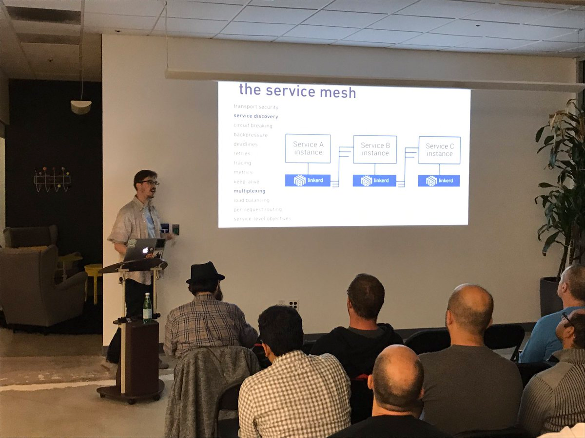

{}
在2016年初，service mesh还只是Buoyant公司的内部词汇，而之后，它开始逐步走向社区.
{}

### 2016-09-29 Service Mesh第一次公开使用

2016年9月29日在SF Microservices上，“Service Mesh”这个词汇第一次在公开场合被使用。这标志着“Service Mesh”这个词，从Buoyant公司走向社区。

### 2016-10-01 博客系列文章: A Service Mesh for Kubernetes

2016年10月，Alex Leong开始在buoyant公司的官方Blog中开始"A Service Mesh for Kubernetes"系列博客的连载。随着"The services must mesh"口号的喊出，buoyant和Linkerd开始service mesh概念的布道。

### 2016年年底

借助Service Mesh在社区的认可度，Linkerd在年底开始申请加入CNCF。

